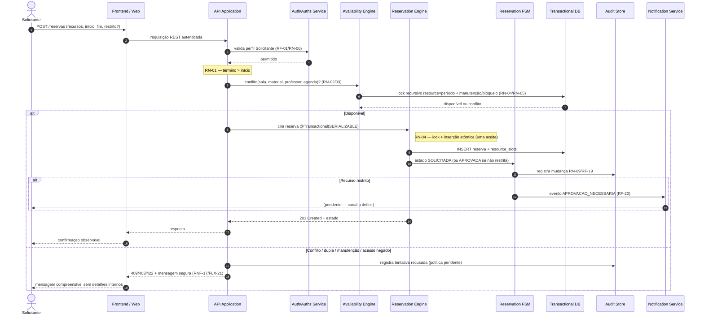

# Arquitetura — Organização de Recursos

> **Documento:** `docs/arquitetura.md`
> **Seção:** Inicial — Contexto, stakeholders, requisitos, atributos de qualidade, drivers, glossário e riscos.
> **Status:** Baseline inicial para revisão da equipe.
> **Fontes tratadas como única verdade:** `docs/prd.md`, `docs/fluxos-personas.md`, `docs/personas/solicitante.md`, `docs/personas/responsavel.md`, `docs/personas/administrador.md`, `README.md`.
> **Data:** 2026-08-31

---

## 1. Contexto e Objetivo

### Contexto

O sistema **Organização de Recursos** é uma aplicação para organizar a alocação de **salas**, **professores** e **materiais** sem conflitos de horário, com controle sobre recursos restritos, manutenção, retiradas, devoluções e mudanças realizadas.

- **Origem do problema:** `docs/prd.md:2.1` — "A alocação de salas, professores e materiais precisa ocorrer sem conflitos de horário e com controle sobre recursos restritos, manutenção, retiradas, devoluções e mudanças realizadas."
- **Origem do contexto:** `docs/fluxos-personas.md:2.1` — mesmo problema, acrescentando "inclusive na agenda do professor, e deve preservar rastreabilidade, auditoria, segurança e controle operacional."

### Objetivo

- **Origem:** `docs/prd.md:2.2` — "Desenvolver e validar uma aplicação que organize a alocação de salas, professores e materiais sem conflitos de horário, produzindo evidências objetivas de qualidade, segurança, rastreabilidade e desempenho."
- **Origem complementar:** `docs/fluxos-personas.md:2.2` — mesmo objetivo.

### Escopo

- **Dentro do escopo:** 13 escopos oficiais — E1 (Acesso e Perfis) a E13 (Qualidade, Segurança, Desempenho e CI). Origem: `docs/prd.md:3.1`.
- **Fora do escopo:** Funcionalidades do projeto demonstrativo Foot Fanatics; perfis diferentes de Solicitante, Responsável e Administrador; dados pessoais das personas. Origem: `docs/prd.md:3.2`.

### Premissas oficiais

| Premissa | Origem |
|---|---|
| Java 21 e Spring Boot 3.x | `docs/prd.md:5.1` |
| Entrega prevista para a semana 46 | `docs/prd.md:5.1` |
| Término da reserva deve ser posterior ao início | `docs/prd.md:5.1`, `RN-01` |
| Sobreposição aplica-se a sala, material e professor | `docs/prd.md:5.1`, `RN-02`, `RN-03` |
| Solicitações simultâneas para mesmo recurso/período aceitam somente uma | `docs/prd.md:5.1`, `RN-04` |
| Recursos em manutenção não podem ser reservados | `docs/prd.md:5.1`, `RN-05` |
| Recursos restritos exigem aprovação; somente Responsável pode aprovar | `docs/prd.md:5.1`, `RN-06` |
| Fluxo principal: `SOLICITADA -> APROVADA -> EM_USO -> CONCLUIDA` | `docs/prd.md:5.1`, `RN-07` |
| Estados alternativos: `REJEITADA`, `CANCELADA`, `NAO_COMPARECEU` | `docs/prd.md:5.1`, `RN-07` |
| Reservas iniciadas não podem ser apagadas | `docs/prd.md:5.1`, `RN-08` |
| Toda mudança de estado gera auditoria | `docs/prd.md:5.1`, `RN-09` |
| Qualidade: JUnit 5, testes parametrizados, integração, API caixa-preta, E2E, Testcontainers, WireMock, concorrência automatizada, TDD/BDD, GitHub Actions, JaCoCo, SonarCloud, JMeter | `docs/prd.md:5.1` |
| Metas: 80% cobertura de linhas, 70% de branches, 100% dos requisitos críticos rastreados, zero bugs críticos conhecidos, zero vulnerabilidades críticas conhecidas | `docs/prd.md:5.1` |

---

## 2. Stakeholders / Personas

| Persona | Arquivo de origem | Papel no sistema |
|---|---|---|
| Solicitante | `docs/personas/solicitante.md` | Professor ou coordenador que consulta disponibilidade e cria, altera ou cancela suas próprias reservas |
| Responsável | `docs/personas/responsavel.md` | Aprova solicitações especiais de recursos restritos, valida a alocação de docentes, acompanha retiradas e devoluções de materiais |
| Administrador | `docs/personas/administrador.md` | Gerencia salas, professores, materiais, usuários, bloqueios e períodos de manutenção |

### Premissa sobre o professor

- **Fato:** "Professor como usuário é distinto de professor como recurso." Origem: `docs/fluxos-personas.md:3.1`.
- **Fato:** Um professor pode atuar como usuário com perfil Solicitante, mas a relação entre conta e recurso professor não está formalizada. Origem: `docs/fluxos-personas.md:3.1`, `docs/fluxos-personas.md:5.3`.
- **Lacuna:** Não se sabe se as duas representações são a mesma pessoa, se possuem relação cadastral, se o professor-recurso precisa de conta, ou quais dados pessoais são visíveis. Origem: `docs/fluxos-personas.md:16` (pendência 13).

### Permissões resumidas

| Operação | Solicitante | Responsável | Administrador | Origem |
|---|---|---|---|---|
| Criar reserva | PERMITIDO | NEGADO | NEGADO | `docs/prd.md:RF-10` |
| Alterar reserva própria | CONDICIONAL | NEGADO | PENDENTE DE DECISÃO | `docs/fluxos-personas.md:11` |
| Cancelar reserva própria | CONDICIONAL | NEGADO | PENDENTE DE DECISÃO | `docs/fluxos-personas.md:11` |
| Aprovar recurso restrito | NEGADO | PERMITIDO | NEGADO | `docs/prd.md:RF-14`, `docs/fluxos-personas.md:11` |
| Rejeitar solicitação especial | NEGADO | PERMITIDO | NEGADO | `docs/prd.md:RF-14` |
| Validar professor | NEGADO | PERMITIDO | NEGADO | `docs/prd.md:RF-15` |
| Registrar retirada | NEGADO | PERMITIDO | NEGADO | `docs/prd.md:RF-16` |
| Registrar devolução | NEGADO | PERMITIDO | NEGADO | `docs/prd.md:RF-17` |
| Gerenciar salas/professores/materiais/usuários | NEGADO | NEGADO | PERMITIDO | `docs/prd.md:RF-02/03/04/05` |
| Gerenciar bloqueios/manutenção | NEGADO | NEGADO | PERMITIDO | `docs/prd.md:RF-06/07` |
| Consultar relatórios | NEGADO | PENDENTE | PERMITIDO | `docs/fluxos-personas.md:11` |
| Consultar auditoria | CONDICIONAL | CONDICIONAL | PERMITIDO | `docs/fluxos-personas.md:11` |

---

## 3. Restrições Arquiteturais

### 3.1 Restrições oficiais (do PRD)

| Restrição | Origem |
|---|---|
| Java 21 e Spring Boot 3.x | `docs/prd.md:RNF-01`, `docs/prd.md:5.1` |
| 80% cobertura de linhas (JaCoCo) | `docs/prd.md:RNF-02` |
| 70% cobertura de branches (JaCoCo) | `docs/prd.md:RNF-03` |
| 100% de requisitos críticos rastreados | `docs/prd.md:RN-10`, `docs/prd.md:RNF-04` |
| Zero bugs críticos conhecidos | `docs/prd.md:RNF-05` |
| Zero vulnerabilidades críticas conhecidas | `docs/prd.md:RNF-06`, `docs/prd.md:RNF-13` |
| Persistência crítica validada com Testcontainers | `docs/prd.md:RNF-07` |
| Integrações externas validadas com WireMock | `docs/prd.md:RNF-08` |
| GitHub Actions em pull requests | `docs/prd.md:RNF-12` |
| SonarCloud para análise estática | `docs/prd.md:RNF-13` |
| Toda mudança de estado gera auditoria obrigatória | `docs/prd.md:RN-09` |
| Reservas iniciadas (`EM_USO` em diante) não podem ser apagadas | `docs/prd.md:RN-08` |
| Entrega na semana 46 | `docs/prd.md:5.1` |

### 3.2 Restrição Obrigatória — Cron Job Diário de Treinamento/Retreinamento

> **CON-01 (OBRIGATÓRIA):** Existe um cron job executado diariamente ao final do dia para treinar ou retreinar usando somente dados novos.

- **Origem:** Restrição adicional do enunciado da atividade de arquitetura, ausente no PRD e nas personas.
- **Observação de alinhamento:** Nenhum artefato do projeto menciona aprendizado de máquina, modelos, treinamento, re-treinamento ou pipeline de dados. A `docs/prd.md:3.2` e `docs/fluxos-personas.md:2.3` excluem explicitamente o projeto demonstrativo Foot Fanatics e limitam o escopo a E1-E13. Esta restrição introduz um componente de processamento batch/ML cujo escopo, propósito, dados de entrada, modelo e saída **não estão especificados** nos artefatos oficiais.
- **Implicação arquitetônica:** A restrição exige uma fonte de dados de "novos dados" para alimentar um processo de treinamento diário. No contexto atual, não há definição de quais dados são considerados "novos", nem de como o treinamento se relaciona com as funcionalidades de reserva, auditoria, relatórios ou notificações.

### 3.3 Dependências oficiais

| Dependência | Origem |
|---|---|
| Banco de dados containerizado com Testcontainers para validação de persistência crítica | `docs/prd.md:5.2` |
| WireMock para integrações externas | `docs/prd.md:5.2` |
| GitHub Actions executado em pull requests | `docs/prd.md:5.2` |
| JaCoCo, SonarCloud e JMeter para evidências de qualidade | `docs/prd.md:5.2`, `docs/fluxos-personas.md:14` |

---

## 4. Requisitos Arquiteturalmente Significativos

> Um requisito é "arquiteturalmente significativo" quando seu atendimento impõe decisões de estrutura, componentes, padrões ou tecnologias sobre o restante do sistema.

### 4.1 Regras de negócio críticas

| ID | Requisito | Origem | Impacto arquitetônico |
|---|---|---|---|
| RN-01 | Término posterior ao início | `docs/prd.md:RN-01` | Validação de domínio |
| RN-02 | Sem sobreposição do mesmo recurso (sala, material, professor) | `docs/prd.md:RN-02` | Controle de concorrência e consistência de dados |
| RN-03 | Sobreposição aplica-se à agenda do professor | `docs/prd.md:RN-03` | Modelagem de professor como recurso de agenda |
| RN-04 | Dupla reserva simultânea: somente uma aceita | `docs/prd.md:RN-04` | Serialização/transação em nível de recurso+período |
| RN-05 | Recursos em manutenção não podem ser reservados | `docs/prd.md:RN-05` | Disponibilidade como predicado de reserva |
| RN-06 | Recursos restritos exigem aprovação; somente Responsável aprova | `docs/prd.md:RN-06` | Arquitetura de autorização baseada em perfil e estado |
| RN-07 | Fluxo de estados: `SOLICITADA -> APROVADA -> EM_USO -> CONCLUIDA`; alternativos `REJEITADA`, `CANCELADA`, `NAO_COMPARECEU` | `docs/prd.md:RN-07` | Máquina de estados no domínio |
| RN-08 | Reservas iniciadas não podem ser apagadas | `docs/prd.md:RN-08` | Política de impedimento de exclusão e preservação do histórico |
| RN-09 | Todo estado-change gera auditoria | `docs/prd.md:RN-09` | Cross-cutting concern de auditoria |
| RN-10 | Todos os requisitos críticos rastreados | `docs/prd.md:RN-10` | Matriz de rastreabilidade |

### 4.2 Requisitos funcionais arquiteturalmente significativos

| ID | Requisito | Origem | Impacto arquitetônico |
|---|---|---|---|
| RF-01 | Autenticação e autorização por perfil | `docs/prd.md:RF-01` | Segurança, autorização baseada em perfil |
| RF-05 | Gestão de usuários e perfis oficiais | `docs/prd.md:RF-05` | Domínio de identidade e acesso |
| RF-09 | Pesquisa por filtros e disponibilidade | `docs/prd.md:RF-09` | Consulta e filtragem, predicados de disponibilidade |
| RF-10 | Criação de reservas | `docs/prd.md:RF-10` | Transação atômica, validação de concorrência |
| RF-13 | Detecção de sobreposição e dupla reserva | `docs/prd.md:RF-13` | Controle de concorrência, detecção de conflitos |
| RF-14 | Aprovação de solicitações especiais | `docs/prd.md:RF-14` | Workflow de aprovação, transição de estados |
| RF-18 | Gestão dos estados da reserva | `docs/prd.md:RF-18` | Máquina de estados |
| RF-19 | Histórico auditável | `docs/prd.md:RF-19` | Persistência de histórico, imutabilidade |
| RF-20 | Notificação ou integração externa | `docs/prd.md:RF-20` | Arquitetura de integração/eventos |
| RF-21 | Relatórios operacionais | `docs/prd.md:RF-21` | Agregação e consolidação de dados |
| RF-22 | Interface responsiva e erros compreensíveis | `docs/prd.md:RF-22` | UI/UX, tratamento de erros |
| RF-23 | Documentação da API ou fluxos públicos | `docs/prd.md:RF-23` | Contratos e documentação |

### 4.3 Requisitos não funcionais arquiteturalmente significativos

| ID | Requisito | Origem | Impacto arquitetônico |
|---|---|---|---|
| RNF-01 | Java 21 e Spring Boot 3.x | `docs/prd.md:RNF-01` | Plataforma e framework |
| RNF-02 | 80% cobertura de linhas | `docs/prd.md:RNF-02` | Estratégia de teste |
| RNF-03 | 70% cobertura de branches | `docs/prd.md:RNF-03` | Estratégia de teste |
| RNF-04 | Rastreabilidade de requisitos críticos | `docs/prd.md:RNF-04` | Processo de validação |
| RNF-05 | Zero bugs críticos conhecidos | `docs/prd.md:RNF-05` | QA e gate de qualidade |
| RNF-06 | Zero vulnerabilidades críticas | `docs/prd.md:RNF-06` | Segurança, análise estática |
| RNF-07 | Validação de persistência crítica com Testcontainers | `docs/prd.md:RNF-07` | Infraestrutura de teste |
| RNF-08 | Validação de integrações com WireMock | `docs/prd.md:RNF-08` | Mock de integração |
| RNF-09 | Testes de concorrência | `docs/prd.md:RNF-09` | Estratégia de teste de concorrência |
| RNF-10 | Testes automatizados em camadas | `docs/prd.md:RNF-10` | Camada de teste |
| RNF-11 | Evidência de TDD ou BDD em funcionalidade nova | `docs/prd.md:RNF-11` | Processo de desenvolvimento |
| RNF-12 | GitHub Actions em pull requests | `docs/prd.md:RNF-12` | CI/CD |
| RNF-13 | Análise estática com SonarCloud | `docs/prd.md:RNF-13` | Quality gate |
| RNF-14 | Desempenho sob carga (JMeter) | `docs/prd.md:RNF-14` | Performance testing — **sem valor-alvo aprovado** |
| RNF-15 | Segurança de autenticação, autorização, entrada e erros | `docs/prd.md:RNF-15` | Segurança |
| RNF-16 | Responsividade e acessibilidade | `docs/prd.md:RNF-16` | UI/UX — **sem viewports aprovados** |
| RNF-17 | Mensagens de erro compreensíveis | `docs/prd.md:RNF-17` | UX, segurança |
| RNF-18 | Documentação verificável dos fluxos públicos | `docs/prd.md:RNF-18` | Documentação |

---

## 5. Atributos de Qualidade

| Atributo de Qualidade | Origem | Observação |
|---|---|---|
| Segurança | `docs/prd.md:RNF-06`, `docs/prd.md:RNF-15` | Autenticação, autorização, entrada segura, erros que não expõem detalhes. Zero vulnerabilidades críticas. |
| Testabilidade | `docs/prd.md:RNF-07`, `docs/prd.md:RNF-08`, `docs/prd.md:RNF-09`, `docs/prd.md:RNF-10`, `docs/prd.md:RNF-11` | Testcontainers, WireMock, testes concorrentes, camadas de teste, TDD/BDD. |
| Confiabilidade | `docs/prd.md:RNF-05` | Zero bugs críticos conhecidos. |
| Cobertura de testes | `docs/prd.md:RNF-02`, `docs/prd.md:RNF-03` | 80% linhas, 70% branches (JaCoCo). |
| Auditoria | `docs/prd.md:RN-09`, `docs/prd.md:RNF-04` | Rastreabilidade de requisitos críticos; 100% rastreados. |
| Performance | `docs/prd.md:RNF-14` | JMeter — metas de carga/taxa/tempo **não aprovadas**. |
| Manutenibilidade | `docs/prd.md:RNF-01`, `docs/prd.md:RNF-13` | Java 21, Spring Boot 3.x, SonarCloud. |
| Integração contínua | `docs/prd.md:RNF-12` | GitHub Actions em pull requests — critérios de bloqueio adicionais **pendentes**. |
| Responsividade | `docs/prd.md:RNF-16`, `docs/prd.md:RF-22` | Viewports e critérios de acessibilidade **não definidos**. |
| Usabilidade | `docs/prd.md:RNF-17`, `docs/prd.md:RF-22` | Erros compreensíveis, interface responsiva. |
| Documentação | `docs/prd.md:RNF-18`, `docs/prd.md:RF-23` | Documentar fluxos públicos, estados, autorizações, erros. |

---

## 6. Drivers Priorizados

> Cada driver lista sua origem com citação direta ao artefato e identificador.

### Prioridade 1 — Regras críticas de concorrência e consistência

| # | Driver | Origem | Justificativa |
|---|---|---|---|
| D1 | Prevenir sobreposição de reservas em sala, material e professor | `docs/prd.md:RN-02`, `docs/prd.md:5.1` | "reservas do mesmo recurso não podem se sobrepor" — afeta modelo de dados e transações |
| D2 | Prevenir dupla reserva em solicitações simultâneas | `docs/prd.md:RN-04`, `docs/prd.md:5.1` | "duas solicitações simulâneas para o mesmo recurso e período devem produzir somente uma reserva aceita" — exige controle de concorrência e garantia de consistência |
| D3 | Aplicar sobreposição à agenda do professor | `docs/prd.md:RN-03`, `docs/prd.md:5.1` | "a regra de sobreposição também se aplica à agenda do professor alocado" — professor é recurso com agenda própria |

### Prioridade 2 — Controle de acesso e autorização

| # | Driver | Origem | Justificativa |
|---|---|---|---|
| D4 | Autenticar e autorizar por perfil (Solicitante, Responsável, Administrador) | `docs/prd.md, RF-01 e seção 5.1` | "Somente Responsável aprova recursos restritos" — base da segurança |
| D5 | Restringir aprovação de recursos restritos exclusivamente ao perfil Responsável | `docs/prd.md:RN-06`, `docs/prd.md:5.1` | "recursos restritos exigem aprovação; somente o perfil Responsável pode aprová-los" — separação de responsabilidades crítica |
| D6 | Restringir acesso a reservas alheias | `docs/personas/solicitante.md:148` | "Não pode criar, alterar ou cancelar reservas de outros solicitantes" — proteção de propriedade |

### Prioridade 3 — Integridade do ciclo de vida e auditoria

| # | Driver | Origem | Justificativa |
|---|---|---|---|
| D7 | Manter fluxo de estados: `SOLICITADA -> APROVADA -> EM_USO -> CONCLUIDA` | `docs/prd.md:RN-07`, `docs/prd.md:5.1` | Define a máquina de estados do domínio |
| D8 | Bloquear exclusão de reservas iniciadas | `docs/prd.md:RN-08`, `docs/prd.md:5.1` | "reservas iniciadas não podem ser apagadas" — imutabilidade parcial |
| D9 | Gerar auditoria em toda mudança de estado | `docs/prd.md:RN-09`, `docs/prd.md:5.1` | Cross-cutting concern obrigatório |
| D10 | Registrar histórico auditável consultável | `docs/prd.md:RF-19` | "registrar e permitir consultar o histórico auditável" |

### Prioridade 4 — Disponibilidade e restrições operacionais

| # | Driver | Origem | Justificativa |
|---|---|---|---|
| D11 | Impedir reserva de recursos em manutenção | `docs/prd.md:RN-05`, `docs/prd.md:5.1` | "Recursos em manutenção não podem ser reservados" |
| D12 | Considerar bloqueios e manutenção na disponibilidade | `docs/fluxos-personas.md:FLX-04`, `docs/fluxos-personas.md:FLX-16`, `docs/fluxos-personas.md:FLX-17` | Pesquisa deve excluir recursos bloqueados/manutenção |
| D13 | Validar término posterior ao início | `docs/prd.md:RN-01`, `docs/prd.md:5.1` | "o término da reserva deve ser posterior ao início" |

### Prioridade 5 — Qualidade, segurança e automação

| # | Driver | Origem | Justificativa |
|---|---|---|---|
| D14 | Java 21 e Spring Boot 3.x | `docs/prd.md:RNF-01` | Plataforma oficial imutável |
| D15 | 80% cobertura de linhas, 70% branches | `docs/prd.md:RNF-02`, `docs/prd.md:RNF-03` | Gate de qualidade obrigatório |
| D16 | Zero vulnerabilidades críticas | `docs/prd.md:RNF-06`, `docs/prd.md:RNF-13` | SonarCloud + testes de segurança |
| D17 | Persistência crítica validada com Testcontainers | `docs/prd.md:RNF-07` | "validar em banco real, não apenas mocks" |
| D18 | Teste automatizado de concorrência | `docs/prd.md:RNF-09` | Comprovar RN-04 |
| D19 | Erros seguros e compreensíveis | `docs/prd.md:RNF-15`, `docs/prd.md:RNF-17` | "não expor stack trace, credenciais, SQL, caminhos ou dados sensíveis" |

### Prioridade 6 — Integração, notificação, relatórios e documentação

| # | Driver | Origem | Justificativa |
|---|---|---|---|
| D20 | Produzir notificação simulada ou integrar API externa | `docs/prd.md:RF-20`, `docs/prd.md:RNF-08` | "alternativa ainda não aprovada" — pendente de decisão |
| D21 | Disponibilizar relatórios de utilização, carga horária e conflitos evitados | `docs/prd.md:RF-21` | Fórmulas e filtros **não definidos** — pendente |
| D22 | Documentar API ou fluxos públicos | `docs/prd.md:RF-23`, `docs/prd.md:RNF-18` | "não há fluxo público escolhido sem sua descrição" |

### Prioridade 7 — Entrega

| # | Driver | Origem | Justificativa |
|---|---|---|---|
| D23 | Entrega na semana 46 | `docs/prd.md:5.1` | "A entrega está prevista para a semana 46" — deadline fixo |

### Driver Externo — Restrição obrigatória (cron job)

| # | Driver | Origem | Justificativa |
|---|---|---|---|
| D24 | Cron job diário ao fim do dia para treinar/retreinar com apenas dados novos | **Restrição adicional do enunciado da atividade de arquitetura, ausente no PRD e nas personas** | Regra obrigatória imposta nesta sessão. **Conflito potencial:** nenhum artefato menciona ML, treinamento, modelos ou pipeline de dados. Introduz componente não especificado na baseline. |

---

## 7. Glossário

| Termo | Definição oficial | Origem |
|---|---|---|
| **Solicitante** | Professor ou coordenador que consulta disponibilidade e cria, altera ou cancela suas próprias reservas | `docs/personas/solicitante.md:3` |
| **Responsável** | Perfil que aprova solicitações especiais, valida alocação de docentes e acompanha retiradas/devoluções de materiais | `docs/personas/responsavel.md:3` |
| **Administrador** | Perfil que gerencia salas, professores, materiais, usuários, bloqueios e períodos de manutenção | `docs/personas/administrador.md:3` |
| **Recurso** | Sala, professor, material ou equipamento que pode ser alocado em uma reserva | `docs/fluxos-personas.md:2.5`, `docs/prd.md:3.1` |
| **Sala** | Recurso do tipo ambiente físico; possui capacidade e localização | `docs/personas/solicitante.md:65`, `docs/prd.md:RF-02` |
| **Professor (como recurso)** | Docente selecionável na reserva; sua agenda participa da detecção de sobreposição | `docs/fluxos-personas.md:5.3`, `docs/prd.md:RN-03` |
| **Professor (como usuário)** | Usuário autenticado com perfil Solicitante; pode ser distinto do professor-recurso | `docs/fluxos-personas.md:5.3` |
| **Material/Equipamento** | Recurso físico que pode ser retirado e devolvido | `docs/personas/solicitante.md:20`, `docs/prd.md:RF-04` |
| **Reserva** | Registro de solicitação de alocação de recursos para um período | `docs/prd.md:RN-01` |
| **Bloqueio** | Período em que um recurso fica indisponível para reserva, gerenciado pelo Administrador | `docs/personas/administrador.md:141`, `docs/prd.md:RF-06` |
| **Manutenção** | Período de indisponibilidade de um recurso por manutenção, gerenciado pelo Administrador | `docs/personas/administrador.md:142`, `docs/prd.md:RF-07` |
| **Recurso restrito** | Recurso que exige aprovação do Responsável antes de reserva efetiva | `docs/prd.md:RN-06` — **critério de "restrito" não definido** (pendência 11, `docs/prd.md:14`) |
| **Solicitação especial** | Solicitação de recurso restrito que segue para aprovação do Responsável | `docs/prd.md:RN-06`, `docs/prd.md:RF-14` — **definição não detalhada** (pendência 11) |
| **Sobreposição** | Interseção de períodos na mesma sala, material, equipamento ou professor | `docs/prd.md:RN-02`, `docs/prd.md:RN-03` |
| **Dupla reserva** | Duas solicitações simultâneas para o mesmo recurso e período produzindo mais de uma reserva aceita | `docs/prd.md:RN-04` |
| **Estado da reserva** | Condição atual da reserva no fluxo de vida: `SOLICITADA`, `APROVADA`, `EM_USO`, `CONCLUIDA`, `REJEITADA`, `CANCELADA`, `NAO_COMPARECEU` | `docs/prd.md:RN-07` |
| **Auditoria** | Registro de mudança de estado ou operação auditável, protegido contra alteração por perfis operacionais; política completa de imutabilidade pendente | `docs/prd.md:RN-09`, `docs/prd.md:RF-19` |
| **Retirada** | Registro de material/equipamento retirado de uma reserva | `docs/prd.md:RF-16` |
| **Devolução** | Registro de material/equipamento devolvido, vinculado a uma retirada | `docs/prd.md:RF-17` |
| **Notificação** | Comunicação de evento de reserva; alternativa simulada ou integração externa | `docs/prd.md:RF-20` — **evento, canal, destinatário e conteúdo não definidos** |
| **Relatório operacional** | Utilização por recurso, carga horária alocada, conflitos evitados | `docs/prd.md:RF-21` — **fórmulas e filtros não definidos** |

---

## 8. Riscos Iniciais

| # | Risco | Origem | Severidade |
|---|---|---|---|
| R1 | Dupla reserva em solicitações simultâneas | `docs/fluxos-personas.md:13` (matriz de riscos) | Crítico |
| R2 | Sobreposição na agenda do professor | `docs/fluxos-personas.md:13` | Crítico |
| R3 | Reserva de recurso em manutenção | `docs/fluxos-personas.md:13` | Crítico |
| R4 | Aprovação por perfil indevido | `docs/fluxos-personas.md:13` | Crítico |
| R5 | IDOR / acesso à reserva de outro usuário | `docs/fluxos-personas.md:13` | Alto |
| R6 | Exclusão de reserva iniciada | `docs/fluxos-personas.md:13` | Alto |
| R7 | Alteração sem auditoria | `docs/fluxos-personas.md:13` | Alto |
| R8 | Retirada sem registro associado | `docs/fluxos-personas.md:13` | Médio |
| R9 | Devolução não registrada | `docs/fluxos-personas.md:13` | Médio |
| R10 | Falha na notificação | `docs/fluxos-personas.md:13` | Médio |
| R11 | Relatório inconsistente por fórmula não definida | `docs/fluxos-personas.md:13` | Médio |
| R12 | Mensagem de erro expõe detalhes internos | `docs/fluxos-personas.md:13` | Alto |
| R13 | Manutenção criada sobre reserva existente | `docs/fluxos-personas.md:13` | Médio |
| R14 | Perfis ou usuários mal associados | `docs/fluxos-personas.md:13` | Alto |
| R15 | Professor-usuário confundido com professor-recurso | `docs/fluxos-personas.md:13` | Alto |
| R16 | **Tensão entre CON-01 (cron job de treinamento) e os artefatos do projeto** | Esta seção | Alto |
| R17 | **Ausência de metas de desempenho aprovadas (RNF-14)** | `docs/prd.md:1431` (seção 14) | Médio |
| R18 | **Reservas existentes afetadas por manutenção/bloqueio sem política definida** | `docs/fluxos-personas.md:FLX-17` | Médio |

> **Nota:** As severidades atribuídas (Crítico, Alto, Médio) são preliminares, baseadas na análise deste documento, e estão pendentes de validação pela equipe.

---

## 9. Fatos, Lacunas, Conflitos, Suposições e Perguntas Abertas

### 9.1 Fatos (do PRD e fluxos)

| Fato | Origem |
|---|---|
| Plataforma: Java 21 + Spring Boot 3.x | `docs/prd.md:5.1` |
| Entrega: semana 46 | `docs/prd.md:5.1` |
| Três perfis oficiais: Solicitante, Responsável, Administrador | `docs/prd.md:5.1`, `docs/prd.md:3.1` |
| Não há dados pessoais nas personas (nome, idade, foto, renda, biografia excluídos) | `docs/prd.md:3.2` |
| Não há hipóteses de negócio aprovadas além dos fatos listados | `docs/prd.md:5.3` |
| Não são definidos mecanismos técnicos específicos para concorrência, autenticação, armazenamento, integração ou notificações | `docs/fluxos-personas.md:3.3` |
| Fluxo principal oficial: `SOLICITADA -> APROVADA -> EM_USO -> CONCLUIDA` | `docs/prd.md:5.1`, `docs/prd.md:RN-07` |
| Estados alternativos oficiais: `REJEITADA`, `CANCELADA`, `NAO_COMPARECEU` | `docs/prd.md:5.1`, `docs/prd.md:RN-07` |
| Ferramentas e técnicas de qualidade: JUnit 5, Testcontainers, WireMock, JaCoCo, SonarCloud, JMeter, GitHub Actions, TDD/BDD | `docs/prd.md:5.1` |
| Metas de cobertura: 80% linhas, 70% branches | `docs/prd.md:5.1` |
| Metas de qualidade: zero bugs críticos, zero vulnerabilidades críticas, 100% rastreados | `docs/prd.md:5.1` |
| Banco containerizado (Testcontainers), WireMock, GitHub Actions em PRs | `docs/prd.md:5.2` |
| 23 RFs (RF-01 a RF-23), 18 RNFs (RNF-01 a RNF-18), 10 RNs (RN-01 a RN-10) | `docs/prd.md:9` (matriz de rastreabilidade) |
| 22 fluxos (FLX-01 a FLX-22) | `docs/fluxos-personas.md:1` |
| 9 cenários integrados (A-I) | `docs/fluxos-personas.md:8` |
| 15 riscos identificados | `docs/fluxos-personas.md:13` |

### 9.2 Lacunas

| Lacuna | Origem |
|---|---|
| Nenhum artefato menciona ML, modelos, treinamento, re-treinamento ou pipeline de dados — **mas CON-01 exige cron job de treinamento diário** | Esta seção; ausência em `docs/prd.md`, `docs/fluxos-personas.md` |
| Metas de desempenho (RNF-14) sem valor-alvo, unidade ou condição aprovada | `docs/prd.md:RNF-14`, `docs/prd.md:13.2` (Candidato 2) |
| Viewports e critérios de acessibilidade (RNF-16, RF-22) não definidos | `docs/prd.md:RNF-16`, `docs/prd.md:13.3` (Candidato 3) |
| Evento, canal, destinatário, conteúdo e tratamento de falha de notificação (RF-20, FLX-19) não definidos | `docs/prd.md:RF-20`, `docs/fluxos-personas.md:FLX-19` |
| Fórmula, filtros, período e formato de relatórios (RF-21, FLX-20) não definidos | `docs/prd.md:RF-21`, `docs/fluxos-personas.md:FLX-20` |
| Campos, retenção, visibilidade, imutabilidade do histórico auditável (RF-19, RN-09, FLX-18) não definidos | `docs/prd.md:RF-19`, `docs/fluxos-personas.md:FLX-18` |
| Critérios que caracterizam "recurso restrito" e "solicitação especial" não definidos | `docs/prd.md:14` (pendência 11), `docs/fluxos-personas.md:16` (pendência 11) |
| Diferença operacional entre "bloqueio" e "manutenção" não definida | `docs/personas/administrador.md:133`, `docs/fluxos-personas.md:16` (pendência 14) |
| Estados iniciais de reserva não restrita não definidos (SOLICITADA ocupa o recurso?) | `docs/fluxos-personas.md:6.1`, `docs/fluxos-personas.md:FLX-05`, `docs/prd.md:13.1` (Candidato 1) |
| Transições não especificadas entre estados não aprovadas | `docs/fluxos-personas.md:6`, `docs/prd.md:13.5` (Candidato 5) |
| Momento e perfil de transição para `EM_USO` e `CONCLUIDA` não definidos | `docs/fluxos-personas.md:FLX-10`, `docs/fluxos-personas.md:FLX-13` |
| Momento e perfil de `NAO_COMPARECEU` não definidos | `docs/fluxos-personas.md:FLX-15` |
| Relação entre retirada/devolução e estados de reserva não definida | `docs/fluxos-personas.md:FLX-11`, `docs/fluxos-personas.md:FLX-12`, `docs/fluxos-personas.md:FLX-13` |
| Liberação de recursos após cancelamento, rejeição, devolução e conclusão não definida | `docs/fluxos-personas.md:16` (pendência 10) |
| Campos obrigatórios e validações de cadastros não definidos | `docs/fluxos-personas.md:16` (pendência 15) |
| Limite de intervalo (término = início de outra) não definido | `docs/fluxos-personas.md:16` (pendência 22) |
| Tratamento de concorrência em alterações, cancelamentos não detalhado | `docs/fluxos-personas.md:16` (pendência 23) |
| Critérios de aprovação adicionais para GitHub Actions em PRs não definidos | `docs/prd.md:14` (pendência 12) |
| Sessão, expiração, desativação de usuário não definidos | `docs/fluxos-personas.md:FLX-01` (pendências) |
| Relação entre professor-usuário e professor-recurso não formalizada | `docs/fluxos-personas.md:5.3`, `docs/prd.md:14` (pendência 13) |
| Visibilidade exata de histórico/audit para Solicitante e Responsável não definida | `docs/fluxos-personas.md:FLX-01` (pendências) |
| Tratamento de manutenção sobre reservas existentes não definido | `docs/fluxos-personas.md:FLX-17` (pendência), `docs/prd.md:14` (pendência 11) |
| Motivo obrigatório para rejeição não definido | `docs/fluxos-personas.md:FLX-14` (pendências) |
| Campos e filtros de relatórios não definidos | `docs/prd.md:14` (pendência 8), `docs/prd.md:13.6` (Candidato 6) |

### 9.3 Conflitos

| Conflito / Tensão | Descrição | Origem |
|---|---|---|
| **CON-01 vs. escopo oficial** | CON-01 exige cron job de treinamento diário, mas nenhum artefato do projeto menciona ML, modelos, dados de treinamento ou pipeline de dados. O escopo `docs/prd.md:3.2` exclui explicitamente funcionalidades fora de E1-E13 e do Foot Fanatics. | Esta análise |
| **RN-05 vs. bloqueio** | RN-05 formaliza apenas "recursos em manutenção não podem ser reservados", mas as personas e fluxos tratam "bloqueio" e "manutenção" como conceitos distintos que ambos afetam disponibilidade. A regra formal não menciona bloqueio. | `docs/prd.md:RN-05` vs. `docs/fluxos-personas.md:FLX-16`, `docs/fluxos-personas.md:FLX-17` |
| **RNF-06 vs. RNF-13** | RNF-06 exige "zero vulnerabilidades críticas" e RNF-13 exige "análise estática com SonarCloud e zero vulnerabilidades críticas". Ambas apontam ao mesmo alvo, mas são listadas como requisitos separados. | `docs/prd.md:RNF-06`, `docs/prd.md:RNF-13` |

### 9.4 Suposições

> **Importante:** A baseline oficial afirma que não há hipóteses de negócio aprovadas além dos fatos listados (`docs/prd.md:5.3`). Nenhuma suposição adicional é assumida pela presente análise.

| Suposição | Origem |
|---|---|
| A entrega "semana 46" refere-se a 2026 | Inferido de `docs/prd.md:5.1` ("Data da geração: 2026-08-28") — **não é uma hipótese aprovada** |
| O "cron job de treinamento" (CON-01) é compatível com o escopo Java/Spring Boot | **Suposição não validada** — não há base nos artefatos |

### 9.5 Perguntas Abertas (resumidas das pendências)

> Lista completa: 25 pendências em `docs/fluxos-personas.md:16` e 12 grupos em `docs/prd.md:14`; 8 candidatos em `docs/fluxos-personas.md:15` e 6 candidatos em `docs/prd.md:13`.

| # | Pergunta | Origem |
|---|---|---|
| P1 | Que estado assume uma reserva não restrita inicialmente? `SOLICITADA` já ocupa o recurso? | `docs/fluxos-personas.md:16` (pendência 1) |
| P2 | De quais estados uma reserva pode ser cancelada? Cancelamento exige motivo? | `docs/prd.md:16` (pendência 2) |
| P3 | De qual estado uma reserva pode ir para `NAO_COMPARECEU`? Quem registra e quando? | `docs/fluxos-personas.md:16` (pendências 3-4) |
| P4 | Quais estados permitem alteração? | `docs/fluxos-personas.md:16` (pendência 5) |
| P5 | Alteração de recurso restrito exige nova aprovação? | `docs/fluxos-personas.md:16` (pendência 6) |
| P6 | Alteração de professor após validação exige nova validação? | `docs/fluxos-personas.md:16` (pendência 7) |
| P7 | Quem e quando uma reserva passa para `EM_USO`? | `docs/fluxos-personas.md:16` (pendência 8) |
| P8 | Quem pode concluir uma reserva? Devolução pendente impede `CONCLUIDA`? | `docs/fluxos-personas.md:16` (pendência 9) |
| P9 | Quando recursos são liberados após cancelamento, rejeição, devolução e conclusão? | `docs/fluxos-personas.md:16` (pendência 10) |
| P10 | O que caracteriza um recurso restrito e uma solicitação especial? | `docs/prd.md:14` (pendência 11), `docs/fluxos-personas.md:16` (pendência 11) |
| P11 | Quais são os limites operacionais do Responsável? | `docs/fluxos-personas.md:16` (pendência 12) |
| P12 | Como professor-usuário se relaciona com professor-recurso? | `docs/fluxos-personas.md:5.3`, `docs/prd.md:14` (pendência 13) |
| P13 | Como bloqueio se diferencia de manutenção? Efeitos sobre reservas existentes? | `docs/personas/administrador.md:133`, `docs/fluxos-personas.md:16` (pendência 14) |
| P14 | Quais campos e validações são obrigatórios para cadastros? | `docs/fluxos-personas.md:16` (pendência 15) |
| P15 | Campos, retenção, visibilidade e imutabilidade do histórico auditável? | `docs/prd.md:14` (pendência 8), `docs/fluxos-personas.md:16` (pendência 16) |
| P16 | Qual alternativa de notificação será adotada? Evento, canal, destinatário? | `docs/prd.md:14` (pendência 7), `docs/prd.md:13.1` (Candidato 1) |
| P17 | Qual fórmula, filtro, período e formato para relatórios? | `docs/prd.md:14` (pendência 8), `docs/prd.md:13.6` (Candidato 6) |
| P18 | Quais metas de desempenho, carga, taxa de erro, duração? | `docs/prd.md:14` (pendência 1), `docs/prd.md:13.2` (Candidato 2) |
| P19 | Quais viewports, dispositivos e critérios de acessibilidade? | `docs/prd.md:14` (pendência 2), `docs/prd.md:13.3` (Candidato 3) |
| P20 | Qual política de retenção do histórico auditável? | `docs/prd.md:14` (pendência 8), `docs/prd.md:13.4` (Candidato 4) |
| P21 | Quais transições adicionais entre estados são permitidas? | `docs/fluxos-personas.md:6`, `docs/prd.md:13.5` (Candidato 5) |
| P22 | Quais filtros e formato de report? Perfis de consulta? | `docs/fluxos-personas.md:FLX-20` (pendências) |
| P23 | Critérios de aprovação adicionais para GitHub Actions em PRs? | `docs/prd.md:14` (pendência 12) |
| P24 | Usuário pode ter mais de um perfil? Como desativação afeta reservas? | `docs/fluxos-personas.md:FLX-01` (pendências), `docs/prd.md:14` (pendência 21) |
| P25 | Término pode coincidir com início de outra reserva? | `docs/fluxos-personas.md:16` (pendência 22) |
| P26 | Como manipular alterações, aprovações, cancelamentos e concorrência em todos os cenários? | `docs/fluxos-personas.md:16` (pendência 23) |
| P27 | Responsável pode consultar todas as reservas ou somente as sob sua responsabilidade? | `docs/fluxos-personas.md:16` (pendência 24) |
| P28 | Política para retirada/devolução duplicada, parcial, atrasada ou divergente? | `docs/fluxos-personas.md:16` (pendência 25) |
| P29 | **Qual o propósito, dados de entrada, modelo e saída do cron job de treinamento (CON-01)?** | Esta análise — **não há base nos artefatos** |
| P30 | **Que dados são considerados "novos" para o cron job (CON-01)?** | Esta análise — **não há base nos artefatos** |
| P31 | **Como o treinamento diário se relaciona com reservas, auditoria, relatórios e notificações?** | Esta análise — **não há base nos artefatos** |

---

## 10. Matriz de Rastreabilidade Inicial (Resumo)

> Matriz completa: `docs/prd.md:9` (Matriz de Rastreabilidade Inicial).

| Escopo | RFs | RNFs | RNs | Observação |
|---|---|---|---|---|
| E1 - Acesso e Perfis | RF-01, RF-05 | RNF-06, RNF-15 | RN-06, RN-10 | Detalhes de sessão pendentes |
| E2 - Cadastro de Recursos | RF-02, RF-03, RF-04 | RNF-01 | RN-02, RN-03, RN-05, RN-09 | Campos de cadastro não especificados |
| E3 - Pesquisa e Disponibilidade | RF-08, RF-09 | RNF-14, RNF-15, RNF-16, RNF-17 | RN-01, RN-02, RN-03, RN-05 | Metas de desempenho pendentes |
| E4 - Reservas e Agenda | RF-10, RF-11, RF-12, RF-13, RF-18 | RNF-07, RNF-09, RNF-14 | RN-01 a RN-04, RN-07, RN-08, RN-09 | Transições não especificadas pendentes |
| E5 - Aprovação de Recursos Restritos | RF-14, RF-15 | RNF-15 | RN-02, RN-03, RN-05, RN-06, RN-07, RN-09 | Critérios de recurso restrito pendentes |
| E6 - Manutenção e Bloqueios | RF-06, RF-07 | RNF-15, RNF-17 | RN-05, RN-09 | Relação bloqueio/manutenção pendente |
| E7 - Retirada e Devolução | RF-16, RF-17 | RNF-07 | RN-09 | Estados detalhados de movimentação pendentes |
| E8 - Auditoria e Histórico | RF-19 | RNF-04, RNF-06, RNF-07, RNF-18 | RN-09, RN-10 | Retenção e formato do histórico pendentes |
| E9 - Notificações e Integrações | RF-20 | RNF-08 | RN-06, RN-07, RN-09 | Escolha entre simulação e API externa pendente |
| E10 - Relatórios | RF-21 | RNF-14, RNF-17 | RN-02, RN-03, RN-04, RN-10 | Fórmula e filtros pendentes |
| E11 - Interface, Erros e Acessibilidade | RF-22 | RNF-15, RNF-16, RNF-17 | RN-01, RN-02, RN-05, RN-06, RN-08 | Viewports e critérios de acessibilidade pendentes |
| E12 - Documentação de API/Fluxos | RF-23 | RNF-18 | RN-06, RN-07, RN-09 | Forma documental pendente |
| E13 - Qualidade, Segurança, Desempenho e CI | RF-01, RF-13, RF-19, RF-20, RF-22 | RNF-01 a RNF-17 | RN-10 | Portões adicionais pendentes |

---

## 11. Evidências de Validação (Base)

> Fonte: `docs/prd.md:5.1` e `docs/fluxos-personas.md:14`.

| Técnica | Aplicação | Origem |
|---|---|---|
| JUnit 5 | RN-01, estados, autorização contextual, conflito e validações isoladas | `docs/fluxos-personas.md:14` |
| Testes parametrizados | FLX-04/05/06/08/21, horários, recursos, perfis | `docs/fluxos-personas.md:14` |
| Testes de integração | FLX-02/03/05/07/08/11/12/13/16/17/18/20 | `docs/fluxos-personas.md:14` |
| Testcontainers | Banco realista para reservas, estados, auditoria, concorrência | `docs/prd.md:5.2`, `docs/fluxos-personas.md:14` |
| API em caixa-preta | FLX-01/04/05/06/07/08/09/14/19/20/21/22 | `docs/fluxos-personas.md:14` |
| WireMock | FLX-19 — sucesso, erro, timeout, resposta inválida | `docs/fluxos-personas.md:14` |
| End-to-end | Jornadas completas das três personas; cenários A-I | `docs/fluxos-personas.md:14` |
| Teste automatizado de concorrência | FLX-06 e cenário E — somente uma reserva aceita | `docs/prd.md:5.1`, `docs/fluxos-personas.md:14` |
| Teste de segurança | FLX-01, FLX-07, FLX-08, FLX-09, cenário I | `docs/fluxos-personas.md:14` |
| JMeter | FLX-04, FLX-05, FLX-20 — após metas aprovadas | `docs/fluxos-personas.md:14` |
| JaCoCo | 80% linhas, 70% branches | `docs/prd.md:5.1` |
| SonarCloud | Análise estática, zero vulnerabilidades críticas | `docs/prd.md:5.1` |
| GitHub Actions | Em pull requests | `docs/prd.md:5.2` |
| TDD/BDD | Evidência em pelo menos uma funcionalidade nova | `docs/prd.md:5.1` |

---

## 12. Próximos Passos Recomendados (Não Executados)

> Esta etapa registra apenas a análise. Nenhum código foi implementado, nenhum comando shell foi executado e nenhum requisito foi alterado, conforme instrução.

1. Obter decisão da equipe sobre os **25 itens de pendência** listados em `docs/prd.md:16`.
2. Resolver os **8 candidatos não aprovados** em `docs/prd.md:13`.
3. Esclarecer a **restrição CON-01** (cron job de treinamento): escopo, dados de entrada, propósito e integração com E1-E13.
4. Aprovar metas de desempenho (RNF-14), viewports/a11y (RNF-16), e critérios adicionais do CI (RNF-12).
5. Definir estados/transições não especificadas e política de liberação de recursos.
6. Produzir a matriz de rastreabilidade completa revisada por Analyst, Product Manager, QA e Architect (`docs/prd.md:RN-10`).

---

## 13. Projeto Arquitetural — Responsabilidades, Limites e Interfaces

> Esta seção complementa o baseline. **Não altera** as fontes de verdade (`docs/prd.md`, personas e `docs/fluxos-personas.md`). Toda decisão sem respaldo explícito na baseline é marcada com `[DECISÃO SEM REQUISITO]`.

### 13.1 Separação de planos: Online (transacional) vs. Batch (analítico)

| Característica | Plano Online (`Organização Recursos Core`) | Plano Batch (`Batch Analytics / ML`) |
|---|---|---|
| Finalidade | Servir as jornadas E1–E12 em tempo real | Atender **CON-01**: treinar/retreinar diariamente com **apenas dados novos** |
| Requisitos originais | RF-01 a RF-23, RN-01 a RN-10, RNF-01 a RNF-18 | **Apenas CON-01** — fora do escopo E1–E13 (`docs/prd.md:3.2`) |
| Latência | Resposta interativa | Janela noturna |
| Consistência | Forte/atomicidade por transação (RN-02, RN-04) | Eventual, read-replica |
| Acoplamento com transações | Direto | **Zero acoplamento forte** — o batch não bloqueia nem compromete reservas em tempo real |

> `[DECISÃO SEM REQUISITO]` A proposta de desacoplar o batch do core transacional é uma interpretação arquitetônica, pois nenhum artefato define integração entre CON-01 e E1–E13 (risco R16).

### 13.2 Responsabilidades por domínio

| Domínio | Responsabilidade principal | Requisito/Atributo de origem |
|---|---|---|
| **Auth & Access** | Autenticação por perfil; autorização back-end por operação | RF-01, RF-05, D4, D5 |
| **Resource Catalog** | Cadastro/consulta de salas, professores, materiais | RF-02, RF-03, RF-04, RF-08 |
| **Availability** | Disponibilidade em tempo real — exclui bloqueado/manutenção/conflito/agenda | RN-02, RN-03, RN-05, D1, D2, D3 |
| **Reservation** | Criação, alteração, cancelamento com transação única por recurso+período | RN-01 a RN-04, RN-08, D1, D2 |
| **Approval** | Workflow de aprovação de recursos restritos (apenas Responsável) | RN-06, RF-14, D5, D6 |
| **FSM** | Máquina de estados da reserva; protege `EM_USO`+ de exclusão | RN-07, RN-08, RF-18 |
| **Audit & History** | Persistência imutável de mudança de estado; consulta autorizada | RN-09, RN-10, RF-19 |
| **Notification** | Produzir notificação simulada ou integração externa (pendente escolha) | RF-20, D20 |
| **Reports** | Utilização, carga horária, conflitos evitados (sujeito a definição da equipe) | RF-21, D21 |
| **Batch ML** | Execução diária incremental de treinamento; versionamento, promoção, rollback | **CON-01** (apenas); `[DECISÃO SEM REQUISITO]` propósito/modelo |

### 13.3 Limites do projeto

| Limite | Fundamentação |
|---|---|
| **Dentro do core** | E1–E13 (`docs/prd.md:3.1`); perfis Solicitante/Responsável/Administrador; estados oficiais RN-07. |
| **Fora do core** | Funcionalidades do Foot Fanatics (`docs/prd.md:3.2`); perfis não oficiais; dados pessoais das personas (`docs/prd.md:3.2`). |
| **CON-01 é obrigatório mas não especificado** | Nenhum artefato define dados, modelo, saída ou integração do cron (`docs/arquitetura.md:108-109`). |
| **Pendências não resolvidas operacionalmente** | Estados/transições não especificadas, política de retenção, fórmulas de relatório, canal de notificação (`docs/prd.md:14`). |

### 13.4 Responsabilidades de integração (interfaces)

#### 13.4.1 Interface online externa
- **Autenticação**: `FLX-01` — entrada de credenciais, saída de token/perfil (`docs/arquitetura.md:145`).
- **Consulta de recursos/ disponibilidade**: `FLX-04` — filtros por tipo, capacidade, localização, competência, período (`docs/arquitetura.md:147`).
- **Reserva**: `FLX-05` — recursos + período, bloqueio concorrente, auditoria (`docs/arquitetura.md:148`).
- **Aprovação/validação**: `FLX-07`, `FLX-14` — decisão do Responsável (`docs/arquitetura.md:149`).
- **Movimentação**: `FLX-11`, `FLX-12` — retirada/devolução (`docs/arquitetura.md:149`).
- **Auditoria**: `FLX-18` — consulta histórico autorizada (`docs/arquitetura.md:149`).
- **Notificação**: `FLX-19` — API externa simulada/WireMock (`docs/arquitetura.md:150`).
- **Relatório**: `FLX-20` — utilização/carga/conflitos (`docs/arquitetura.md:150`).

#### 13.4.2 Interface batch → core (read-only)
- **Extrator incremental**: leitura de `reserva`, `auditoria`, `retirada/devolucao`, `resource` e `unavailability` (bloqueio/manutenção) via réplica read-only.
- **Watermark**: `last_processed_timestamp` — não promovido ao core escrito.

> `[DECISÃO SEM REQUISITO]` A escolha por réplica read-only para o batch evita carga no transactional store, mas não consta em nenhum artefato.

#### 13.4.3 Interface batch → artefato/modelo
- **Registry**: armazenamento versionado de artefato de modelo (hash + metadados).
- **Promotion**: `staging → production` mediante validação; rollback preserva versão anterior.

---

## 14. Visualizações C4

### 14.1 C1 — Contexto (C4Context)

```mermaid
C4Context
  Title "C1 — Contexto: Organização de Recursos"

  Person(solicitante, "Solicitante", "Professor/coordenador — cria, altera, cancela reservas")
  Person(responsavel, "Responsável", "Aprova recursos restritos, valida docentes, movimenta materiais")
  Person(administrador, "Administrador", "Gerencia cadastros, bloqueios, manutenção, relatórios")

  System_Boundary(s1, "Organização Recursos") {
    System(core, "Core Online", "Java 21 + Spring Boot 3.x — jornadas E1-E13, RN-01 a RN-10")
    System(batch, "Batch ML Diário", "Processo noturno — CON-01: treino/retreino incremental")
  }

  System(identity, "Provedor de Identidade", "LDAP/IdP externo — fonte de usuário/perfil")
  System(notify, "API de Notificação", "Serviço externo ou simulação — RF-20/FLX-19 (pendente decisão)")
  Person(data_steward, "Data Steward", "Administra linha de dados e modelo")

  Rel(solicitante, core, "REST API", "")
  Rel(responsavel, core, "REST API", "")
  Rel(administrador, core, "REST API", "")
  Rel(core, identity, "valida credencial", "LDAP/SAML")
  Rel(core, notify, "dispara evento", "REST assíncrono/evento")
  Rel(notify, solicitante, "informa resultado", "")
  Rel(notify, responsavel, "informa decisão", "")

  Rel_U(batch, core, "read replica — novos dados do dia", "JDBC read-only, watermark")
  Rel(batch, data_steward, "reporta job/metrics", "observabilidade")
```

### 14.2 C2 — Contêineres (C4Container)

```mermaid
C4Container
  Title "C2 — Contêineres"

  Person(solicitante, "Solicitante")
  Person(responsavel, "Responsável")
  Person(administrador, "Administrador")
  Person(data_steward, "Data Steward")

  System_Boundary(s, "Organização Recursos") {
    Container(web, "Frontend/Web", "HTML/JS — UI responsiva", "RF-22/RNF-16 — responsivo (viewports pendentes)")
    Container(api, "API Application", "Spring Boot 3.x, Java 21", "RF-01..RF-23; RNF-01, RNF-15")
    ContainerDb(db, "Transactional DB", "RDBMS (Spring Data JPA)", "RN-02/04 atomicidade; RNF-07 Testcontainers")
    Container(replica, "Read Replica", "RDBMS réplica", "Fonte incremental do batch — read-only")
    Container(audit, "Audit Store", "Append-only (RDBMS/TS)", "RF-19/RN-09 imutabilidade")
    Container(cache, "Availability Cache", "Redis/In-mem", "FLX-04/05 latência — RNF-14 meta não aprovada")
    Container(batch, "Batch ML Job", "Spring Batch/Quartz", "CON-01 — treino incremental diário")
    Container(registry, "Model Registry", "Object store + metadados", "Versionamento/promoção/rollback")
    Container(metrics, "Observabilidade", "Prometheus/Grafana/logs", "RNF-12/13 CI; observabilidade batch")
  }

  Rel(solicitante, web, "UI interage")
  Rel(responsavel, web, "UI interage")
  Rel(administrador, web, "UI gerencia")
  Rel(web, api, "REST/JSON")
  Rel(api, db, "JPA transacional", "")
  Rel(api, audit, "APPEND auditoria", "")
  Rel(replica, db, "repl. assíncrona", "")
  Rel(web, cache, "consulta disponibilidade")
  Rel(api, cache, "cacheia disponibilidade")
  Rel(batch, replica, "extrai novos dados")
  Rel(batch, registry, "grava artefato")
  Rel(batch, metrics, "emite job metrics")
  Rel(registry, metrics, "reporta versionamento")
  Rel(metrics, data_steward, "dashboard/exibição")
  Rel(api, metrics, "emite health/metrics")
  Rel(data_steward, batch, "aciona/valida job")
```

### 14.3 C3 — Componentes (C4Component)

#### 3.1 Core Online — componentes transacionais

```mermaid
C4Component
  Title "C3 — Componentes (Core Online)"

  Container_Boundary(api, "API Application (Spring Boot)") {
    Component(auth, "Auth/Authz", "Spring Security", "RF-01, RN-06")
    Component(resources, "Resource Catalog", "Spring MVC", "RF-02/03/04/08")
    Component(availability, "Availability Engine", "Spring Service", "RN-02/03/05; FLX-04/05")
    Component(reservation, "Reservation Engine", "Spring Service @Transactional", "RN-01/02/03/04; RF-10")
    Component(fsm, "Reservation FSM", "StateMachine", "RN-07/08; RF-18")
    Component(approval, "Approval Workflow", "Spring Service", "RN-06; RF-14/15")
    Component(movement, "Material Movement", "Spring Service", "RF-16/17")
    Component(audit, "Audit Logger", "Append-only writer", "RN-09; RF-19")
    Component(reports, "Report Engine", "Spring Service", "RF-21")
    Component(notification, "Notification Service", "Evento/WireMock", "RF-20")
    Component(errors, "Error Handler", "@ControllerAdvice", "RNF-15/17; FLX-21")
  }

  Person(s, "Solicitante")
  Person(r, "Responsável")
  Person(a, "Administrador")

  Rel(s, auth, "autentica/operacionaliza")
  Rel(s, availability, "consulta disponibilidade")
  Rel(s, reservation, "cria/altera/cancela")
  Rel(r, approval, "aprova/rejeita/valida")
  Rel(r, movement, "registra retirada/devolucao")
  Rel(a, resources, "gerencia recursos/usuarios/bloqueios/manutencao")
  Rel(a, reports, "consulta relatorios")
  Rel(reservation, fsm, "orquestra estados")
  Rel(reservation, availability, "verifica conflito/agenda/manutencao")
  Rel(approval, availability, "revalida disponibilidade")
  Rel(reservation, audit, "registra eventos RN-09")
  Rel(approval, audit, "registra aprovacao/rejeicao")
  Rel(movement, audit, "registra movimentacao")
  Rel(errors, auth, "recusa segura")
  Rel(notification, s, "evento definido (pendente)")
  Rel(reports, audit, "consome historico")
```

#### 3.2 Batch ML — componentes de pipeline noturno

```mermaid
C4Component
  Title "C3 — Componentes (Batch ML Diário — CON-01)"

  Container_Boundary(b, "Batch ML Job") {
    Component(trigger, "Job Trigger", "Quartz/Scheduler", "Execução diária ao fim do dia")
    Component(lock, "Job Lock", "DB row lock/ZooKeeper", "Prevenir concorrência CONCURRENT_RUN")
    Component(watermark, "Watermark Manager", "Checkpoint store", "last_processed_timestamp")
    Component(extractor, "Incremental Extractor", "JDBC read-replica", "Novos dados desde watermark")
    Component(quality, "Data Quality", "Assert/Deequ", "Linha branca/linhagem")
    Component(fe, "Feature Store", "Parquet", "Features derivadas; versão de dados")
    Component(trainer, "Model Trainer", "Framework ML (pendente)", "Treino/retreino")
    Component(validator, "Model Validator", "Test split", "Métricas (pendente)")
    Component(registry, "Model Registry", "Object store", "Versionamento/artefato + hash")
    Component(promoter, "Model Promoter", "Policy gate", "staging→production / rollback")
    Component(observer, "Batch Observer", "Logs/metrics", "Observabilidade do job")
  }

  Container_Boundary(c, "Core Online") {
    Container_Boundary_r2(replica, "Read Replica (Transactional DB)")
  }

  Container_Boundary_r2(reg, "Model Registry")

  Person(ds, "Data Steward")

  Rel(trigger, lock, "adquire lock")
  Rel(lock, watermark, "verifica checkpoint")
  Rel(watermark, extractor, "passa high-water-mark")
  Rel(extractor, replica, "SELECT novos registros")
  Rel(extractor, quality, "dados extraídos")
  Rel(quality, observer, "emite data-quality metrics")
  Rel(quality, fe, "dados validos")
  Rel(fe, trainer, "features versionadas")
  Rel(trainer, validator, "artefato candidato")
  Rel(validator, registry, "commita artefato aprovado (staging)")
  Rel(promoter, registry, "promove/rollback staging→production")
  Rel(trainer, watermark, "atualiza checkpoint (commit)")
  Rel(watermark, observer, "commit log")
  Rel(lock, observer, "release lock (finally)")
  Rel(observer, ds, "status/metrics do job")
  Rel(registry, ds, "versoes/rollback UI")
```

---

## 15. Sequências (online vs. batch)

### 15.1 Sequência — Fluxo ONLINE (criação de reserva, FLX-05/FLX-06/RN-04)



> Justificativas: RN-01 valida período (`docs/prd.md:RN-01`); RN-02/03 aplicam sobreposição a sala, material e professor (`docs/prd.md:RN-02/03`); RN-04 exige atomicidade de inserção (uma aceita) (`docs/prd.md:RN-04`); RN-05 impede manutenção (`docs/prd.md:RN-05`); RN-06 isola aprovação (`docs/prd.md:RN-06`); RN-09 gera auditoria (`docs/prd.md:RN-09`); RNF-17 exige mensagem segura (`docs/prd.md:RNF-17`).

### 15.2 Sequência — Fluxo BATCH (cron diário, CON-01)

```mermaid
sequenceDiagram
  autonumber
  actor DS as Data Steward
  participant SCHED as Job Trigger (Quartz)
  participant LOCK as Job Lock (DB)
  participant WM as Watermark Manager
  participant EX as Incremental Extractor
  participant REPL as Read Replica
  participant DQ as Data Quality
  participant FS as Feature Store
  participant TR as Model Trainer
  participant VAL as Model Validator
  participant REG as Model Registry
  participant PROM as Model Promoter
  participant OBS as Batch Observer

  DS->>WM: consulta status último job
  SCHED->>LOCK: adquire lock único (evita concorrência)
  alt lock adquirido
    LOCK->>WM: obtém high-water-mark (last_processed_ts)
    WM-->>EX: início incremental = last_processed_ts
    EX->>REPL: SELECT novos reservas/auditoria/retiradas/manutenção FROM watermark
    Note right of REPL: read-only; zero escrita no transactional
    REPL-->>EX: dataset incremental
    EX->>DQ: valida linhagem/chaves/nulos/esquema
    DQ->>OBS: emite métricas de qualidade + linhagem
    alt dados validados
      EX->>FS: materializa features versionadas (snapshot)
      FS->>TR: treina/retreina artefato candidato (seed fixo)
      TR->>VAL: valida em hold-out com gates (pendente definição)
      alt validação aprovada
        VAL->>REG: commit artefato + hash → staging
        REG->>WM: atualiza checkpoint (commit atômico)
        REG->>OBS: promovido para staging; versionamento OK
        Note over PROM: promoção staging→production mediante aprovação (pendente)
        PROM->>REG: staging→production ou rollback preserving previous
        PROM->>OBS: status final + versão ativa
      else validação rejeitada
        VAL->>OBS: rejeitado; rollback automático do artefato
        Note right of REG: artefato rejeitado não entra em registry
      end
    else dados inválidos
      DQ->>OBS: job aborta; checkpoint preservado; alerta de qualidade
      Note right of EX: retry programado fora do horário de pico
    end
    LOCK->>SCHED: libera lock (finally)
  else lock ocupado (job concorrente)
    SCHED->>OBS: skip; exit code 0 (idempotente)
    OBS->>DS: alerta de execução concorrente evitada
  end
```

> `[DECISÃO SEM REQUISITO]` Propósito do modelo, features e métricas de validação são definidos pela equipe — nenhum artefato os especifica.

---

## 16. Modelagem do Cron Job Diário (CON-01) — Análise Atribuída

### 16.1 Watermark / Checkpoint

| Aspecto | Decisão | Fundamentação |
|---|---|---|
| Estratégia | **High-water-mark temporal** baseado em `updated_at` da tabela mais recente (`auditoria`/reserva) | `[DECISÃO SEM REQUISITO]` Nenhum artefato define "novos dados" (`docs/arquitetura.md:109`); adotado critério determinístico e simples. |
| Persistência | Tabela `batch_checkpoint` com `last_processed_ts` e `run_id` | Requisito implícito de reprodutibilidade do cron (`docs/arquitetura.md:105`). |
| Frequência | Execução única ao final do dia (`docs/arquitetura.md:105`); reprocessa somente intervalo `(last_processed_ts, now]` | CON-01. |
| Commit | Checkpoint só avança **após** commit bem-sucedido do artefato no registry (exactly-once no cursor) | Evita perda/duplicação; idempotência. |
| Reprocessamento parcial | Em caso de falha pré-commit, cursor não avança → reprocessa do mesmo ponto | `[DECISÃO SEM REQUISITO]` Estratégia de recuperação não especificada. |

### 16.2 Idempotência

| Aspecto | Decisão | Fundamentação |
|---|---|---|
| Execução concorrente | **Job lock distribuído** (`getdb lock`/row lock) — segunda instância faz `exit 0` | CON-01 (execução diária) + `[DECISÃO SEM REQUISITO]` prevenir sobreposição de runs não definida. |
| Determinismo | Seed fixo + snapshot imutável de features → reprocessar mesmo período gera artefato idêntico (hash estável) | Reprodutibilidade (CON-01 `docs/arquitetura.md:105`); RN-10 rastreabilidade. |
| Re-processamento manual | Reprocessar um dia já completado reescreve artefato com mesmo `run_id`-derived → sobrescreve sem duplicar | Idempotência operacional. |

### 16.3 Lock / Concorrência

| Aspecto | Decisão | Fundamentação |
|---|---|---|
| Lock do scheduler | Row-level lock na tabela `batch_lock` (`for update` ou advisory lock) | Evita execução concorrente (`docs/arquitetura.md:105`). `[DECISÃO SEM REQUISITO]` mecanismo técnico não prescrito (`docs/arquitetura.md:337`). |
| Acesso a dados | Réplica read-only — **nunca escrita** no transactional DB pelo batch | Isolamento de carga (D24 `docs/arquitetura.md:267`). |
| Concorrência com online | Sem bloqueio de tabelas transacionais; leitura não-bloqueante | Não interfere RN-02/04 (`docs/prd.md:RN-02/04`). |

### 16.4 Retry / Recuperação

| Aspecto | Decisão | Fundamentação |
|---|---|---|
| Window | Job deve terminar antes do início do dia útil (janela noturna) | ENTREGA semana 46 (`docs/prd.md:5.1`/D23). |
| Retry interno | `retry policy` com backoff exponencial dentro do mesmo run para falhas transitórias (conexão, lock) | Robustez do cron (`docs/arquitetura.md:105`). `[DECISÃO SEM REQUISITO]` número de tentativas não definido. |
| Falha total | Job aborta, checkpoint **não avança**, artefato não é promovido → modelo anterior continua ativo | Rollback implícito. |
| Recuperação manual | `run_id` registrado permite reprocessamento seletivo por período | Reprodutibilidade. |

### 16.5 Qualidade e linhagem (data lineage)

| Aspecto | Decisão | Fundamentação |
|---|---|---|
| Linhagem | `run_id` + `source_table` + `watermark_interval` + `record_count` registrados em `batch_log` | Auditoria RN-09/10 (`docs/prd.md:RN-09/RN-10`); `[DECISÃO SEM REQUISITO]` não prescrito. |
| Qualidade | Asserções: not-null de chaves, cardinalidade mínima, schema esperado (`docs/prd.md:RN-01` para períodos) | Qualidade de dados antes do treino. |
| Falha de qualidade | Abortar job sem avançar checkpoint; alerta para Data Steward | Não treinar com dados corrompidos. |

### 16.6 Reprodutibilidade

| Aspecto | Decisão | Fundamentação |
|---|---|---|
| Snapshot de dados | Features versionadas em `parquet` imutável (`features/v{run_id}/`) | Reprodutibilidade do experimento. |
| Seed | RNG fixo passado como argumento ao trainer | Determinismo (CON-01 `docs/arquitetura.md:105`); RN-10. |
| Versão | `git_sha` do código + `data_version` (watermark) + `model_hash` no registry | RN-10 rastreabilidade (`docs/prd.md:RN-10`). |

### 16.7 Validação do modelo

| Aspecto | Decisão | Fundamentação |
|---|---|---|
| Hold-out | Split temporal (dados do dia vs. hold-out anterior) | `[DECISÃO SEM REQUISITO]` estratégia não especificada. |
| Gates | Métricas customizáveis via config (threshold `> 0` por padrão) — **bloquear promoção** se falhar | Qualidade/conservadorismo. |
| Comparação | Artefato candidato comparado ao modelo `production` atual (champion/challenger) | `[DECISÃO SEM REQUISITO]` não definido. |

### 16.8 Versionamento / Registry

| Aspecto | Decisão | Fundamentação |
|---|---|---|
| Armazenamento | Object store com caminho imutável `models/{name}/{timestamp_hash}` | RN-10 (`docs/prd.md:RN-10`). |
| Metadados | `run_id`, `watermark`, `data_version`, `model_hash`, `metrics_json`, `git_sha`, `valid_status` | Rastreabilidade. `[DECISÃO SEM REQUISITO]`. |
| Staging | Artefato aprovado por validator vai para `staging` primeiro | Separação de promoção. `[DECISÃO SEM REQUISITO]`. |
| Production | Tag `models/{name}/production` aponta para um artefato imutável | Rollback sem reescrita. |

### 16.9 Promoção

| Aspecto | Decisão | Fundamentação |
|---|---|---|
| Gatilho | Manual (Data Steward) ou automática condicional (gates passados) | `[DECISÃO SEM REQUISITO]` política não definida. |
| Transition | `staging → production` via atualização de tag imutável | RN-08 imutabilidade (`docs/prd.md:RN-08`). |
| Condição | Apenas artefatos com `valid_status = PASS` e sem regressão | Qualidade. |

### 16.10 Rollback

| Aspecto | Decisão | Fundamentação |
|---|---|---|
| Trigger | Data Steward ou falha agendada na produção | `[DECISÃO SEM REQUISITO]` não especificado. |
| Mecânica | `production` aponta de volta para artefato anterior (tag imutável) | RN-08 RN-09 preservação/histórico (`docs/prd.md:RN-08/09`). |
| Observabilidade | Evento `ROLLBACK` emitido; `run_id` original preservado | Auditoria. |

### 16.11 Observabilidade

| Aspecto | Decisão | Fundamentação |
|---|---|---|
| Métricas | `job_run_duration`, `records_extracted`, `data_quality_score`, `model_metrics.*`, `lock_contention` | RNF-12/13 CI/observabilidade (`docs/prd.md:RNF-12/13`). |
| Logs | Structured JSON: `run_id`, `step`, `level`, `elapsed_ms`, `outcome` | Rastreabilidade (RN-10). |
| Alertas | Falha de job, data-quality < threshold, lock ocupado por > N× janela | Risco R16 (`docs/arquitetura.md:318`). |
| Saúde online | Health check do core não depende do batch (`docs/arquitetura.md:242` D14) | Isolamento de disponibilidade. |

### 16.12 Segurança / LGPD

| Aspecto | Decisão | Fundamentação |
|---|---|---|
| Dados pessoais | Personas excluem dados pessoais (`docs/prd.md:3.2`); batch opera **reservas/anônimos por id** — não processa PII | LGPD — escopo sem PII (`docs/prd.md:3.2`). |
| Acesso | Credential via secret gerenciado; réplica read-only com `role` restrita | RNF-06/15 zero vulnerabilidades (`docs/prd.md:RNF-06/15`). `[DECISÃO SEM REQUISITO]` secret management não especificado. |
| Criptografia | Rest no object store; TLS no trânsito | RNF-06 (`docs/prd.md:RNF-06`). |
| Auditoria | Job actions (commit/abort/promote/rollback) registrados em `audit` | RN-09 (`docs/prd.md:RN-09`). |

### 16.13 Custos

| Aspecto | Decisão | Fundamentação |
|---|---|---|
| Infra batch | Reutiliza réplica existente + object store serverless; job é efêmero (não 24×7) | Minimiza custo; `[DECISÃO SEM REQUISITO]` não há budget nos artefatos. |
| Custos de modelo | Artefatos versionados por dia → retenção definida pela equipe | `[DECISÃO SEM REQUISITO]`. |
| Window de cálculo | Janela noturna curta reduz runtime → custo controlado | ENTREGA semana 46 (`docs/prd.md:5.1`). |

---

## 17. Matriz de Decisões e Justificativas

| # | Decisão | Justificativa (requisito/atributo) | Sem requisito? |
|---|---|---|---|
| J1 | Separar plano online (core transacional) do plano batch (ML) | D24 (CON-01), RN-02/04 exigem atomicidade online não bloqueada por batch | **Sim** — CON-01 não detalha integração (`docs/arquitetura.md:108`) |
| J2 | Réplica read-only como fonte do batch | Não interferir RN-02/04 (atomicidade online); RNF-07 (Testcontainers já valida réplica) | **Sim** — não prescrito |
| J3 | High-water-mark temporal como definição de "dados novos" | CON-01 ("apenas dados novos"); RN-09/10 exigem rastreabilidade temporal | **Sim** — "novos dados" não definido (`docs/arquitetura.md:109`) |
| J4 | Checkpoint só avança após commit do artefato no registry | Reprodutibilidade RN-10; exactly-once no cursor | **Sim** — não prescrito |
| J5 | Row-level advisory lock para evitar execução concorrente | CON-01 (cron diário); D24 | **Sim** — mecanismo técnico (`docs/arquitetura.md:337`) |
| J6 | Features versionadas em Parquet imutável + seed fixo | Reprodutibilidade RN-10 | **Sim** |
| J7 | Artefato aprovado → staging → promoção manual; tag imutável production | RN-08 imutabilidade (`docs/prd.md:RN-08`); RN-10 versionamento | **Sim** — pipeline de deploy não definido |
| J8 | Validator bloqueia promoção em falha (hold-out) | Qualidade D14; RNF-05 zero bugs críticos (`docs/prd.md:RNF-05`) | **Sim** — gate não especificado |
| J9 | Rollback por reapontamento de tag `production` a artefato anterior | RN-08 RN-09 preservação/histórico (`docs/prd.md:RN-08/09`) | **Sim** |
| J10 | Mensagens de erro seguras no online (sem stack/SQL/caminhos) | RNF-15/RNF-17 (`docs/prd.md:RNF-15/17`); FLX-21 | **Não** (prescrito) |
| J11 | Autorização back-end por perfil em todas as rotas | RF-01/RN-06 (`docs/prd.md:RF-01/RN-06`); D4/D5 | **Não** (prescrito) |
| J12 | Transações SERIALIZABLE + lock em resource×período | RN-02/RN-03/RN-04 (`docs/prd.md:RN-02/03/04`); D1/D2 | **Não** (prescrito) |
| J13 | Auditoria imutável (append-only) em toda mudança de estado | RN-09 (`docs/prd.md:RN-09`); RF-19 | **Não** (prescrito) |
| J14 | Cache de disponibilidade read-through invalidado após escrita | RNF-14 desempenho (`docs/prd.md:RNF-14`) — meta não aprovada | **Sim** — meta de desempenho (`docs/arquitetura.md:176`) |
| J15 | Notificação assíncrona/evento (falha não acopla à reserva) | RF-20/FLX-19 — "não corromper operação principal" | **Parcial** — alternativa não aprovada (`docs/prd.md:1415`) |
| J16 | Batch usa seed fixo + git_sha + data_version no registry | RN-10 rastreabilidade (`docs/prd.md:RN-10`) | **Parcial** — não é requisito do PRD original |

---

## 18. Riscos Não Resolvidos e Aberturas

| Risco | Aberto por | Ação esperada da equipe |
|---|---|---|
| R16 — CON-01 não especificado | Ausência de ML/modelo/dados na baseline (`docs/arquitetura.md:108`) | Aprovar propósito, features, métricas e integração do cron |
| R21 — Metas de desempenho ausentes | RNF-14 sem valor-alvo (`docs/prd.md:RNF-14`) | Aprovar metas JMeter (Candidato 2) |
| R17 — Viewports não definidos | RNF-16 (`docs/prd.md:RNF-16`) | Aprovar viewports (Candidato 3) |
| R13 — Relação bloqueio/manutenção | `docs/prd.md:13.5` (Candidato 5) | Definir diferença operacional |
| P10 — Critério de recurso restrito | `docs/fluxos-personas.md:16` (pendência 11) | Definir critério de "restrito" |
| P12 — Relação professor-usuário/recurso | `docs/fluxos-personas.md:5.3` | Aprovar modelo de identidade (Candidato 4) |
| Estado inicial não definido | FLX-05/cenário A | Aprovar `SOLICITADA` vs ocupação (Candidato 1) |
| Transições não especificadas | FLX-10/13/15 | Aprovar (Candidato 3) |
| Canal de notificação | RF-20/Candidato 1 | Aprovar (Candidato 1) |
| Fórmula de relatórios | RF-21/Candidato 6 | Aprovar (Candidato 6) |
| Retenção de auditoria | Candidato 4 | Aprovar (Candidato 4) |
| Critérios de CI | RNF-12 | Aprovar (pendente 12) |

---

## 19. Checklist de Arquitetura (este documento)

- [x] Fontes tratadas como única verdade (PRD, personas, fluxos) — não modificadas.
- [x] Todos os 23 RFs, 18 RNFs, 10 RNs e 24 drivers referenciados.
- [x] Tabelas C4: Contexto, Contêineres, Componentes (Mermaid native C4).
- [x] Sequências separadas: fluxo **online** (FLX-05/06) e fluxo **batch** (CON-01).
- [x] Cron job modelado: watermark, idempotência, lock, retry, linhagem, reprodutibilidade, validação, versionamento, promoção, rollback, observabilidade, LGPD, custos.
- [x] Cada decisão tem justificativa; decisões sem requisito estão marcadas `[DECISÃO SEM REQUISITO]` com origem.
- [x] Nenhum código implementado; nenhum comando shell emitido; nenhuma fonte alterada.

## 20. Próximos Passos Recomendados (continuação)

1. A equipe deve aprovar o **propósito, dados, modelo e saída do CON-01** antes que J1–J9 sejam validados (`docs/arquitetura.md:109`).
2. Aprovar metas de desempenho (J14), viewports (RNF-16) e canal de notificação (J15).
3. Aprovar transições de estados não especificadas e política de liberação de recursos.
4. Aprovar política de retenção e campos do histórico auditável (Candidato 4).
5. Aprovar critérios de aprovação adicionais do GitHub Actions (RNF-12).
6. Revisar esta seção com Analyst, Product Manager, QA, Architect e Data Engineer.
