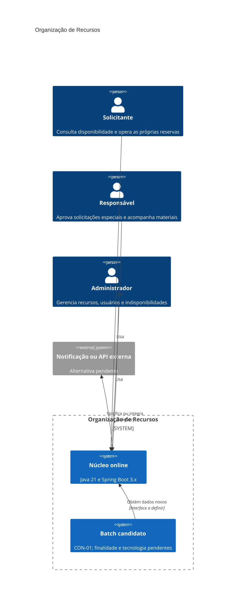
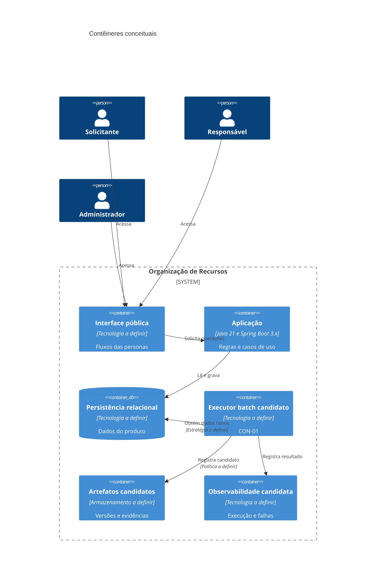
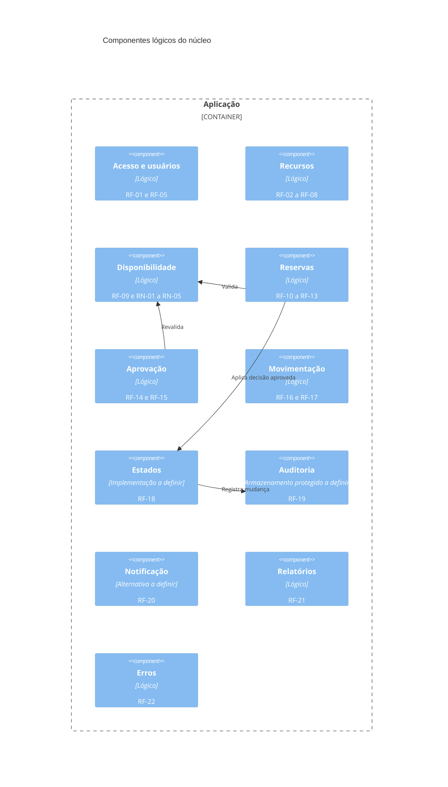
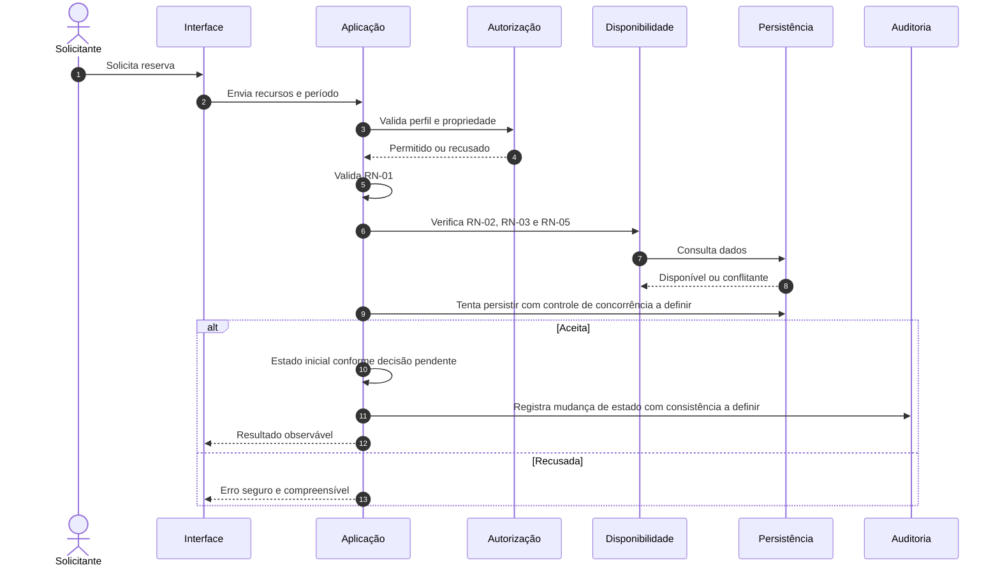
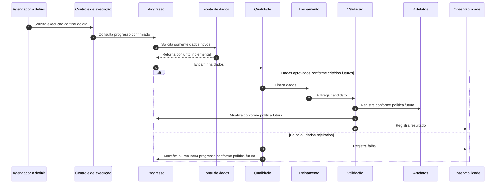

# Arquitetura: Organização de Recursos

> **Documento:** `docs/arquitetura.md`  
> **Status:** baseline arquitetural consolidada para aprovação da equipe  
> **Versão:** 2.1  
> **Data:** 2026-09-02  
> **Fontes oficiais:** `docs/prd.md`, `docs/fluxos-personas.md`, `docs/personas/solicitante.md`, `docs/personas/responsavel.md`, `docs/personas/administrador.md`  
> **Restrição adicional:** CON-01, cron job executado diariamente ao final do dia para treinar ou retreinar usando somente dados novos.

## 1. Governança do documento

1. O PRD, os fluxos e as personas são as fontes de verdade do produto.
2. Os únicos perfis oficiais são Solicitante, Responsável e Administrador.
3. CON-01 é uma restrição adicional do exercício arquitetural, ausente na baseline original do produto.
4. Tecnologias citadas como alternativas não são decisões aprovadas.
5. Lacunas de negócio permanecem `PENDENTE DE DECISÃO DA EQUIPE`.
6. Evidências descritas são esperadas e não executadas, salvo comprovação externa.
7. O projeto demonstrativo Foot Fanatics não fornece funcionalidades, entidades ou perfis ao produto avaliado.

### 1.1 Legenda de status

| Status | Significado |
|---|---|
| APROVADO NA BASELINE | Exigido por requisito ou regra oficial |
| PROPOSTO | Recomendação arquitetural sujeita à deliberação |
| PENDENTE DE DECISÃO DA EQUIPE | Exige decisão humana |
| PENDENTE DE EXPERIMENTO | Exige evidência técnica antes da escolha |
| CANDIDATO NÃO APROVADO | Alternativa possível ainda não escolhida |
| DECISÃO SEM REQUISITO | Escolha técnica sugerida sem imposição da fonte |
| BLOQUEADO | Não deve avançar antes da resolução de uma condição anterior |
| HIPÓTESE PENDENTE | Valor ou comportamento proposto para validação |
| EVIDÊNCIA NÃO EXECUTADA | Validação prevista sem resultado real registrado |

## 2. Contexto, objetivo e escopo

### 2.1 Contexto

O sistema organiza a alocação de salas, professores, materiais e equipamentos sem conflitos de horário, incluindo a agenda do professor, recursos restritos, bloqueios, manutenção, retiradas, devoluções e histórico.

**Origem:** `docs/prd.md`, seção 2; `docs/fluxos-personas.md`, seção 2.

### 2.2 Objetivo

Desenvolver e validar uma aplicação que organize recursos sem conflitos e produza evidências objetivas de qualidade, segurança, rastreabilidade e desempenho.

### 2.3 Escopo oficial

- E1: Acesso e Perfis.
- E2: Cadastro de Recursos.
- E3: Pesquisa e Disponibilidade.
- E4: Reservas e Agenda.
- E5: Aprovação de Recursos Restritos.
- E6: Manutenção e Bloqueios.
- E7: Retirada e Devolução.
- E8: Auditoria e Histórico.
- E9: Notificações e Integrações.
- E10: Relatórios.
- E11: Interface, Erros e Acessibilidade.
- E12: Documentação da API ou Fluxos Públicos.
- E13: Qualidade, Segurança, Desempenho e CI.

### 2.4 Fora do escopo

- funcionalidades do Foot Fanatics;
- perfis diferentes dos três oficiais;
- decisões de negócio não aprovadas;
- dados biográficos das personas;
- finalidade, algoritmo, features ou integração de ML não definidos em CON-01.

## 3. Stakeholders e personas

| Persona | Responsabilidade | Limites | Origem |
|---|---|---|---|
| Solicitante | Consulta disponibilidade e opera as próprias reservas | Não opera reservas alheias, não aprova recurso restrito e não administra cadastros | Persona Solicitante |
| Responsável | Aprova solicitações especiais, valida docentes e registra movimentações | Não administra cadastros e não aprova fora de sua responsabilidade | Persona Responsável |
| Administrador | Gerencia recursos, usuários, bloqueios, manutenção, relatórios e histórico autorizado | Não substitui o Responsável e não contorna regras críticas | Persona Administrador |

### 3.1 Professor como usuário e recurso

Professor-usuário pode atuar como Solicitante. Professor-recurso possui agenda sujeita à sobreposição. A relação cadastral entre essas representações permanece pendente.

### 3.2 Papel técnico do batch

Um papel técnico para acompanhar, validar ou promover artefatos pode ser necessário, mas não é persona oficial.

**Status:** CANDIDATO NÃO APROVADO.

## 4. Restrições e dependências

| Restrição | Origem | Status |
|---|---|---|
| Java 21 e Spring Boot 3.x | RNF-01 | APROVADO NA BASELINE |
| Cobertura de linhas >= 80% | RNF-02 | APROVADO NA BASELINE |
| Cobertura de branches >= 70% | RNF-03 | APROVADO NA BASELINE |
| Requisitos críticos rastreados = 100% | RN-10, RNF-04 | APROVADO NA BASELINE |
| Bugs críticos conhecidos = 0 | RNF-05 | APROVADO NA BASELINE |
| Vulnerabilidades críticas conhecidas = 0 | RNF-06, RNF-13 | APROVADO NA BASELINE |
| Persistência crítica com Testcontainers | RNF-07 | APROVADO NA BASELINE |
| Integração externa com WireMock, quando aplicável | RNF-08 | APROVADO NA BASELINE |
| Teste concorrente com exatamente uma reserva aceita | RNF-09 | APROVADO NA BASELINE |
| GitHub Actions em pull requests | RNF-12 | APROVADO NA BASELINE |
| SonarCloud | RNF-13 | APROVADO NA BASELINE |
| Medição de carga com JMeter | RNF-14 | APROVADO NA BASELINE; METAS PENDENTES |
| Mudança de estado gera auditoria | RN-09 | APROVADO NA BASELINE |
| Reserva iniciada não pode ser apagada | RN-08 | APROVADO NA BASELINE |
| Entrega na semana 46 | PRD, seção 5 | APROVADO NA BASELINE |

### 4.1 CON-01

CON-01 confirma exclusivamente:

- execução diária ao final do dia;
- treinamento ou retreinamento;
- uso somente de dados novos.

Propósito, dados, algoritmo, features, métricas, integração, tecnologia, promoção e rollback permanecem pendentes.

## 5. Requisitos arquiteturalmente significativos

| ID | Síntese | Impacto arquitetural |
|---|---|---|
| RN-01 | Término posterior ao início | Validação de domínio |
| RN-02 | Sem sobreposição do mesmo recurso | Consistência de reservas |
| RN-03 | Agenda do professor participa da sobreposição | Modelagem de agenda |
| RN-04 | Exatamente uma reserva aceita sob concorrência | Controle de concorrência e integridade |
| RN-05 | Recurso em manutenção não pode ser reservado | Disponibilidade |
| RN-06 | Somente Responsável aprova recurso restrito | Autorização contextual |
| RN-07 | Estados oficiais | Ciclo de vida |
| RN-08 | Reserva iniciada não pode ser apagada | Preservação do registro |
| RN-09 | Mudança de estado gera auditoria | Consistência entre estado e registro de auditoria |
| RN-10 | Rastreabilidade crítica | Governança de qualidade |

RFs significativos: RF-01, RF-05, RF-09 a RF-15 e RF-18 a RF-23.  
RNFs significativos: RNF-01 a RNF-18, com destaque para RNF-07, RNF-09, RNF-14 e RNF-15.

## 6. Atributos de qualidade

| Atributo | Origem | Evidência esperada | Pendência |
|---|---|---|---|
| Consistência | RN-01 a RN-05 | Testes unitários, integração e concorrência | Mecanismo técnico |
| Segurança | RF-01, RN-06, RNF-06, RNF-15 | Testes positivos/negativos e SonarCloud | Autenticação e sessão |
| Auditabilidade | RN-09, RN-10, RF-19 | Histórico e matriz de rastreabilidade | Campos, retenção e imutabilidade completa |
| Testabilidade | RNF-07 a RNF-11 | JUnit, API, E2E, Testcontainers e WireMock | Quantidades adicionais |
| Confiabilidade | RNF-05, RNF-07, RNF-09 | Testes de falha e concorrência | Técnicas específicas |
| Desempenho | RNF-14 | Relatório JMeter | Carga, percentis, erro e duração |
| Usabilidade | RF-22, RNF-16, RNF-17 | E2E e inspeção | Viewports e acessibilidade |
| Manutenibilidade | RNF-01, RNF-13 | Build e análise estática | Limites modulares |
| Operabilidade batch | CON-01 | Execução e recuperação observáveis | Políticas do pipeline |
| Privacidade | RNF-06, RNF-15, CON-01 | Inventário e controles LGPD | Dados e base legal |
| Custo | CON-01 | Medição de execução, armazenamento e retenção | Volume e orçamento |

## 7. Drivers priorizados

| Prioridade | Driver | Origem |
|---|---|---|
| 1 | Evitar sobreposição | RN-02, RN-03 |
| 1 | Aceitar exatamente uma reserva simultânea | RN-04, RF-13, RNF-09 |
| 1 | Impedir reserva em manutenção | RN-05 |
| 1 | Autorizar por perfil, propriedade e responsabilidade | RF-01, RN-06, personas |
| 1 | Auditar toda mudança de estado | RN-09, RF-19 |
| 2 | Preservar ciclo de vida oficial | RN-07, RN-08 |
| 2 | Validar persistência e concorrência em ambiente realista | RNF-07, RNF-09 |
| 2 | Executar CON-01 sem inventar finalidade | CON-01 |
| 2 | Recuperar falhas e impedir jobs incompatíveis sobrepostos | CON-01 |
| 3 | Tratar erros com segurança | RF-22, RNF-15, RNF-17 |
| 3 | Medir desempenho sem inventar metas | RNF-14 |
| 3 | Produzir documentação e rastreabilidade | RF-23, RNF-04, RNF-18 |
| 3 | Proteger dados e artefatos | RNF-06, RNF-15, LGPD |

## 8. Glossário

| Termo | Definição |
|---|---|
| Recurso | Sala, professor, material ou equipamento alocável |
| Reserva | Solicitação de alocação em um período |
| Sobreposição | Interseção de períodos do mesmo recurso |
| Dupla reserva | Mais de uma reserva aceita no mesmo recurso e período concorrente |
| Recurso restrito | Recurso que exige aprovação, com critério ainda pendente |
| Auditoria | Registro de mudança de estado protegido contra alteração operacional; política completa pendente |
| Dados novos | Dados ainda não processados pelo batch, conforme critério pendente |
| Checkpoint/watermark | Alternativas para registrar progresso incremental |
| Artefato candidato | Resultado de treinamento ainda não utilizado |
| Gate | Critério de aprovação de dados ou candidato, ainda pendente |
| Registry | Alternativa de governança e versionamento de artefatos, não obrigatória |

## 9. Fatos, lacunas, tensões e suposições

### 9.1 Fatos

- Java 21 e Spring Boot 3.x.
- Três perfis oficiais e sete estados oficiais.
- Exatamente uma reserva aceita sob concorrência.
- Recursos em manutenção não podem ser reservados.
- Mudanças de estado devem gerar auditoria.
- CON-01 executa diariamente ao final do dia e usa somente dados novos.

### 9.2 Lacunas

- estado inicial e ocupação de reserva não restrita;
- transições e atores não definidos;
- recurso restrito e responsabilidade exata;
- professor-usuário versus professor-recurso;
- bloqueio versus manutenção;
- auditoria, notificação, relatórios, desempenho e acessibilidade;
- finalidade e definições técnicas de CON-01 além dos fatos confirmados.

### 9.3 Tensões

- CON-01 está fora do escopo original E1 a E13.
- RN-05 formaliza manutenção, enquanto os fluxos também tratam bloqueio.
- RN-04 define resultado, não mecanismo.
- RN-09 cobre estado da reserva, não todo evento técnico.

### 9.4 Suposições não aprovadas

Não se presume banco, cache, scheduler, IdP, réplica, lock, microserviços, finalidade do modelo, ausência de dados pessoais, promoção ou rollback automáticos.

## 10. Riscos iniciais

| ID | Risco | Severidade preliminar | Origem |
|---|---|---|---|
| R1 | Dupla reserva | Crítica | RN-04, FLX-06 |
| R2 | Sobreposição docente | Crítica | RN-03 |
| R3 | Reserva em indisponibilidade | Crítica | RN-05 |
| R4 | Aprovação indevida | Crítica | RN-06 |
| R5 | IDOR | Alta | FLX-08/09 |
| R6 | Exclusão de reserva iniciada | Alta | RN-08 |
| R7 | Estado sem auditoria | Alta | RN-09 |
| R8 | Movimentação inconsistente | Média | RF-16, RF-17 |
| R9 | Falha externa afetar operação | Média | RF-20 |
| R10 | Erro expor detalhes | Alta | RNF-15, RNF-17 |
| R11 | CON-01 sem propósito | Alta | CON-01 |
| R12 | Dados pessoais sem governança | Alta | CON-01, LGPD |
| R13 | Job sobreposto ou reprocessamento inconsistente | Alta | CON-01 |
| R14 | Candidato inadequado utilizado | Alta | CON-01 |

## 11. Abordagem arquitetural do núcleo

Recomenda-se um **monólito modular Spring Boot** como decisão candidata, evitando complexidade distribuída sem requisito ou evidência de escala.

Módulos lógicos candidatos:

- `identity`;
- `resources`;
- `availability`;
- `reservations`;
- `approvals`;
- `inventory`;
- `audit`;
- `notifications`;
- `reports`;
- `shared`.

Controllers cuidam de requisição, validação inicial, resposta e redirecionamento. Services concentram regras, autorização contextual e transações. Repositories tratam persistência. DTOs controlam contratos públicos e exposição de dados.

## 12. Decisões de domínio pendentes

1. Estado inicial da reserva não restrita.
2. Ocupação produzida por `SOLICITADA`.
3. Estados que permitem alteração e cancelamento.
4. Atores de `EM_USO`, `CONCLUIDA` e `NAO_COMPARECEU`.
5. Liberação de recursos.
6. Nova aprovação ou validação após alteração.
7. Relação entre devolução e conclusão.
8. Critério de recurso restrito.
9. Reserva afetada por manutenção ou bloqueio.
10. Política de auditoria, relatórios e notificações.

## 13. Responsabilidades, limites e interfaces

### 13.1 Núcleo online e batch

| Aspecto | Núcleo online | Batch CON-01 |
|---|---|---|
| Finalidade | Atender E1 a E13 | Treinar ou retreinar diariamente com dados novos |
| Origem | PRD e fluxos | Restrição adicional |
| Consistência | RN-01 a RN-09 | Progresso e idempotência a definir |
| Tecnologia | Java 21 e Spring Boot 3.x | A definir |
| Integração | Fluxos das personas | Relação com o núcleo pendente |

A separação do batch do caminho crítico online é decisão candidata, não requisito.

### 13.2 Interfaces confirmadas

- autenticação e autorização;
- consulta de recursos;
- pesquisa de disponibilidade;
- criação, alteração e cancelamento de reservas;
- aprovação e validação docente;
- retirada e devolução;
- consulta de histórico;
- notificação simulada ou integração externa;
- relatórios.

Protocolos, rotas, payloads, mecanismos de sessão e códigos HTTP permanecem a definir.

### 13.3 Necessidades conceituais do batch

- fonte autorizada;
- definição de dados novos;
- controle de progresso;
- prevenção de sobreposição;
- recuperação;
- qualidade e linhagem;
- treinamento e validação;
- versionamento, quando necessário;
- observabilidade;
- segurança, LGPD e custo.

## 14. Diagramas C4

### 14.1 Contexto

### 14.2 Contêineres

### 14.3 Componentes do núcleo

### 14.4 Componentes conceituais do batch

## 15. Sequências críticas

### 15.1 Reserva online

### 15.2 Batch

## 16. Análise de CON-01

| Tema | Necessidade | Alternativas | Trade-off | Status |
|---|---|---|---|---|
| Dados novos | Identificar não processados | timestamp, ID, versão, log | Simplicidade versus precisão | PENDENTE DE DECISÃO |
| Checkpoint | Registrar progresso | tabela, metadado, eventos | Consistência versus complexidade | PENDENTE DE EXPERIMENTO |
| Idempotência | Evitar efeito duplicado | chave, deduplicação, escrita condicional | Armazenamento versus segurança | PENDENTE DE EXPERIMENTO |
| Jobs sobrepostos | Coordenar execuções | banco, scheduler, coordenação externa | Infraestrutura versus isolamento | PENDENTE DE EXPERIMENTO |
| Retry | Recuperar falhas | execução total ou por etapa | Simplicidade versus velocidade | PENDENTE DE DECISÃO |
| Qualidade | Validar dados | esquema, integridade, completude, distribuição | Confiança versus custo | BLOQUEADO PELO DATASET |
| Linhagem | Relacionar fonte, execução e artefato | metadados, catálogo, logs | Auditabilidade versus manutenção | PENDENTE |
| Reprodutibilidade | Registrar código, dados, configuração e ambiente | metadados mínimos a definir | Explicabilidade versus retenção | PENDENTE |
| Validação | Avaliar candidato | conjunto de validação, referência, revisão humana | Automação versus controle | BLOQUEADO PELA FINALIDADE |
| Gates | Impedir candidato inadequado | critérios de dados e modelo | Confiança versus custo | BLOQUEADO PELA FINALIDADE |
| Versionamento | Distinguir candidatos | ID, metadados, armazenamento versionado | Recuperação versus custo | PENDENTE |
| Promoção | Tornar candidato utilizável | manual, automática, múltiplas etapas | Agilidade versus governança | BLOQUEADO |
| Rollback | Retornar à versão anterior | reapontamento, restauração, nova promoção | Rapidez versus complexidade | BLOQUEADO |
| Observabilidade | Tornar execução visível | logs, métricas, alertas | Diagnóstico versus custo | PENDENTE |
| LGPD | Proteger dados | minimização, autorização, retenção, pseudonimização | Proteção versus restrição | BLOQUEADO |
| Custos | Medir execução e retenção | compartilhado, dedicado, sob demanda | Custo versus isolamento | PENDENTE |

A análise LGPD deve definir inventário, finalidade, base legal, minimização, acesso, retenção, descarte e tratamento de identificadores. Identificadores não são presumidos anônimos.

Não estão aprovados: exactly-once, determinismo binário, hash estável, threshold padrão, quantidade de retries, rollback automático, réplica, serverless, prazo máximo ou integração online.

## 17. Matriz de decisões

| ID | Decisão ou necessidade | Origem | Classificação | Status |
|---|---|---|---|---|
| J1 | Separar online e batch | CON-01 | Candidata | PENDENTE DE DECISÃO |
| J2 | Definir fonte autorizada | CON-01 | Necessidade | PENDENTE DE DECISÃO |
| J3 | Definir dados novos | CON-01 | Necessidade | PENDENTE DE DECISÃO |
| J4 | Registrar progresso | CON-01 | Candidata | PENDENTE DE EXPERIMENTO |
| J5 | Impedir jobs sobrepostos | CON-01 | Candidata | PENDENTE DE EXPERIMENTO |
| J6 | Preservar metadados | CON-01 | Candidata | PENDENTE DE DECISÃO |
| J7 | Definir versão, promoção e rollback | CON-01 | Candidata | BLOQUEADO PELA FINALIDADE |
| J8 | Definir métricas e gates | CON-01 | Necessidade | BLOQUEADO PELA FINALIDADE |
| J9 | Definir observabilidade e recuperação | CON-01 | Candidata | PENDENTE DE DECISÃO |
| J10 | Erros seguros | RF-22, RNF-15, RNF-17 | Requisito | APROVADO NA BASELINE |
| J11 | Autorização no back-end | RF-01, RN-06 | Requisito | APROVADO NA BASELINE |
| J12 | Exatamente uma reserva sob concorrência | RN-04, RNF-09 | Resultado obrigatório | RESULTADO APROVADO NA BASELINE; MECANISMO PENDENTE DE DECISÃO |
| J13 | Auditar toda mudança de estado | RN-09 | Requisito | APROVADO NA BASELINE; MECANISMO DE CONSISTÊNCIA PENDENTE |
| J14 | Cache de disponibilidade | RNF-14 sem meta | Alternativa | CANDIDATO NÃO APROVADO |
| J15 | Notificação simulada ou externa | RF-20 | Alternativa oficial | PENDENTE DE DECISÃO |
| J16 | Metadados e reprodutibilidade batch | CON-01 | Candidata | PENDENTE DE DECISÃO |

Alternativas para J12: constraint, isolamento transacional, lock pessimista, controle otimista, slots ou outra técnica comprovada. Nenhuma está aprovada.

## 18. Riscos não resolvidos

| ID | Risco | Tratamento |
|---|---|---|
| R16 | CON-01 sem finalidade | Decisão humana |
| R17 | Metas de desempenho ausentes | Definir antes do aceite |
| R18 | Acessibilidade sem critérios | Definir cenários |
| R19 | Dados pessoais sem análise | Bloquear uso |
| R20 | Concorrência inadequada | Comparar e testar |
| R21 | Jobs sobrepostos | Definir coordenação |
| R22 | Falha parcial avançar progresso | Definir checkpoint |
| R23 | Candidato pior utilizado | Definir gates e rollback |
| R24 | Complexidade prematura | Experimentar antes de adotar |
| R25 | Cron sem valor demonstrável | Definir finalidade |

## 19. Checklist de consistência

- [x] Três perfis oficiais.
- [x] CON-01 separada do PRD.
- [x] Estado inicial pendente.
- [x] RN-04 define resultado, não mecanismo.
- [x] RN-08, RN-09 e RN-10 não justificam governança de modelos.
- [x] RNF-07 não exige réplica.
- [x] Tecnologias aparecem como alternativas.
- [x] LGPD não presume ausência de dados pessoais.
- [x] Semana 46 é prazo acadêmico.
- [x] Nenhuma evidência foi declarada executada.

## 20. Experimentos preparatórios

| Experimento | Objetivo | Evidência esperada | Status |
|---|---|---|---|
| Concorrência | Comparar alternativas para RN-04 | Testcontainers | NÃO EXECUTADO |
| Dados novos | Comparar critérios incrementais | Omissão e duplicação | NÃO EXECUTADO |
| Falha parcial | Avaliar checkpoint | Progresso consistente | NÃO EXECUTADO |
| Job sobreposto | Avaliar exclusão | Uma execução efetiva | NÃO EXECUTADO |
| Candidato pior | Avaliar gates | Não promoção | BLOQUEADO |
| Rollback | Avaliar recuperação | Restauração rastreável | BLOQUEADO |
| LGPD | Validar finalidade e minimização | Inventário | NÃO EXECUTADO |
| Custo | Medir execução e retenção | Relatório | NÃO EXECUTADO |

## 21. Avaliação ATAM independente

### 21.1 Propósito, escopo e independência

Esta avaliação aplica o método ATAM à arquitetura. A análise não altera requisitos, não aprova tecnologias pendentes e não trata hipóteses como fatos.

**Fontes avaliadas:** `docs/prd.md`, `docs/fluxos-personas.md`, personas oficiais, seções anteriores de `docs/arquitetura.md` e CON-01.

### 21.2 Participantes conceituais

A avaliação considera perspectivas de arquitetura, domínio, dados/ML, segurança/LGPD, operações/SRE, custos, qualidade e facilitação ATAM. Esses papéis não são personas do produto.

### 21.3 Drivers ATAM

| Prioridade | Driver | Origem | Justificativa |
|---|---|---|---|
| 1 | Exatamente uma reserva aceita | RN-04, RF-13, RNF-09 | Integridade central |
| 1 | Ausência de sobreposição | RN-02, RN-03 | Finalidade central |
| 1 | Autorização contextual | RF-01, RN-06, RNF-15 | Segurança e IDOR |
| 1 | Coerência estado-auditoria | RN-09, RF-19 | Rastreabilidade obrigatória |
| 2 | Indisponibilidade | RN-05, RF-06, RF-07 | Controle operacional |
| 2 | Ciclo de vida | RN-07, RN-08 | Integridade histórica |
| 2 | Execução diária incremental | CON-01 | Restrição adicional |
| 2 | Recuperação e jobs sobrepostos | CON-01 | Consistência batch |
| 3 | Erros seguros | RF-22, RNF-15, RNF-17 | Segurança e usabilidade |
| 3 | Evidências de qualidade | RNF-02 a RNF-13 | Aceitação e rastreabilidade |
| 3 | Desempenho medido | RNF-14 | Metas pendentes |
| 3 | LGPD | RNF-06, RNF-15, CON-01 | Dados ainda não inventariados |

### 21.4 Atributos prioritários

| Atributo | Prioridade | Critério |
|---|---|---|
| Consistência e integridade | Muito alta | Não aceitar reservas inválidas |
| Segurança | Muito alta | Impedir ações e exposições indevidas |
| Auditabilidade | Muito alta | Relacionar mudança e evidência |
| Confiabilidade | Alta | Comportamento previsível sob falha |
| Recuperabilidade | Alta | Retomar sem perda silenciosa |
| Operabilidade | Alta | Detectar execução e falha |
| Qualidade de dados | Alta | Impedir uso de dados inadequados |
| Privacidade | Alta | Limitar dados à finalidade |
| Testabilidade | Alta | Permitir evidência automatizada |
| Desempenho | Média | Medir segundo plano aprovado |
| Manutenibilidade | Média | Concentrar mudanças |
| Custo | Média | Evitar infraestrutura desproporcional |

## 22. Utility tree

| Atributo | Refinamento | Cenário | Importância | Dificuldade | Origem |
|---|---|---|---|---|---|
| Consistência | Concorrência | ATAM-01 | Alta | Alta | RN-04 |
| Consistência | Agenda docente | ATAM-02 | Alta | Média | RN-03 |
| Segurança | Autorização contextual | ATAM-03 | Alta | Alta | RF-01, RN-06 |
| Auditabilidade | Falha estado-auditoria | ATAM-04 | Alta | Alta | RN-09 |
| Disponibilidade | Manutenção/bloqueio | ATAM-05 | Alta | Média | RN-05 |
| Operabilidade batch | Execução diária | ATAM-06 | Alta | Média | CON-01 |
| Consistência batch | Dados novos | ATAM-07 | Alta | Alta | CON-01 |
| Recuperabilidade | Falha parcial | ATAM-08 | Alta | Alta | CON-01 |
| Operabilidade | Jobs sobrepostos | ATAM-09 | Alta | Alta | CON-01 |
| Qualidade de dados | Degradação | ATAM-10 | Alta | Alta | CON-01 |
| Confiabilidade ML | Candidato pior | ATAM-11 | Alta | Alta | CON-01 |
| Recuperabilidade ML | Rollback | ATAM-12 | Alta | Alta | CON-01 |
| Disponibilidade | Falha externa | ATAM-13 | Média | Média | RF-20 |
| Privacidade | Vazamento | ATAM-14 | Alta | Alta | RNF-06, RNF-15 |
| Desempenho | Carga | ATAM-15 | Média | Alta | RNF-14 |
| Manutenibilidade | Política de estados | ATAM-16 | Média | Média | RN-07 |
| Confiabilidade | Movimentação | ATAM-17 | Média | Média | RF-16, RF-17 |
| Operabilidade | Ausência de dados novos | ATAM-18 | Média | Média | CON-01 |

## 23. Cenários de atributos de qualidade

### ATAM-01: Duas solicitações simultâneas

- **Fonte:** dois Solicitantes autenticados.
- **Estímulo:** enviam simultaneamente o mesmo recurso e período.
- **Ambiente:** operação normal com persistência disponível.
- **Artefato:** reserva, disponibilidade, concorrência e persistência.
- **Resposta:** exatamente uma solicitação é aceita e a outra recusada, sem dados parciais.
- **Métrica:** exatamente 1 aceita e 0 conflitos persistidos.
- **Origem:** RN-04, RF-10, RF-13, RNF-09, FLX-06.
- **Importância:** alta.
- **Dificuldade:** alta.
- **Decisões relacionadas:** J12.

### ATAM-02: Conflito somente na agenda do professor

- **Fonte:** Solicitante.
- **Estímulo:** tenta reservar recursos livres com professor ocupado.
- **Ambiente:** operação normal.
- **Artefato:** pesquisa, disponibilidade, agenda e criação.
- **Resposta:** indisponibilidade ou recusa na confirmação.
- **Métrica:** 0 reservas aceitas com sobreposição docente.
- **Origem:** RN-03, RF-09, RF-13, FLX-04/05.
- **Importância:** alta.
- **Dificuldade:** média.
- **Decisões relacionadas:** J12 e revalidação.

### ATAM-03: Acesso indevido por perfil ou objeto

- **Fonte:** usuário sem permissão, propriedade ou responsabilidade.
- **Estímulo:** acessa diretamente operação ou objeto.
- **Ambiente:** operação normal.
- **Artefato:** autenticação, autorização e caso de uso.
- **Resposta:** recusa no back-end sem alteração ou exposição.
- **Métrica:** 0 operações indevidas aceitas.
- **Origem:** RF-01, RN-06, RNF-15, FLX-01/07/08/09.
- **Importância:** alta.
- **Dificuldade:** alta.
- **Decisões relacionadas:** J11.

### ATAM-04: Falha entre estado e auditoria

- **Fonte:** falha de persistência ou dependência.
- **Estímulo:** ocorre entre a validação da transição e a auditoria.
- **Ambiente:** degradação parcial.
- **Artefato:** estados, persistência e auditoria.
- **Resposta:** não existe estado efetivado sem auditoria correspondente.
- **Métrica:** 0 mudanças de estado sem auditoria.
- **Origem:** RN-09, RF-18, RF-19, RNF-07.
- **Importância:** alta.
- **Dificuldade:** alta.
- **Decisões relacionadas:** J13.

### ATAM-05: Recurso em manutenção ou bloqueio

- **Fonte:** Administrador e Solicitante.
- **Estímulo:** indisponibilidade coincide com a reserva.
- **Ambiente:** operação normal.
- **Artefato:** indisponibilidade, pesquisa e criação.
- **Resposta:** recurso não reservável; reservas existentes seguem política pendente.
- **Métrica:** 0 reservas novas durante manutenção.
- **Origem:** RN-05, RF-06, RF-07, FLX-16/17.
- **Importância:** alta.
- **Dificuldade:** média.
- **Decisões relacionadas:** política de indisponibilidade.

### ATAM-06: Execução diária

- **Fonte:** agendador batch.
- **Estímulo:** chega o horário aprovado ao final do dia.
- **Ambiente:** operação normal.
- **Artefato:** agendamento, controle e pipeline.
- **Resposta:** execução controlada é iniciada e fica observável.
- **Métrica:** HIPÓTESE PENDENTE: uma execução por ciclo aprovado.
- **Origem:** CON-01.
- **Importância:** alta.
- **Dificuldade:** média.
- **Decisões relacionadas:** J1, J5, J9.

### ATAM-07: Processamento somente de dados novos

- **Fonte:** executor batch.
- **Estímulo:** solicita o conjunto incremental.
- **Ambiente:** inclusões e atualizações tardias.
- **Artefato:** fonte, incrementalidade e checkpoint.
- **Resposta:** somente dados classificados como novos são processados.
- **Métrica:** HIPÓTESE PENDENTE: 0 omissões e 0 reclassificações indevidas.
- **Origem:** CON-01, J2, J3, J4.
- **Importância:** alta.
- **Dificuldade:** alta.
- **Decisões relacionadas:** J2, J3, J4.

### ATAM-08: Falha parcial do batch

- **Fonte:** falha de etapa ou dependência.
- **Estímulo:** ocorre após processamento parcial.
- **Ambiente:** execução diária.
- **Artefato:** progresso, extração, treinamento e artefato.
- **Resposta:** sem perda silenciosa; progresso mantido ou recuperado.
- **Métrica:** HIPÓTESE PENDENTE: 0 omissões/duplicações após recuperação.
- **Origem:** CON-01, J3, J4, J9.
- **Importância:** alta.
- **Dificuldade:** alta.
- **Decisões relacionadas:** J4, J9.

### ATAM-09: Jobs sobrepostos

- **Fonte:** agendador ou retomada.
- **Estímulo:** nova execução começa durante outra ativa.
- **Ambiente:** operação ou recuperação.
- **Artefato:** agendamento e coordenação.
- **Resposta:** uma execução incompatível por intervalo ou coordenação equivalente.
- **Métrica:** HIPÓTESE PENDENTE: uma execução efetiva por intervalo incompatível.
- **Origem:** CON-01, J5.
- **Importância:** alta.
- **Dificuldade:** alta.
- **Decisões relacionadas:** J5.

### ATAM-10: Degradação dos dados

- **Fonte:** origem ou erro operacional.
- **Estímulo:** dados chegam inválidos, incompatíveis ou degradados.
- **Ambiente:** execução diária.
- **Artefato:** extração, qualidade, linhagem e treino.
- **Resposta:** conjunto inadequado não é usado e progresso não avança indevidamente.
- **Métrica:** HIPÓTESE PENDENTE: critérios após finalidade e dataset.
- **Origem:** CON-01, J8, J9.
- **Importância:** alta.
- **Dificuldade:** alta.
- **Decisões relacionadas:** J8, J9.

### ATAM-11: Candidato pior

- **Fonte:** treinamento.
- **Estímulo:** candidato apresenta regressão.
- **Ambiente:** validação anterior ao uso.
- **Artefato:** validação, versionamento e promoção.
- **Resposta:** candidato não substitui referência válida.
- **Métrica:** HIPÓTESE PENDENTE: métricas dependem do propósito.
- **Origem:** CON-01, J7, J8.
- **Importância:** alta.
- **Dificuldade:** alta.
- **Decisões relacionadas:** J7, J8.

### ATAM-12: Rollback

- **Fonte:** responsável técnico candidato ou observabilidade.
- **Estímulo:** versão utilizada apresenta regressão.
- **Ambiente:** após promoção, se houver uso.
- **Artefato:** versionamento e política de uso.
- **Resposta:** versão anterior restaurada com rastreabilidade.
- **Métrica:** HIPÓTESE PENDENTE: restauração sem perda; tempo não definido.
- **Origem:** CON-01, J7.
- **Importância:** alta.
- **Dificuldade:** alta.
- **Decisões relacionadas:** J7.

### ATAM-13: Indisponibilidade externa

- **Fonte:** serviço externo, caso escolhido.
- **Estímulo:** timeout, indisponibilidade ou resposta inválida.
- **Ambiente:** reserva ou aprovação.
- **Artefato:** integração RF-20.
- **Resposta:** falha segura, observável e sem corromper operação principal.
- **Métrica:** 0 operações principais corrompidas nos cenários WireMock.
- **Origem:** RF-20, RNF-08, FLX-19.
- **Importância:** média.
- **Dificuldade:** média.
- **Decisões relacionadas:** J15.

### ATAM-14: Vazamento de dados

- **Fonte:** usuário, log, erro, integração, dataset ou artefato.
- **Estímulo:** tentativa de acesso ou exposição indevida.
- **Ambiente:** operação, falha ou diagnóstico.
- **Artefato:** APIs, logs, auditoria, datasets e artefatos.
- **Resposta:** acesso recusado e dados protegidos; batch bloqueado sem LGPD.
- **Métrica:** 0 exposições conhecidas; métricas adicionais pendentes.
- **Origem:** RNF-06, RNF-15, FLX-21, CON-01.
- **Importância:** alta.
- **Dificuldade:** alta.
- **Decisões relacionadas:** J2, J6, J16.

### ATAM-15: Operação sob carga

- **Fonte:** usuários simultâneos.
- **Estímulo:** aumento de consultas, reservas e relatórios.
- **Ambiente:** plano JMeter aprovado.
- **Artefato:** interface, aplicação e persistência.
- **Resposta:** comportamento funcional e seguro dentro das metas aprovadas.
- **Métrica:** HIPÓTESE PENDENTE: carga, percentis, erro e duração.
- **Origem:** RNF-14.
- **Importância:** média.
- **Dificuldade:** alta.
- **Decisões relacionadas:** J14 e concorrência.

### ATAM-16: Alteração da política de estados

- **Fonte:** equipe do produto.
- **Estímulo:** aprova novas transições, atores ou condições.
- **Ambiente:** evolução planejada.
- **Artefato:** estados, autorização, auditoria, documentação e testes.
- **Resposta:** mudança concentrada, rastreável e validada.
- **Métrica:** HIPÓTESE PENDENTE: módulos afetados e regressão.
- **Origem:** RN-07, RF-18.
- **Importância:** média.
- **Dificuldade:** média.
- **Decisões relacionadas:** política de estados.

### ATAM-17: Movimentação inconsistente

- **Fonte:** Responsável ou falha de persistência.
- **Estímulo:** devolução sem retirada, duplicação ou falha parcial.
- **Ambiente:** operação ou degradação.
- **Artefato:** retirada, devolução, reserva e persistência.
- **Resposta:** operação inválida recusada e vínculos consistentes.
- **Métrica:** 0 devoluções sem retirada correspondente.
- **Origem:** RF-16, RF-17, FLX-11/12.
- **Importância:** média.
- **Dificuldade:** média.
- **Decisões relacionadas:** política de movimentação.

### ATAM-18: Execução sem dados novos

- **Fonte:** agendador batch.
- **Estímulo:** inicia ciclo sem dados novos.
- **Ambiente:** operação normal.
- **Artefato:** incrementalidade, treino e observabilidade.
- **Resposta:** comportamento explícito sem reutilizar dados antigos.
- **Métrica:** HIPÓTESE PENDENTE: 0 antigos classificados como novos.
- **Origem:** CON-01.
- **Importância:** média.
- **Dificuldade:** média.
- **Decisões relacionadas:** J3, J4, J9.

## 24. Abordagens arquiteturais avaliadas

| ID | Abordagem | Benefícios | Limitações | Status |
|---|---|---|---|---|
| AB-01 | Monólito modular | Simplicidade e separação lógica | Exige disciplina de dependências | CANDIDATO NÃO APROVADO |
| AB-02 | Autorização por perfil e objeto | Proteção contextual | Mais regras e testes | NECESSIDADE DERIVADA |
| AB-03 | Revalidação na confirmação | Reduz janela de inconsistência | Maior custo por operação | PROPOSTO |
| AB-04 | Consistência estado-auditoria | Evita estado sem evidência | Mecanismo pode ser complexo | NECESSIDADE; MECANISMO PENDENTE |
| AB-05 | Concorrência no ponto de persistência | Protege RN-04 | Técnica e desempenho pendentes | RESULTADO OBRIGATÓRIO |
| AB-06 | Separação lógica do batch | Isola falhas | Introduz coordenação | CANDIDATO NÃO APROVADO |
| AB-07 | Checkpoint incremental | Permite retomada | Pode omitir atualizações se mal definido | PENDENTE DE EXPERIMENTO |
| AB-08 | Exclusão de jobs | Evita conflito batch | Pode exigir infraestrutura | PENDENTE DE EXPERIMENTO |
| AB-09 | Gate antes da promoção | Evita candidato inadequado | Depende de finalidade/métricas | BLOQUEADO |
| AB-10 | Versionamento e rollback | Permite recuperação | Custo e governança | BLOQUEADO/PENDENTE |
| AB-11 | Observabilidade batch | Diagnóstico | Custo e privacidade | PROPOSTO |
| AB-12 | Minimização e governança | Reduz exposição | Pode limitar dataset | OBRIGAÇÃO ANTES DO USO |

## 25. Pontos de sensibilidade

| ID | Ponto | Efeito | Cenários | Decisões |
|---|---|---|---|---|
| PS-01 | Fronteira transacional | Dupla reserva ou auditoria inconsistente | ATAM-01/04 | J12, J13 |
| PS-02 | Momento da revalidação | Reserva baseada em dado desatualizado | ATAM-01/02/05 | AB-03 |
| PS-03 | Ocupação por `SOLICITADA` | Altera concorrência | ATAM-01/05/16 | Decisão de domínio |
| PS-04 | Autorização por objeto | IDOR | ATAM-03 | J11 |
| PS-05 | Acoplamento externo | Propagação de falha | ATAM-13 | J15 |
| PS-06 | Dados novos/checkpoint | Omissão ou duplicação | ATAM-07/08/18 | J3, J4 |
| PS-07 | Jobs sobrepostos | Artefatos conflitantes | ATAM-09 | J5 |
| PS-08 | Qualidade dos dados | Treino inadequado | ATAM-10 | J8 |
| PS-09 | Métricas e promoção | Candidato pior utilizado | ATAM-11/12 | J7, J8 |
| PS-10 | Logs e datasets | Vazamento | ATAM-14 | J6, J16 |
| PS-11 | Tecnologias candidatas | Custo/prazo | ATAM-06 a ATAM-15 | J1 a J9, J14 |

## 26. Trade-offs

| ID | Trade-off | Benefício | Custo/risco | Cenários | Decisões |
|---|---|---|---|---|---|
| TO-01 | Consistência versus desempenho | Evita dupla reserva | Contenção | ATAM-01/15 | J12 |
| TO-02 | Revalidação versus custo | Reduz desatualização | Mais consultas | ATAM-01/02/05 | AB-03 |
| TO-03 | Estado-auditoria versus simplicidade | Preserva histórico | Mecanismo mais complexo | ATAM-04 | J13 |
| TO-04 | Cache versus consistência | Menor latência | Invalidação | ATAM-01/02/05/15 | J14 |
| TO-05 | Síncrono versus desacoplado | Imediatismo ou isolamento | Latência/complexidade | ATAM-13 | J15 |
| TO-06 | Batch integrado versus separado | Menos componentes ou isolamento | Acoplamento/coordenação | ATAM-06/08/09 | J1, J9 |
| TO-07 | Checkpoint simples versus precisão | Rapidez | Atualizações tardias | ATAM-07/08/18 | J3, J4 |
| TO-08 | Validação ampla versus custo | Confiança | Duração | ATAM-10/11 | J8 |
| TO-09 | Promoção automática versus humana | Agilidade | Risco/esforço | ATAM-11/12 | J7, J8 |
| TO-10 | Retenção versus LGPD/custo | Reprodução | Exposição e armazenamento | ATAM-12/14 | J6, J7, J16 |
| TO-11 | Infraestrutura dedicada versus compartilhada | Isolamento | Custo | ATAM-06/09/15 | J1, J9 |
| TO-12 | Sofisticação versus prazo | Robustez futura | Desvio do essencial | Cenários batch | J1 a J9 |

## 27. Riscos arquiteturais

| ID | Risco | Cenários | Decisões | Prioridade |
|---|---|---|---|---|
| RA-01 | Técnica não garante RN-04 | ATAM-01 | J12 | Alta |
| RA-02 | Ausência de revalidação | ATAM-01/02/05 | AB-03 | Alta |
| RA-03 | Estado sem auditoria | ATAM-04 | J13 | Alta |
| RA-04 | Autorização somente por perfil | ATAM-03 | J11 | Alta |
| RA-05 | Estado inicial indefinido | ATAM-01/05/16 | Domínio | Alta |
| RA-06 | CON-01 sem finalidade | ATAM-06 a ATAM-12/18 | J1 a J9 | Alta |
| RA-07 | Omissão/duplicação incremental | ATAM-07/08/18 | J3, J4 | Alta |
| RA-08 | Jobs sobrepostos | ATAM-09 | J5 | Alta |
| RA-09 | Degradação não detectada | ATAM-10 | J8, J9 | Alta |
| RA-10 | Candidato pior promovido | ATAM-11 | J7, J8 | Alta |
| RA-11 | Rollback inviável | ATAM-12 | J7 | Alta |
| RA-12 | Dados pessoais sem governança | ATAM-14 | J2, J6, J16 | Alta |
| RA-13 | Falha externa propagada | ATAM-13 | J15 | Média |
| RA-14 | Movimentação inválida | ATAM-17 | Política pendente | Média |
| RA-15 | Infraestrutura excessiva | ATAM-06 a ATAM-15 | J1 a J9, J14 | Média |
| RA-16 | Metas inventadas | ATAM-10/11/15 | J8, J14 | Média |

## 28. Não-riscos

| ID | Não-risco condicionado | Justificativa |
|---|---|---|
| NR-01 | Java 21 e Spring Boot 3.x | Restrição oficial |
| NR-02 | Testcontainers | Alinhado ao risco de persistência |
| NR-03 | WireMock | Adequado a integração externa |
| NR-04 | Separação lógica | Não obriga distribuição |
| NR-05 | Métricas como hipóteses | Evita fatos inventados |
| NR-06 | CON-01 separada do PRD | Preserva fonte de verdade |
| NR-07 | Estado inicial pendente | Evita transição inventada |

## 29. Temas de risco

| Tema | Riscos | Cenários prioritários |
|---|---|---|
| Integridade transacional | RA-01, RA-02, RA-03, RA-05 | ATAM-01/02/04/05 |
| Segurança contextual | RA-04, RA-12, RA-13 | ATAM-03/13/14 |
| Governança de CON-01 | RA-06 a RA-11 | ATAM-06 a ATAM-12/18 |
| Operação e recuperação | RA-07, RA-08, RA-09, RA-11 | ATAM-07 a ATAM-12 |
| Complexidade prematura | RA-15, RA-16 | ATAM-15 e batch |

## 30. Matriz integrada ATAM

| Cenário | Atributo | Decisão | Sensibilidade | Trade-off | Risco |
|---|---|---|---|---|---|
| ATAM-01 | Consistência | J12 | PS-01/02/03 | TO-01/02 | RA-01/02/05 |
| ATAM-02 | Consistência | AB-03 | PS-02 | TO-02/04 | RA-02 |
| ATAM-03 | Segurança | J11 | PS-04 | Proteção versus custo | RA-04 |
| ATAM-04 | Auditabilidade | J13 | PS-01 | TO-03 | RA-03 |
| ATAM-05 | Disponibilidade | Política pendente | PS-02/03 | TO-02/04 | RA-02/05 |
| ATAM-06 | Operabilidade | J1/J5/J9 | PS-07/11 | TO-06/11/12 | RA-06/15 |
| ATAM-07 | Consistência batch | J2/J3/J4 | PS-06 | TO-07 | RA-07 |
| ATAM-08 | Recuperabilidade | J4/J9 | PS-06 | TO-06/07 | RA-07 |
| ATAM-09 | Operabilidade | J5 | PS-07 | TO-06/11 | RA-08 |
| ATAM-10 | Qualidade de dados | J8/J9 | PS-08 | TO-08 | RA-09/16 |
| ATAM-11 | Confiabilidade ML | J7/J8 | PS-09 | TO-08/09 | RA-10/16 |
| ATAM-12 | Recuperabilidade ML | J7 | PS-09 | TO-09/10 | RA-11 |
| ATAM-13 | Disponibilidade | J15 | PS-05 | TO-05 | RA-13 |
| ATAM-14 | Privacidade | J2/J6/J16 | PS-10 | TO-10 | RA-12 |
| ATAM-15 | Desempenho | J14 | PS-01/11 | TO-01/04/11 | RA-15/16 |
| ATAM-16 | Manutenibilidade | Política de estados | PS-03 | Flexibilidade versus complexidade | RA-05 |
| ATAM-17 | Confiabilidade | Política de movimentação | Vínculo operacional | Integridade versus flexibilidade | RA-14 |
| ATAM-18 | Operabilidade | J3/J4/J9 | PS-06 | TO-07 | RA-07 |

## 31. Recomendações e conclusão ATAM

### 31.1 Decisões bloqueantes

1. Estado inicial e ocupação da reserva não restrita.
2. Estratégia de concorrência que comprove RN-04.
3. Consistência entre mudança de estado e auditoria.
4. Critério de recurso restrito e responsabilidade do Responsável.
5. Propósito, dados e uso do resultado de CON-01.
6. Critério de dados novos, checkpoint e recuperação.
7. Inventário e decisão LGPD.
8. Métricas de validação e gates.

### 31.2 Experimentos prioritários

| Ordem | Experimento | Cenários | Evidência esperada |
|---|---|---|---|
| 1 | Concorrência | ATAM-01 | Exatamente uma aceita |
| 2 | Estado-auditoria | ATAM-04 | Nenhum estado sem auditoria |
| 3 | Autorização por objeto | ATAM-03 | IDOR recusado |
| 4 | Revalidação | ATAM-01/02/05 | Ausência de janela de conflito |
| 5 | Dados novos | ATAM-07/18 | Sem omissão/duplicação conforme hipótese |
| 6 | Falha parcial | ATAM-08 | Progresso consistente |
| 7 | Job sobreposto | ATAM-09 | Coordenação correta |
| 8 | Degradação | ATAM-10 | Bloqueio e observabilidade |
| 9 | Candidato pior e rollback | ATAM-11/12 | Não promoção e recuperação |
| 10 | Vazamento e LGPD | ATAM-14 | Controles após inventário |
| 11 | Carga | ATAM-15 | JMeter após metas aprovadas |

### 31.3 Resultado da avaliação ATAM

A avaliação ATAM identificou os principais drivers, atributos de qualidade, pontos de sensibilidade, trade-offs, riscos, não-riscos e temas de risco da arquitetura.

Os cenários de maior importância e dificuldade foram encaminhados ao painel multidisciplinar para revisão das abordagens arquiteturais e formalização das decisões candidatas.

A conclusão da avaliação não representa aprovação automática de tecnologias, aceitação de riscos ou comprovação de evidências ainda não executadas.

## 32. Revisão independente por painel multidisciplinar

### 32.1 Mandato, escopo e critérios

O painel revisa a coerência, a suficiência e os riscos da arquitetura sem modificar `docs/prd.md`, `docs/fluxos-personas.md`, as personas ou CON-01. A revisão utiliza `docs/arquitetura.md` como artefato arquitetural consolidado e considera as perspectivas de arquitetura de solução, dados/ML, segurança e LGPD, operações/SRE, custos e facilitação ATAM.

As conclusões seguem estas regras:

1. Requisito oficial não é substituído por preferência técnica.
2. Alternativa não é considerada decisão até possuir status explícito.
3. Métrica ausente permanece `HIPÓTESE PENDENTE DE DECISÃO DA EQUIPE`.
4. Decisão bloqueada por lacuna de negócio não deve ser implementada como definitiva.
5. Risco alto ou crítico não é aceito implicitamente.
6. Evidência esperada não equivale a evidência executada.
7. Papéis do painel não são personas do produto.

### 32.2 Evidências examinadas

| Artefato | Elementos examinados | Finalidade da revisão |
|---|---|---|
| `docs/prd.md` | RN-01 a RN-10, RF-01 a RF-23, RNF-01 a RNF-18, escopos e pendências | Confirmar obrigações e limites |
| `docs/fluxos-personas.md` | FLX-01 a FLX-22, cenários A a I, matrizes, candidatos e pendências | Confirmar jornadas, autorizações e exceções |
| `docs/arquitetura.md` | Drivers, C4, sequências, pipeline, decisões, riscos e ATAM | Avaliar coerência interna e cobertura |
| CON-01 | Execução diária, final do dia, treinamento/retreinamento e dados novos | Avaliar o processamento batch sem inventar finalidade |

## 33. Pareceres e objeções fundamentadas

### 33.1 Perspectiva do arquiteto de solução

**Parecer:** a separação lógica em responsabilidades de acesso, recursos, disponibilidade, reservas, aprovação, movimentação, auditoria, notificação e relatórios é coerente com os escopos do produto. Um monólito modular é uma alternativa proporcional ao contexto acadêmico, mas ainda precisa de aprovação formal.

**Objeções:**

1. O C4 apresenta persistência relacional como contêiner conceitual, mas a tecnologia do banco permanece indefinida. Isso é aceitável desde que não seja interpretado como escolha de fornecedor.
2. A sequência de reserva registra revalidação e tentativa de persistência, porém o limite transacional de RN-04 e RN-09 ainda não está decidido.
3. A arquitetura depende da decisão sobre o estado inicial e sobre a ocupação causada por `SOLICITADA`.
4. A separação lógica do batch é defensável, mas a separação física não pode ser aprovada sem dados de carga, isolamento e custo.
5. Cache, mensageria, réplica, microserviços e armazenamento dedicado não possuem justificativa suficiente no estágio atual.

**Recomendação:** aprovar a separação modular e bloquear decisões físicas até a realização dos experimentos de concorrência, falha parcial e carga.

### 33.2 Perspectiva de dados e ML

**Parecer:** a arquitetura cobre as capacidades operacionais solicitadas para CON-01, mas corretamente não define o propósito do modelo.

**Objeções:**

1. “Dados novos” não possui semântica aprovada. Inclusão, atualização tardia, correção e exclusão podem exigir políticas diferentes.
2. Um watermark baseado somente em horário pode perder registros com atraso, empates de timestamp ou atualizações retroativas.
3. “Retreinamento usando somente dados novos” pode significar treinamento incremental ou treinamento com dataset acumulado atualizado. A restrição não diferencia essas opções.
4. Idempotência do pipeline não garante determinismo binário do modelo.
5. Gates de qualidade e desempenho não podem ser definidos antes do problema de ML, da variável-alvo e do custo de erro.
6. Registry, promoção e rollback somente são necessários como governança operacional se houver artefato versionado e consumo do modelo.
7. Sem definição de inferência online ou batch, não é possível aprovar uma interface de consumo.

**Recomendação:** tratar o primeiro resultado de CON-01 como artefato experimental não consumido, até que finalidade, dataset, métricas e uso sejam aprovados.

### 33.3 Perspectiva de segurança e LGPD

**Parecer:** a arquitetura reconhece corretamente que a ausência de dados biográficos nas personas não elimina a possibilidade de dados pessoais na aplicação.

**Objeções:**

1. Identificadores de usuários, professores, autores de auditoria e responsáveis podem ser dados pessoais.
2. Logs de execução, datasets, checkpoints, relatórios de qualidade e artefatos podem ampliar a superfície de exposição.
3. A finalidade e a base legal do treinamento não estão definidas.
4. A retenção de dados e artefatos precisa considerar necessidade, descarte e direitos aplicáveis.
5. Pseudonimização reduz exposição, mas não torna o dado automaticamente anônimo.
6. A autorização deve considerar perfil, propriedade, responsabilidade e finalidade de uso.
7. Erros, auditoria e observabilidade não devem registrar credenciais, payloads completos ou dados desnecessários.

**Recomendação:** bloquear o uso de dados reais no treinamento até existir inventário, finalidade, base legal, minimização, matriz de acesso, retenção e descarte aprovados.

### 33.4 Perspectiva de operações e SRE

**Parecer:** o núcleo online e o batch possuem preocupações operacionais distintas e devem ter falhas isoláveis.

**Objeções:**

1. O comportamento em execução sem dados novos deve ser explícito e observável.
2. O checkpoint não pode avançar antes do ponto de sucesso definido pela equipe.
3. Retry sem classificação de erro pode repetir falhas permanentes e aumentar indisponibilidade.
4. Job sobreposto exige exclusão ou coordenação verificável, mas o mecanismo permanece aberto.
5. Observabilidade deve cobrir início, fim, duração, volume, etapa, resultado e causa de falha, respeitando minimização.
6. A saúde do núcleo online não deve depender do sucesso do treinamento enquanto não existir requisito de consumo.
7. Promoção e rollback devem possuir procedimento verificável caso um modelo venha a ser utilizado.

**Recomendação:** definir estados operacionais do job, taxonomia de falhas, política de retomada e sinais mínimos antes da implementação definitiva.

### 33.5 Perspectiva de custos

**Parecer:** não existe orçamento, volume ou meta de tempo que justifique infraestrutura dedicada.

**Objeções:**

1. Réplica, registry dedicado, feature store, cluster de observabilidade e serviço separado podem ser desproporcionais.
2. Retenção diária de datasets e artefatos pode produzir crescimento contínuo.
3. Validações extensas e múltiplos treinos aumentam custo computacional.
4. Separação física amplia custo operacional, ainda que melhore isolamento.
5. A escolha deve considerar custo total de implementação, teste, armazenamento, execução e manutenção.

**Recomendação:** começar com alternativas simples e mensuráveis, mantendo possibilidade de evolução após evidência de volume, duração e risco.

### 33.6 Perspectiva do facilitador ATAM

**Parecer:** a arquitetura possui utility tree, cenários e rastreabilidade suficientes para orientar decisões, desde que as pendências não sejam ocultadas.

**Objeções:**

1. Cenários de alta importância e alta dificuldade precisam orientar a ordem dos experimentos.
2. Decisões candidatas devem possuir responsável e critério para mudança de status.
3. Riscos sem tratamento ou aceitação explícita devem permanecer abertos.
4. Divergências entre simplicidade e robustez devem ser registradas como trade-offs, não resolvidas por preferência individual.
5. O painel não deve confundir qualidade documental com evidência de execução.

**Recomendação:** usar ADRs para registrar decisões e manter uma matriz única ligando requisito, decisão, componente e evidência.

## 34. Divergências consolidadas

| ID | Tema | Posição A | Posição B | Impacto | Consolidação | Status |
|---|---|---|---|---|---|---|
| DIV-01 | Concorrência de reservas | Isolamento ou lock forte | Constraint ou controle otimista | Consistência e desempenho | Comparar com banco realista e escolher pela evidência de RN-04 | PENDENTE DE EXPERIMENTO |
| DIV-02 | Estado e auditoria | Mesma transação | Outbox ou compensação | Auditabilidade e complexidade | Exigir consistência observável; mecanismo pendente | PENDENTE DE EXPERIMENTO |
| DIV-03 | Batch | Mesmo processo | Processo ou serviço separado | Custo, isolamento e operação | Aprovar separação lógica; decidir separação física após medição | PARCIALMENTE CONSOLIDADO |
| DIV-04 | Dados novos | Timestamp simples | Versão, CDC ou marcador composto | Precisão e simplicidade | Testar inclusões, empates e atualizações tardias | PENDENTE DE EXPERIMENTO |
| DIV-05 | Retreinamento | Somente lote incremental | Dataset acumulado atualizado | Qualidade e custo | Depende do algoritmo e propósito, ainda ausentes | BLOQUEADO |
| DIV-06 | Promoção | Automática | Aprovação humana | Agilidade e risco | Não promover antes de finalidade e gates aprovados | BLOQUEADO |
| DIV-07 | Observabilidade | Ferramentas dedicadas | Logs e métricas mínimos | Diagnóstico e custo | Definir sinais mínimos e ferramenta proporcional | PENDENTE |
| DIV-08 | Retenção | Ampla para reprodução | Mínima para LGPD e custo | Reprodutibilidade, privacidade e custo | Definir por finalidade e obrigação de retenção | BLOQUEADO POR LGPD |
| DIV-09 | Cache | Melhorar latência | Evitar inconsistência prematura | Desempenho e consistência | Não adotar sem meta e evidência JMeter | NÃO APROVADO |
| DIV-10 | Consumo do modelo | Integrar ao núcleo | Manter experimental | Valor e risco | Manter sem consumo até decisão de negócio | BLOQUEADO |

## 35. Verificação de coerência entre as visões

### 35.1 C4 versus responsabilidades e requisitos

| Verificação | Resultado | Observação |
|---|---|---|
| Somente três personas oficiais | COERENTE | Papéis técnicos permanecem fora das personas |
| Núcleo cobre E1 a E13 | COERENTE | Componentes lógicos representam os escopos principais |
| Batch associado somente a CON-01 | COERENTE | Finalidade e integração permanecem pendentes |
| Integração externa marcada como alternativa | COERENTE | RF-20 ainda exige escolha |
| Persistência identificada sem fornecedor | COERENTE | Tecnologia permanece a definir |
| Artefatos e observabilidade como candidatos | COERENTE | Não são requisitos oficiais |

### 35.2 C4 versus sequência online

| Verificação | Resultado | Observação |
|---|---|---|
| Autorização antes da alteração | COERENTE | Deve incluir perfil e objeto |
| Disponibilidade antes da persistência | COERENTE | Revalidação no ponto de confirmação é sensível |
| RN-04 sem mecanismo fixado | COERENTE | Controle permanece a definir |
| Estado inicial pendente | COERENTE | Não há transição inventada |
| Auditoria após mudança de estado | PARCIALMENTE COERENTE | Limite consistente ainda precisa de decisão |

### 35.3 C4 versus sequência batch

| Verificação | Resultado | Observação |
|---|---|---|
| Execução diária representada | COERENTE | Tolerância e calendário operacional pendentes |
| Dados novos representados | COERENTE | Semântica e mecanismo pendentes |
| Checkpoint representado | COERENTE COMO CANDIDATO | Ponto de avanço não aprovado |
| Qualidade antes do treinamento | COERENTE COMO ABORDAGEM | Critérios dependem do dataset |
| Versionamento após validação | COERENTE COMO CANDIDATO | Registry não é obrigatório |
| Relação com núcleo online | COERENTE | Interface permanece a definir |

### 35.4 Pipeline versus utility tree e cenários

| Capacidade do pipeline | Cenários | Cobertura | Lacuna |
|---|---|---|---|
| Agendamento diário | ATAM-06 | COBERTA | Tolerância e calendário |
| Dados novos | ATAM-07 e ATAM-18 | COBERTA | Semântica incremental |
| Falha parcial | ATAM-08 | COBERTA | Política de checkpoint e retry |
| Jobs sobrepostos | ATAM-09 | COBERTA | Mecanismo de exclusão |
| Qualidade de dados | ATAM-10 | COBERTA | Regras e thresholds |
| Candidato pior | ATAM-11 | COBERTA | Métricas e referência |
| Rollback | ATAM-12 | COBERTA | Procedimento e tempo-alvo |
| Indisponibilidade externa | ATAM-13 | COBERTA | Política de retry |
| Vazamento | ATAM-14 | COBERTA | Inventário e base legal |
| Carga | ATAM-15 | COBERTA | Metas JMeter |

### 35.5 Utility tree versus riscos

A utility tree prioriza os cenários com maior impacto nos riscos RA-01 a RA-16. Não foram identificados riscos altos sem cenário relacionado. Riscos de domínio ainda dependentes de decisão estão ligados a ATAM-01, ATAM-04, ATAM-05 e ATAM-16. Riscos de CON-01 estão ligados a ATAM-06 a ATAM-14 e ATAM-18.

### 35.6 Inconsistências e ações

| ID | Inconsistência ou insuficiência | Efeito | Ação necessária |
|---|---|---|---|
| INC-01 | Estado inicial e ocupação não definidos | Afeta C4 lógico, sequência e concorrência | Decisão de domínio e atualização das fontes |
| INC-02 | Limite estado-auditoria não definido | Risco de histórico incompleto | Experimento e ADR definitivo |
| INC-03 | CON-01 sem finalidade | Impede métricas, gates e consumo | Decisão de negócio |
| INC-04 | “Dados novos” sem semântica | Impede checkpoint confiável | Experimento incremental |
| INC-05 | LGPD sem inventário | Impede uso de dados reais | Avaliação de privacidade |
| INC-06 | Metas de carga ausentes | Impede decisão sobre cache/escala | Plano JMeter aprovado |

## 36. Confirmação das preocupações obrigatórias do pipeline

| Preocupação | Confirmação | Decisão mínima necessária | Alternativas | Status |
|---|---|---|---|---|
| Watermark/checkpoint | Analisado em ATAM-07/08/18 | Registrar progresso confirmado | timestamp, ID, versão, CDC, marcador composto | PENDENTE |
| Idempotência | Analisada em ATAM-07/08/09 | Evitar efeitos duplicados em reexecução | chave de execução, deduplicação, escrita condicional | PENDENTE |
| Lock/coordenação | Analisado em ATAM-09 | Impedir execuções incompatíveis | lock em banco, scheduler, coordenação externa | PENDENTE |
| Retry/recuperação | Analisado em ATAM-08/13 | Classificar falhas e definir retomada | total, por etapa, manual, automatizada | PENDENTE |
| Gates | Analisados em ATAM-10/11 | Bloquear candidato inadequado | critérios de dados, métricas e revisão humana | BLOQUEADO POR FINALIDADE |
| Registry/versionamento | Analisado em ATAM-11/12 | Distinguir candidatos e versão utilizada, se houver | metadados em banco, armazenamento versionado, registry | PENDENTE |
| Promoção/rollback | Analisados em ATAM-11/12 | Controlar entrada e retorno de versão, se houver consumo | manual, automática, múltiplas etapas | BLOQUEADO POR FINALIDADE |
| Observabilidade | Analisada em ATAM-06/08/09/10 | Tornar execução, etapa, volume e falha visíveis | logs, métricas, alertas, painel | PENDENTE |
| LGPD | Analisada em ATAM-14 | Aprovar finalidade, base legal, minimização e retenção | exclusão, pseudonimização, anonimização, restrição | BLOQUEADO |
| Custos | Analisados nos trade-offs e pelo painel | Medir execução, retenção e operação | compartilhado, dedicado, sob demanda | PENDENTE |

## 37. Registros de decisão arquitetural

### ADR-001: estilo arquitetural do núcleo

- **Status:** PROPOSTO.
- **Contexto:** o produto possui escopo acadêmico, plataforma Java 21/Spring Boot 3.x e entrega na semana 46. Não há requisito de distribuição.
- **Forças:** simplicidade operacional, separação de responsabilidades, testabilidade, prazo e custo.
- **Alternativas:** monólito modular; monólito sem limites explícitos; microserviços.
- **Decisão:** adotar monólito modular, sujeito à aprovação da equipe.
- **Consequências positivas:** implantação simples, testes integrados diretos e menor overhead operacional.
- **Consequências negativas:** exige disciplina para evitar acoplamento entre módulos.
- **Riscos:** degradação para monólito acoplado e dependências cíclicas.
- **Requisitos relacionados:** RNF-01, RNF-07 a RNF-13.
- **Cenários:** ATAM-15, ATAM-16.
- **Evidência esperada:** inspeção de dependências modulares e testes de integração.

### ADR-002: controle de concorrência de reservas

- **Status:** PENDENTE DE EXPERIMENTO.
- **Contexto:** RN-04 exige exatamente uma reserva aceita para solicitações simultâneas.
- **Forças:** integridade, desempenho, portabilidade e testabilidade.
- **Alternativas:** constraint no banco; isolamento transacional; lock pessimista; controle otimista; estrutura de slots; combinação proporcional.
- **Decisão:** não selecionar mecanismo antes de experimento com banco containerizado.
- **Consequências positivas:** decisão orientada por evidência e pelo banco real.
- **Consequências negativas:** implementação definitiva permanece bloqueada.
- **Riscos:** dupla reserva, contenção excessiva, deadlock ou solução dependente de fornecedor.
- **Requisitos relacionados:** RN-02, RN-03, RN-04, RF-10, RF-13, RNF-07, RNF-09.
- **Cenários:** ATAM-01, ATAM-02, ATAM-15.
- **Evidência esperada:** teste concorrente com exatamente uma reserva aceita e nenhuma inconsistência.

### ADR-003: autorização contextual no back-end

- **Status:** PROPOSTO COM FORTE RESPALDO NOS REQUISITOS.
- **Contexto:** perfil válido não garante autorização sobre qualquer objeto.
- **Forças:** prevenção de IDOR, propriedade, responsabilidade do Responsável e separação de deveres.
- **Alternativas:** autorização somente na interface; autorização por rota; autorização por rota, método e objeto.
- **Decisão proposta:** validar perfil, operação e objeto no back-end, preferencialmente na camada de serviço.
- **Consequências positivas:** proteção consistente independentemente da interface.
- **Consequências negativas:** aumenta a quantidade de regras e testes negativos.
- **Riscos:** duplicação de autorização ou omissão em casos de uso novos.
- **Requisitos relacionados:** RF-01, RF-05, RN-06, RNF-15, FLX-01/07/08/09.
- **Cenários:** ATAM-03.
- **Evidência esperada:** testes positivos e negativos por perfil, propriedade e responsabilidade.

### ADR-004: consistência entre estado e auditoria

- **Status:** PROPOSTO; MECANISMO PENDENTE.
- **Contexto:** toda mudança de estado deve gerar auditoria.
- **Forças:** rastreabilidade, consistência, falha parcial e simplicidade.
- **Alternativas:** mesma transação; outbox transacional; compensação verificável.
- **Decisão:** exigir consistência observável entre estado e auditoria; determinar mecanismo por experimento.
- **Consequências positivas:** impede estado confirmado sem evidência correspondente.
- **Consequências negativas:** pode ampliar transação ou introduzir processamento adicional.
- **Riscos:** bloqueio, falha parcial, evento duplicado ou compensação incompleta.
- **Requisitos relacionados:** RN-09, RF-18, RF-19, RNF-07.
- **Cenários:** ATAM-04.
- **Evidência esperada:** injeção de falha antes/depois da persistência e verificação de consistência.

### ADR-005: revalidação de disponibilidade na confirmação

- **Status:** PROPOSTO.
- **Contexto:** a disponibilidade pesquisada pode mudar antes da confirmação.
- **Forças:** consistência, experiência do usuário e custo por requisição.
- **Alternativas:** confiar na pesquisa; revalidar na confirmação; reservar provisoriamente.
- **Decisão:** revalidar sala, material, professor, manutenção e bloqueio no ponto de confirmação.
- **Consequências positivas:** reduz reservas aceitas com informação desatualizada.
- **Consequências negativas:** aumenta acesso à persistência e pode ampliar latência.
- **Riscos:** contenção e respostas de conflito após resultado positivo da pesquisa.
- **Requisitos relacionados:** RN-02, RN-03, RN-05, RF-09, RF-10, RF-13.
- **Cenários:** ATAM-01, ATAM-02, ATAM-05.
- **Evidência esperada:** teste entre pesquisa e confirmação com alteração concorrente.

### ADR-006: separação lógica do batch

- **Status:** PROPOSTO.
- **Contexto:** falhas ou consumo do batch não devem comprometer reservas sem requisito explícito.
- **Forças:** isolamento, confiabilidade, simplicidade e custo.
- **Alternativas:** mesma rotina do núcleo; módulo separado no mesmo processo; processo separado; serviço separado.
- **Decisão:** manter separação lógica; separação física será decidida após medição.
- **Consequências positivas:** dependências explícitas e recuperação independente.
- **Consequências negativas:** exige interface e coordenação adicionais.
- **Riscos:** duplicação de modelos de dados e complexidade operacional prematura.
- **Requisitos relacionados:** CON-01; decisão sem requisito do produto.
- **Cenários:** ATAM-06, ATAM-08, ATAM-09, ATAM-15, ATAM-18.
- **Evidência esperada:** falha do batch sem impacto funcional no núcleo.

### ADR-007: identificação incremental e checkpoint

- **Status:** PENDENTE DE EXPERIMENTO.
- **Contexto:** CON-01 exige uso somente de dados novos.
- **Forças:** precisão, atualizações tardias, simplicidade, idempotência e recuperação.
- **Alternativas:** timestamp; ID crescente; versão; CDC/log; marcador composto.
- **Decisão:** selecionar estratégia após experimento com inclusões, empates e atualizações tardias.
- **Consequências positivas:** definição verificável de dados novos.
- **Consequências negativas:** checkpoint e reprocessamento dependem da semântica escolhida.
- **Riscos:** omissão, duplicação e avanço prematuro.
- **Requisitos relacionados:** CON-01.
- **Cenários:** ATAM-07, ATAM-08, ATAM-18.
- **Evidência esperada:** conjunto de casos sem omissão ou duplicação conforme hipótese aprovada.

### ADR-008: coordenação de jobs e idempotência

- **Status:** PENDENTE DE EXPERIMENTO.
- **Contexto:** sobreposição e reexecução podem processar o mesmo intervalo.
- **Forças:** consistência, recuperação, simplicidade e infraestrutura.
- **Alternativas:** lock no banco; exclusão do scheduler; coordenação externa; chave de execução e escrita condicional.
- **Decisão:** exigir exclusão ou coordenação verificável e efeito idempotente; mecanismo pendente.
- **Consequências positivas:** reduz artefatos conflitantes e processamento duplicado.
- **Consequências negativas:** pode criar ponto de coordenação e indisponibilidade.
- **Riscos:** lock órfão, starvation, duplicação ou bloqueio indevido.
- **Requisitos relacionados:** CON-01.
- **Cenários:** ATAM-08, ATAM-09.
- **Evidência esperada:** duas ativações concorrentes e reexecução controlada.

### ADR-009: política de retry e recuperação

- **Status:** PENDENTE.
- **Contexto:** falhas transitórias e permanentes exigem tratamentos diferentes.
- **Forças:** disponibilidade, custo, observabilidade e consistência.
- **Alternativas:** sem retry automático; retry limitado por etapa; reinício total; retomada manual.
- **Decisão:** classificar erros antes de aplicar retry e não avançar progresso sem sucesso confirmado.
- **Consequências positivas:** evita repetição cega de falhas permanentes.
- **Consequências negativas:** exige taxonomia de falhas e estados operacionais.
- **Riscos:** tempestade de retries, atraso acumulado ou execução incompleta.
- **Requisitos relacionados:** CON-01; RF-20/RNF-08 para integração externa.
- **Cenários:** ATAM-08, ATAM-13.
- **Evidência esperada:** testes de falha transitória, permanente e retomada.

### ADR-010: qualidade, linhagem e reprodutibilidade

- **Status:** BLOQUEADO PARCIALMENTE.
- **Contexto:** treinamento confiável exige conhecimento da origem, versão e qualidade dos dados.
- **Forças:** explicabilidade, diagnóstico, LGPD, custo e retenção.
- **Alternativas:** metadados mínimos; catálogo; snapshots; logs estruturados; combinação proporcional.
- **Decisão:** registrar metadados mínimos de execução, código, dados e configuração; campos definitivos após finalidade e dataset.
- **Consequências positivas:** melhora investigação e comparação.
- **Consequências negativas:** aumenta armazenamento e governança.
- **Riscos:** falsa reprodutibilidade, metadados incompletos ou retenção excessiva.
- **Requisitos relacionados:** CON-01; RN-10 apenas como referência de disciplina de rastreabilidade, não como obrigação de ML.
- **Cenários:** ATAM-07, ATAM-08, ATAM-10, ATAM-14.
- **Evidência esperada:** reconstrução documental de uma execução com os metadados aprovados.

### ADR-011: gates, versionamento, promoção e rollback

- **Status:** BLOQUEADO POR DEFINIÇÃO DE NEGÓCIO.
- **Contexto:** não há propósito, métrica, referência ou consumo definidos.
- **Forças:** confiabilidade, agilidade, recuperação, explicabilidade e custo.
- **Alternativas:** sem promoção; promoção manual; automática; múltiplos gates; armazenamento simples; registry especializado.
- **Decisão:** não promover nem integrar candidato até finalidade, métricas, gates e uso serem aprovados. Se houver consumo, manter versões e procedimento de rollback verificável.
- **Consequências positivas:** impede uso prematuro de candidato inadequado.
- **Consequências negativas:** limita automação até decisões de negócio.
- **Riscos:** candidato pior em uso, rollback impossível ou complexidade desnecessária.
- **Requisitos relacionados:** CON-01; decisão sem requisito do produto.
- **Cenários:** ATAM-11, ATAM-12.
- **Evidência esperada:** candidato abaixo do gate não promovido e restauração demonstrada após política aprovada.

### ADR-012: observabilidade do batch

- **Status:** PROPOSTO; IMPLEMENTAÇÃO PENDENTE.
- **Contexto:** execução diária, falhas, volume e resultado precisam ser diagnosticáveis.
- **Forças:** operabilidade, custo, privacidade e diagnóstico.
- **Alternativas:** logs mínimos; métricas; alertas; painel; ferramentas dedicadas.
- **Decisão:** definir sinais mínimos independentes de fornecedor e selecionar ferramentas proporcionalmente.
- **Consequências positivas:** permite detectar ausência, falha, sobreposição e degradação.
- **Consequências negativas:** custo de instrumentação e retenção.
- **Riscos:** excesso de dados em logs ou alertas sem ação.
- **Requisitos relacionados:** CON-01; não derivado de RNF-12 ou RNF-13.
- **Cenários:** ATAM-06, ATAM-08, ATAM-09, ATAM-10, ATAM-18.
- **Evidência esperada:** registros correlacionáveis de início, etapa, resultado e falha.

### ADR-013: segurança e LGPD do batch

- **Status:** BLOQUEADO.
- **Contexto:** dados e finalidade ainda não foram inventariados.
- **Forças:** finalidade, base legal, minimização, acesso, retenção, descarte e segurança.
- **Alternativas:** excluir dados pessoais; pseudonimizar; anonimizar quando tecnicamente possível; restringir dataset e acesso.
- **Decisão:** impedir uso de dados reais antes de análise LGPD documentada e aprovada.
- **Consequências positivas:** reduz risco de tratamento indevido e vazamento.
- **Consequências negativas:** pode limitar dataset ou atrasar experimentação.
- **Riscos:** reidentificação, exposição em logs, retenção excessiva e acesso indevido.
- **Requisitos relacionados:** RNF-06, RNF-15, CON-01, LGPD.
- **Cenários:** ATAM-14.
- **Evidência esperada:** inventário, finalidade, base legal, matriz de acesso, retenção e descarte.

### ADR-014: controle de custos do batch

- **Status:** PROPOSTO.
- **Contexto:** não há orçamento, volume ou meta que justifique infraestrutura dedicada.
- **Forças:** custo total, prazo, isolamento, desempenho e manutenção.
- **Alternativas:** recursos compartilhados; processo dedicado; serviço sob demanda; infraestrutura especializada.
- **Decisão:** adotar a alternativa mais simples que satisfaça os cenários aprovados e medir antes de escalar.
- **Consequências positivas:** evita complexidade e custo prematuros.
- **Consequências negativas:** pode exigir evolução quando volume e criticidade aumentarem.
- **Riscos:** subdimensionamento ou migração futura.
- **Requisitos relacionados:** CON-01; decisão sem requisito de orçamento.
- **Cenários:** ATAM-06 a ATAM-12, ATAM-15, ATAM-18.
- **Evidência esperada:** medição de duração, consumo, armazenamento e retenção em cenário aprovado.

## 38. Matriz requisito → decisão → componente → evidência

| Requisito/origem | Decisão ou ADR | Componente/artefato | Evidência esperada | Estado da cobertura |
|---|---|---|---|---|
| RF-01, RF-05, RN-06, RNF-15 | ADR-003 | Acesso e usuários | Testes positivos/negativos por perfil, objeto e responsabilidade | COBERTA ARQUITETURALMENTE; APROVAÇÃO FORMAL PENDENTE |
| RN-01 | Validação de domínio | Reservas | JUnit parametrizado e API com períodos válidos/inválidos | COBERTA |
| RN-02, RN-03, RF-09, RF-13 | ADR-005 | Disponibilidade e reservas | Integração com conflitos de recurso e agenda docente | COBERTA |
| RN-04, RF-10, RF-13, RNF-09 | ADR-002 | Reservas e persistência | Teste concorrente com exatamente uma aceita | MECANISMO PENDENTE |
| RN-05, RF-06, RF-07 | ADR-005 e política de indisponibilidade | Recursos e disponibilidade | API/E2E negativos para manutenção e bloqueio | PARCIAL; RESERVAS EXISTENTES PENDENTES |
| RN-07, RF-18 | Política de estados | Estados | Testes de transições aprovadas e rejeição das inválidas | PARCIAL; TRANSIÇÕES PENDENTES |
| RN-08 | Não apagar reserva iniciada | Reservas e estados | Teste negativo de exclusão após `EM_USO` | COBERTA |
| RN-09, RF-19, RNF-07 | ADR-004 | Estados e auditoria | Testcontainers e injeção de falha | MECANISMO PENDENTE |
| RF-14, RF-15 | ADR-003 e ADR-005 | Aprovação e disponibilidade | Autorização e revalidação antes da decisão | COBERTA |
| RF-16, RF-17 | Política de movimentação | Retirada e devolução | Integração e devolução sem retirada recusada | PARCIAL; REGRAS DETALHADAS PENDENTES |
| RF-20, RNF-08 | J15 e ADR-009 | Notificação/integração | WireMock ou evidência de simulação | ALTERNATIVA PENDENTE |
| RF-21 | Política de relatório | Relatórios | Dados controlados após fórmula aprovada | FÓRMULA PENDENTE |
| RF-22, RNF-16, RNF-17 | Erro seguro e interface | Interface e tratamento de erros | E2E, revisão QA e viewports aprovadas | PARCIAL; VIEWPORTS PENDENTES |
| RF-23, RNF-18 | Documentação verificável | Documentação pública | Inspeção cruzada entre contrato e comportamento | COBERTA COMO ESTRATÉGIA |
| RN-10, RNF-04 | Matriz de rastreabilidade | Governança | 100% dos requisitos críticos ligados a risco, teste e evidência | COBERTA DOCUMENTALMENTE |
| RNF-02, RNF-03 | Gates JaCoCo | CI e testes | Relatório >= 80% linhas e >= 70% branches | EVIDÊNCIA NÃO EXECUTADA |
| RNF-05 | Gate de defeitos | QA | 0 bugs críticos conhecidos | EVIDÊNCIA NÃO EXECUTADA |
| RNF-06, RNF-13 | Gate de segurança | SonarCloud e testes | 0 vulnerabilidades críticas conhecidas | EVIDÊNCIA NÃO EXECUTADA |
| RNF-07 | Persistência realista | Testes com banco containerizado | Execução Testcontainers nas áreas críticas | EVIDÊNCIA NÃO EXECUTADA |
| RNF-09 | Concorrência automatizada | Teste concorrente | Uma reserva aceita por cenário | EVIDÊNCIA NÃO EXECUTADA |
| RNF-10, RNF-11 | Testes em camadas e TDD/BDD | Suíte e histórico | Cinco tipos de teste e uma funcionalidade com evidência | EVIDÊNCIA NÃO EXECUTADA |
| RNF-12 | CI em pull requests | GitHub Actions | Workflow executado em PR | EVIDÊNCIA NÃO EXECUTADA |
| RNF-14 | Desempenho | JMeter | Plano e relatório com metas aprovadas | METAS PENDENTES |
| CON-01 | ADR-006 a ADR-014 | Pipeline batch conceitual | Experimentos de incrementalidade, falha, sobreposição, qualidade, gates, rollback, LGPD e custo | FINALIDADE E MECANISMOS PENDENTES |

## 39. Requisitos sem cobertura arquitetural definitiva

| Item | Cobertura existente | Lacuna impeditiva | Ação |
|---|---|---|---|
| Estado inicial de reserva não restrita | Estados oficiais mapeados | Estado e ocupação não decididos | Aprovação de domínio |
| Transições alternativas | Estados registrados | Atores, origem e condições pendentes | Atualizar PRD/fluxos após decisão |
| Bloqueio versus manutenção | Ambos afetam disponibilidade nos fluxos | Diferença e efeito em reservas existentes | Política operacional |
| Recurso restrito | Aprovação exclusiva definida | Critério e responsabilidade exata | Definição de negócio |
| RF-20 | Simulação ou API previstas | Alternativa, evento, canal e contrato | Decisão da equipe |
| RF-21 | Indicadores previstos | Fórmulas, filtros e autorização | Definição de relatório |
| RNF-14 | JMeter previsto | Carga, percentis, erro e duração | Plano de desempenho |
| RNF-16 | Avaliação prevista | Viewports e critérios de acessibilidade | Plano de interface |
| CON-01 | Capacidades conceituais analisadas | Propósito, dados, modelo, métricas e uso | Definição de negócio e dados |

## 40. Decisões sem requisito explícito

| Decisão candidata | Justificativa | Risco | Condição para aprovação |
|---|---|---|---|
| Monólito modular | Proporcionalidade ao escopo | Acoplamento interno | Revisão de dependências e concordância da equipe |
| Separação lógica do batch | Isolar falhas | Coordenação adicional | Cenários ATAM-06/08/09 |
| Separação física do batch | Maior isolamento | Custo e operação | Medição de carga e impacto |
| Checkpoint específico | Recuperação incremental | Omissão/duplicação | Experimento ATAM-07/08/18 |
| Exclusão de jobs | Evitar sobreposição | Lock órfão/indisponibilidade | Experimento ATAM-09 |
| Registry especializado | Governança de versões | Complexidade/custo | Consumo de modelo aprovado |
| Promoção/rollback | Recuperabilidade | Política inadequada | Métricas e gates aprovados |
| Observabilidade operacional | Diagnóstico | Custo e privacidade | Sinais mínimos e retenção aprovados |
| Papel técnico do modelo | Responsabilidade operacional | Criação de papel não oficial | Aprovação organizacional |
| Cache | Desempenho | Inconsistência | Evidência JMeter |

## 41. Suposições controladas

| ID | Suposição | Impacto se falsa | Tratamento |
|---|---|---|---|
| SUP-01 | Monólito modular é suficiente para a escala inicial | Pode exigir redistribuição | Validar com metas e JMeter |
| SUP-02 | Batch pode ser isolado do caminho online | Pode existir requisito de consumo não documentado | Confirmar finalidade de CON-01 |
| SUP-03 | Fonte de dados permite identificação incremental | Pode impedir “somente dados novos” | Experimento de incrementalidade |
| SUP-04 | Existe forma de preservar versão anterior, se houver consumo | Rollback pode ser inviável | Definir armazenamento/versionamento |
| SUP-05 | Dados pessoais podem ser minimizados para treinamento | Dataset pode ficar inadequado | Avaliação LGPD e de utilidade |
| SUP-06 | A equipe pode operar sinais mínimos do batch | Falhas podem ficar invisíveis | Definir responsabilidade e observabilidade |

Nenhuma suposição possui status de requisito ou decisão aprovada.

## 42. Perguntas abertas para decisão

### 42.1 Domínio e produto

1. Qual estado inicial assume uma reserva não restrita?
2. `SOLICITADA` ocupa recursos?
3. Quais estados permitem alteração e cancelamento?
4. Quem inicia, conclui e marca não comparecimento?
5. Quando recursos são liberados?
6. O que caracteriza recurso restrito?
7. Qual é o escopo de responsabilidade do Responsável?
8. Como bloqueio difere de manutenção?
9. Como reservas existentes reagem a indisponibilidade posterior?
10. Qual relação existe entre professor-usuário e professor-recurso?

### 42.2 Qualidade e integração

11. A notificação será simulada ou externa?
12. Quais evento, canal, destinatário, contrato e política de falha?
13. Quais fórmulas, filtros e autorizações dos relatórios?
14. Quais metas de carga, percentis, taxa de erro e duração?
15. Quais viewports e critérios de acessibilidade?
16. Quais campos, visibilidade, retenção e imutabilidade da auditoria?

### 42.3 Dados e ML

17. Qual problema CON-01 pretende resolver?
18. Qual valor do modelo para o produto?
19. Quais dados podem ser utilizados?
20. O que significa dado novo para inclusão, atualização, correção e exclusão?
21. O treinamento é incremental ou usa dataset acumulado atualizado?
22. Qual algoritmo, target e conjunto de features?
23. Quais métricas e custos de erro?
24. Existe consumo online ou batch do resultado?
25. Como candidatos são validados, versionados e promovidos?
26. Quem autoriza promoção e rollback?
27. Qual retenção de datasets, metadados e artefatos?
28. Qual base legal e quais controles LGPD?

## 43. Registro de riscos aceitos

Nenhum risco alto ou crítico é considerado aceito por este painel.

Para aceitar um risco, a equipe deverá registrar:

- identificador do risco;
- justificativa de negócio;
- responsável pela aceitação;
- prazo de revisão;
- controles compensatórios;
- evidência disponível;
- impacto residual;
- decisão formal vinculada a ADR.

| Risco candidato à aceitação futura | Condição mínima | Status atual |
|---|---|---|
| Latência adicional por revalidação | Metas e resultado JMeter | NÃO ACEITO |
| Complexidade de consistência estado-auditoria | Experimento de falha e ADR definitivo | NÃO ACEITO |
| Execução batch atrasada | Tolerância operacional aprovada | NÃO ACEITO |
| Retenção limitada de artefatos | LGPD, reprodução e custo avaliados | NÃO ACEITO |
| Operação manual de promoção | Responsável e procedimento definidos | NÃO ACEITO |

## 44. Próximos experimentos priorizados

| Ordem | Experimento | Hipótese | Cenários | Evidência esperada | Decisão habilitada |
|---|---|---|---|---|---|
| 1 | Concorrência de reservas | Uma alternativa garante exatamente uma aceita | ATAM-01 | Teste com Testcontainers e banco consistente | ADR-002 definitivo |
| 2 | Falha estado-auditoria | Mecanismo evita estado sem auditoria | ATAM-04 | Injeção de falha em pontos definidos | ADR-004 definitivo |
| 3 | Autorização por objeto | Verificação contextual impede IDOR | ATAM-03 | Testes positivos/negativos | ADR-003 validado |
| 4 | Revalidação na confirmação | Mudança entre pesquisa e confirmação é recusada | ATAM-01/02/05 | Teste concorrente de alteração | ADR-005 validado |
| 5 | Dados novos | Estratégia trata inclusão, empate e atualização tardia | ATAM-07/18 | Casos sem omissão/duplicação | ADR-007 definitivo |
| 6 | Falha parcial | Checkpoint não avança indevidamente | ATAM-08 | Retomada/reprocessamento verificável | ADR-007/009 |
| 7 | Job sobreposto | Coordenação impede conflito | ATAM-09 | Duas ativações concorrentes | ADR-008 definitivo |
| 8 | Degradação de dados | Regras bloqueiam conjunto impróprio | ATAM-10 | Resultado observável sem promoção | ADR-010/011 |
| 9 | Candidato pior | Gate impede substituição | ATAM-11 | Candidato rejeitado | ADR-011 |
| 10 | Rollback | Versão anterior é restaurável | ATAM-12 | Procedimento e histórico | ADR-011 |
| 11 | LGPD do dataset | Dados podem ser usados com finalidade e minimização | ATAM-14 | Inventário e avaliação aprovados | ADR-013 |
| 12 | Custo e carga | Solução simples atende cenário aprovado | ATAM-15 | JMeter e medição de recursos | ADR-001/006/014 |

## 45. Síntese do painel

### 45.1 Decisões recomendadas para aprovação imediata

- autorização contextual no back-end;
- preservação das regras oficiais de estado;
- revalidação da disponibilidade no ponto de confirmação;
- separação lógica entre núcleo online e processamento batch;
- bloqueio do uso de dados reais antes da análise LGPD;
- manutenção de métricas não oficiais como hipóteses;
- execução de experimentos antes da escolha dos mecanismos de concorrência e incrementalidade.

### 45.2 Decisões bloqueadas

- mecanismo definitivo de concorrência;
- estado inicial e ocupação de `SOLICITADA`;
- finalidade e consumo do modelo;
- algoritmo, features e métricas de ML;
- definição definitiva de checkpoint;
- promotion/rollback operacional;
- registry especializado;
- separação física do batch;
- retenção de dados e artefatos;
- infraestrutura dedicada.

### 45.3 Parecer final

O painel considera a arquitetura coerente e suficientemente abrangente para orientar decisões e experimentos. A principal fragilidade não é a ausência de componentes, mas a presença de decisões de negócio ainda não aprovadas, especialmente no ciclo de vida da reserva e em CON-01. A arquitetura deve permanecer evolutiva e proporcional: decisões técnicas serão promovidas de candidatas para aceitas somente após requisito, experimento ou evidência correspondente.

A revisão não aprova automaticamente tecnologias, métricas ou riscos e não declara implementação, teste, build, pipeline, análise estática ou teste de carga como executados.

## 46. Correção documental após auditoria final

Esta seção preserva o histórico da auditoria registrada em `docs/auditoria-final.md` e corrige somente classificações documentais. A atividade é arquitetural e não autoriza implementação, execução de testes ou fabricação de resultados.

### 46.1 Reclassificação de falsos positivos

| Item apontado pela auditoria | Reclassificação | Fundamento existente |
|---|---|---|
| Ausência de build, testes, pipeline, batch, treinamento, promoção ou rollback executados | Não é pendência documental de arquitetura | A atividade proíbe execução; as seções 20, 31.2, 36, 37 e 44 registram evidência necessária, experimento pendente, critério esperado e condição de revisão. |
| Ausência de ADRs em arquivos separados | Não é pendência | Os ADRs estão formalmente registrados nesta arquitetura, seção 37, com identificadores e histórico preservados. |
| Ausência de decisão humana para lacunas de domínio e CON-01 | Pendência legítima, não corrigível documentalmente | As seções 12, 42 e 45.2 mantêm essas decisões abertas. |
| Ausência de resultado de métrica ainda não definida | Pendência de decisão/métrica, não falha de evidência | As métricas estão marcadas como `HIPÓTESE PENDENTE` e `validação pendente`. |

### 46.2 Invariantes documentais

As três invariantes são requisitos de controle arquitetural, mas não são declaradas como comprovadas:

1. **Batch e online:** a separação lógica é uma abordagem candidata em J1/ADR-006; a evidência necessária é demonstrar falha do batch sem impacto funcional no núcleo. Status: **PARCIAL, validação pendente**.
2. **Checkpoint:** ADR-007 e ADR-009 exigem progresso confirmado somente após sucesso; o mecanismo e o ponto de commit permanecem pendentes. Status: **PARCIAL, experimento pendente**.
3. **Candidato pior:** ADR-011 bloqueia promoção ou integração até finalidade, métricas e gates aprovados; o gate concreto e a referência ainda não existem. Status: **PARCIAL, decisão de negócio pendente**.

### 46.3 Controles batch e status documental

| Controle | Decisão relacionada | Componente | Cenário | Tática candidata | Métrica | Status |
|---|---|---|---|---|---|---|
| Dados novos | J2/J3/ADR-007 | Extração incremental/Progresso | ATAM-07, ATAM-19 | Detectar e validar entrada | Hipótese: zero omissões/reclassificações | Pendente |
| Checkpoint atômico | J4/ADR-007/009 | Progresso | ATAM-08, ATAM-19 | Transação/commit após sucesso | Hipótese: checkpoint não avança em falha | Pendente |
| Idempotência | ADR-008 | Execução exclusiva/Progresso | ATAM-08, ATAM-19 | Detectar duplicatas; tornar operação repetível | Hipótese: reexecução sem efeitos duplicados | Pendente |
| Deduplicação | ADR-008 | Extração/Qualidade | ATAM-20 | Validar entrada e rejeitar duplicata | Métrica depende do dataset | Pendente |
| Lock e concorrência | J5/ADR-008 | Execução exclusiva | ATAM-09 | Arbitrar recurso/execução | Hipótese: uma execução compatível | Pendente |
| Retry e falhas | J9/ADR-009 | Controle de execução/Observabilidade | ATAM-08, ATAM-13 | Tratamento de exceção e retry limitado | Taxonomia e quantidade pendentes | Pendente |
| Timeout | J9/ADR-009 | Controle de execução | ATAM-21 | Limitar recurso/execução | Duração máxima pendente | Pendente |
| Esquema e qualidade | J8/ADR-010 | Qualidade | ATAM-10, ATAM-20 | Validar entrada e rejeitar dados inválidos | Thresholds pendentes | Pendente |
| Linhagem e reprodução | J6/J16/ADR-010 | Versionamento/Artefatos | ATAM-07, ATAM-10 | Registrar contexto e histórico | Campos e retenção pendentes | Pendente |
| Modelo ativo e candidato | J7/J8/ADR-011 | Validação/Versionamento/Promoção | ATAM-11, ATAM-22 | Comparar antes de liberar | Métricas dependem da finalidade | Bloqueado |
| Promoção incompleta | J7/ADR-011 | Promoção/rollback | ATAM-22 | Verificar estado antes de disponibilizar | Critério pendente | Bloqueado |
| Registry indisponível | J7/ADR-011 | Versionamento/Artefatos | ATAM-23 | Tratar exceção e preservar ativo | Métrica pendente | Bloqueado |
| Isolamento online | J1/ADR-006 | Núcleo online/Batch | ATAM-24 | Limitar recurso e separar responsabilidades | Impacto online pendente | Pendente |
| Segurança e LGPD | J2/J6/J16/ADR-013 | Fonte/Artefatos/Observabilidade | ATAM-14, ATAM-25 | Autenticar, autorizar e proteger dados | Inventário e base legal pendentes | Bloqueado |
| Custo e janela | J1/J9/ADR-014 | Execução/Artefatos/Observabilidade | ATAM-26, ATAM-27 | Gerenciar demanda e limitar consumo | Volume, janela e orçamento pendentes | Pendente |

Nenhuma linha acima representa implementação ou resultado executado. A tabela explicita a intenção arquitetural, a lacuna e a evidência necessária.

## 47. Cenários ATAM complementares

Os cenários abaixo corrigem a ausência de cenários mínimos independentes apontada pela auditoria. Todos derivam de CON-01, J7-J9, ADR-008 a ADR-014 e riscos RA-06 a RA-16. As métricas são hipóteses e têm **validação pendente**.

### ATAM-19: Reexecução do mesmo intervalo

- **Fonte:** operador ou agendador batch.
- **Estímulo:** o mesmo intervalo é reexecutado após sucesso, falha ou retomada.
- **Ambiente:** execução diária ou recuperação.
- **Artefato:** extração, progresso, artefatos e efeitos do treinamento.
- **Resposta:** a reexecução não duplica efeitos nem avança o checkpoint de forma indevida.
- **Métrica:** HIPÓTESE PENDENTE: zero efeitos duplicados e checkpoint consistente.
- **Origem:** CON-01, J4, J9, ADR-007/008/009.
- **Importância:** alta; deriva da exigência de dados novos e do risco RA-07.
- **Dificuldade:** alta; depende de semântica incremental e mecanismo ainda não escolhido.
- **Decisões relacionadas:** J4, J9, ADR-007, ADR-008, ADR-009.
- **Evidência:** experimento de reexecução; não executado.

### ATAM-20: Dados duplicados ou fora do esquema

- **Fonte:** fonte de dados ou operação de ingestão.
- **Estímulo:** chegam registros duplicados, inválidos ou incompatíveis com o esquema.
- **Ambiente:** execução diária.
- **Artefato:** extração, qualidade, linhagem e checkpoint.
- **Resposta:** dados inadequados são bloqueados ou encaminhados conforme política aprovada; progresso não avança indevidamente.
- **Métrica:** HIPÓTESE PENDENTE: zero dados inadequados usados e zero avanço indevido.
- **Origem:** CON-01, J8, J9, ADR-010, RA-09.
- **Importância:** alta; protege a confiabilidade do treino.
- **Dificuldade:** alta; critérios e dataset não estão definidos.
- **Decisões relacionadas:** J8, J9, ADR-010.
- **Evidência:** experimento com duplicação e alteração de esquema; não executado.

### ATAM-21: Execução acima do tempo de janela

- **Fonte:** operação batch.
- **Estímulo:** a execução excede a janela operacional aprovada.
- **Ambiente:** execução diária com carga aprovada.
- **Artefato:** agendamento, controle de execução, treinamento e observabilidade.
- **Resposta:** a condição é detectada, registrada e tratada conforme política aprovada, sem afetar o online.
- **Métrica:** HIPÓTESE PENDENTE: duração observada versus janela aprovada e impacto no online.
- **Origem:** RNF-14, CON-01, J9, ADR-012/014, RA-15/16.
- **Importância:** alta; combina a restrição temporal com custo e operação.
- **Dificuldade:** alta; não há janela, volume ou meta aprovados.
- **Decisões relacionadas:** J1, J9, ADR-006, ADR-012, ADR-014.
- **Evidência:** medição de carga e custo após metas aprovadas; não executada.

### ATAM-22: Promoção incompleta ou candidato pior

- **Fonte:** validação do treinamento ou observabilidade.
- **Estímulo:** candidato piora a métrica aprovada ou a promoção falha parcialmente.
- **Ambiente:** antes ou durante a disponibilização, se o consumo for aprovado.
- **Artefato:** validação, modelo ativo, candidato, versionamento e promoção.
- **Resposta:** candidato não substitui o modelo ativo; estado de promoção incompleta fica observável e o ativo permanece preservado.
- **Métrica:** HIPÓTESE PENDENTE: zero candidatos piores promovidos e zero ativo perdido.
- **Origem:** CON-01, J7/J8, ADR-011, RA-10/11.
- **Importância:** alta; protege a decisão de não usar candidato sem gate.
- **Dificuldade:** alta; finalidade, referência e métricas não existem.
- **Decisões relacionadas:** J7, J8, ADR-011.
- **Evidência:** experimento com candidato abaixo do gate e falha parcial; bloqueado.

### ATAM-23: Indisponibilidade do registry ou armazenamento de artefatos

- **Fonte:** serviço de artefatos ou registry, caso adotado.
- **Estímulo:** o armazenamento não responde durante registro, leitura ou restauração.
- **Ambiente:** validação, promoção ou rollback, se aplicável.
- **Artefato:** artefatos, modelo ativo, versionamento e observabilidade.
- **Resposta:** o modelo ativo permanece preservado; promoção/rollback não é confirmado sem registro verificável.
- **Métrica:** HIPÓTESE PENDENTE: zero perda do ativo e zero promoção sem registro.
- **Origem:** CON-01, ADR-011/012, RA-11.
- **Importância:** alta; preserva recuperação e governança.
- **Dificuldade:** alta; registry e consumo não foram aprovados.
- **Decisões relacionadas:** J7, J9, ADR-011/012.
- **Evidência:** teste de indisponibilidade após definição do armazenamento; bloqueado.

### ATAM-24: Impacto do batch no online

- **Fonte:** operação do núcleo online.
- **Estímulo:** batch executa, falha ou disputa recursos enquanto usuários reservam.
- **Ambiente:** operação normal e degradação parcial.
- **Artefato:** núcleo online, persistência, batch e observabilidade.
- **Resposta:** reservas permanecem disponíveis e consistentes; falha batch é isolada e observável.
- **Métrica:** HIPÓTESE PENDENTE: disponibilidade e consistência online durante o ciclo batch.
- **Origem:** CON-01, J1, ADR-006, RA-06/15.
- **Importância:** alta; protege o fluxo online oficial.
- **Dificuldade:** alta; separação física e metas de carga estão pendentes.
- **Decisões relacionadas:** J1, J9, ADR-006/014.
- **Evidência:** experimento de falha e carga; não executado.

### ATAM-25: Uso indevido de dados

- **Fonte:** usuário, operador, processo ou artefato.
- **Estímulo:** dados pessoais são usados fora da finalidade aprovada ou por acesso não autorizado.
- **Ambiente:** extração, treino, logs, auditoria, validação ou armazenamento.
- **Artefato:** fonte de dados, datasets, checkpoints, logs e artefatos.
- **Resposta:** uso é bloqueado ou limitado à finalidade aprovada; ocorrência fica rastreável sem exposição desnecessária.
- **Métrica:** HIPÓTESE PENDENTE: zero usos fora da finalidade aprovada.
- **Origem:** RNF-06, RNF-15, CON-01, ADR-013, RA-12.
- **Importância:** alta; privacidade é atributo prioritário.
- **Dificuldade:** alta; finalidade, base legal e inventário estão ausentes.
- **Decisões relacionadas:** J2, J6, J16, ADR-013.
- **Evidência:** inventário e avaliação LGPD; não executado.

### ATAM-26: Custo acima do orçamento ou capacidade aprovada

- **Fonte:** operação ou responsável financeiro.
- **Estímulo:** computação, armazenamento, retenção ou reexecução excede limite aprovado.
- **Ambiente:** execução diária e recuperação.
- **Artefato:** execução, artefatos, observabilidade e retenção.
- **Resposta:** condição é detectada e a execução é tratada conforme política de custo aprovada, sem descartar dados necessários silenciosamente.
- **Métrica:** HIPÓTESE PENDENTE: custo observado versus limite aprovado.
- **Origem:** CON-01, ADR-014, RA-15.
- **Importância:** média; custo foi priorizado como atributo de apoio.
- **Dificuldade:** alta; não há orçamento, volume ou unidade definidos.
- **Decisões relacionadas:** J1, J6, J9, ADR-014.
- **Evidência:** medição de consumo, armazenamento e retenção; não executada.

### ATAM-27: Dados tardios ou atualização retroativa

- **Fonte:** sistema de origem.
- **Estímulo:** registro antigo é incluído ou atualizado depois do checkpoint.
- **Ambiente:** execução incremental diária.
- **Artefato:** fonte, extração, progresso e linhagem.
- **Resposta:** registro é classificado conforme a estratégia aprovada, sem omissão silenciosa ou reclassificação indevida.
- **Métrica:** HIPÓTESE PENDENTE: zero omissões e reclassificações indevidas nos casos aprovados.
- **Origem:** CON-01, J3/J4, ADR-007, RA-07.
- **Importância:** alta; é a principal sensibilidade de dados novos.
- **Dificuldade:** alta; semântica e critério incremental estão pendentes.
- **Decisões relacionadas:** J3, J4, ADR-007.
- **Evidência:** experimento com atualização tardia; não executado.

## 48. Utility tree complementar

| Atributo | Refinamento | Cenário | Importância | Dificuldade | Justificativa | Origem | Decisões |
|---|---|---|---|---|---|---|---|
| Recuperabilidade | Reexecução idempotente | ATAM-19 | Alta | Alta | Evita duplicação após falha e atende CON-01 | CON-01, RA-07 | ADR-007/008/009 |
| Qualidade de dados | Duplicação e esquema | ATAM-20 | Alta | Alta | Impede treino com entrada inadequada | CON-01, RA-09 | ADR-010 |
| Operabilidade | Janela excedida | ATAM-21 | Alta | Alta | Torna custo e duração verificáveis sem inventar meta | RNF-14, RA-15 | ADR-012/014 |
| Confiabilidade ML | Promoção incompleta | ATAM-22 | Alta | Alta | Preserva o ativo antes de qualquer uso | CON-01, RA-10/11 | ADR-011 |
| Recuperabilidade ML | Registry indisponível | ATAM-23 | Alta | Alta | Evita promoção ou restauração sem registro | CON-01, RA-11 | ADR-011/012 |
| Disponibilidade | Isolamento online/batch | ATAM-24 | Alta | Alta | Pressiona diretamente a separação lógica candidata | CON-01, RA-06/15 | ADR-006 |
| Privacidade | Finalidade de uso | ATAM-25 | Alta | Alta | Exige governança antes de dados reais | RNF-06, RNF-15, RA-12 | ADR-013 |
| Custo | Limite de consumo | ATAM-26 | Média | Alta | Expõe retenção, reexecução e infraestrutura | CON-01, RA-15 | ADR-014 |
| Consistência batch | Atualização tardia | ATAM-27 | Alta | Alta | Pressiona a definição de dado novo | CON-01, RA-07 | ADR-007 |

## 49. Táticas de Len Bass associadas às decisões

As táticas abaixo são associações de intenção arquitetural, não evidências e não decisões tecnológicas. Quando a intenção documentada não permite uma associação segura, o campo permanece pendente.

| Decisão | Atributo | Tática de Len Bass | Cenário | Métrica | Evidência necessária | Trade-off | Origem |
|---|---|---|---|---|---|---|---|
| ADR-002: concorrência | Consistência | Arbitrar recursos; controlar concorrência | ATAM-01 | 1 aceita; zero inconsistências | Teste concorrente em banco realista | Consistência versus desempenho | RN-04, RNF-09 |
| ADR-003: autorização contextual | Segurança | Autenticar usuários; autorizar usuários; limitar exposição | ATAM-03 | Zero operações indevidas | Testes positivos/negativos por objeto | Proteção versus esforço de regras | RF-01, RN-06, RNF-15 |
| ADR-004: estado-auditoria | Integridade/auditabilidade | Coordenar operações; detectar falha | ATAM-04 | Zero estados sem auditoria | Injeção de falha e verificação | Consistência versus simplicidade | RN-09 |
| ADR-005: revalidação | Consistência | Detectar mudança; validar antes de confirmar | ATAM-02/05 | Zero conflitos aceitos | Alteração entre pesquisa e confirmação | Consistência versus latência | RN-02, RN-03, RN-05 |
| ADR-006: separação lógica | Disponibilidade | Isolar recursos; limitar impacto de falha | ATAM-24 | Impacto online dentro da meta pendente | Falha batch durante operação online | Isolamento versus coordenação | CON-01 |
| ADR-007: incrementalidade | Consistência batch | Validar entrada; registrar progresso | ATAM-07/19/27 | Zero omissões/duplicações, hipótese | Experimento com atraso e reexecução | Precisão versus complexidade | CON-01 |
| ADR-008: jobs/idempotência | Confiabilidade | Arbitrar execução; detectar duplicatas | ATAM-09/19/20 | Uma execução; zero efeitos duplicados, hipótese | Duas ativações e reexecução | Segurança versus infraestrutura | CON-01 |
| ADR-009: retry/recuperação | Confiabilidade | Tratar exceção; limitar recurso; recuperar estado | ATAM-08/13/21 | Falha classificada e progresso consistente | Falhas transitórias/permanentes | Recuperação versus custo | CON-01 |
| ADR-010: linhagem/reprodução | Auditabilidade | Registrar histórico; preservar contexto | ATAM-10/25 | Reconstrução da execução, hipótese | Registro de metadados aprovado | Reprodução versus retenção | CON-01 |
| ADR-011: gates/promoção/rollback | Confiabilidade | Verificar antes de liberar; manter versão estável | ATAM-11/12/22/23 | Zero candidato pior promovido, hipótese | Candidato pior e registry indisponível | Agilidade versus governança | CON-01 |
| ADR-012: observabilidade | Operabilidade | Detectar condição; registrar estado; gerar alerta | ATAM-06/08/09/21/24 | Execução e falha observáveis, hipótese | Registros correlacionáveis | Diagnóstico versus custo/privacidade | CON-01 |
| ADR-013: LGPD | Privacidade/segurança | Minimizar dados; autorizar acesso; manter confidencialidade | ATAM-14/25 | Zero uso fora da finalidade, hipótese | Inventário, acesso, retenção e descarte | Proteção versus utilidade | RNF-06, RNF-15, CON-01 |
| ADR-014: custos | Custo/desempenho | Gerenciar demanda; limitar consumo | ATAM-21/26 | Consumo versus limite aprovado, hipótese | Medição de duração e armazenamento | Simplicidade versus escala | CON-01 |

### 49.1 Táticas pendentes de validação

Permanecem sem associação segura, até esclarecimento da equipe: finalidade e consumidor de CON-01; política de promoção; semântica de dados novos; critério de recurso restrito; transições de estados; e escolha entre simulação ou API em RF-20. Nenhuma ferramenta é tratada como tática.

## 50. Matriz suplementar de rastreabilidade

| Requisito/driver | Decisão/ADR | Componente | Cenário | Tática | Evidência | Situação |
|---|---|---|---|---|---|---|
| RN-04/RNF-09 | ADR-002 | Reservas/Persistência | ATAM-01 | Arbitrar recursos | Teste concorrente necessário | Planejada; validação pendente |
| RN-09 | ADR-004 | Estados/Auditoria | ATAM-04 | Coordenar operações | Injeção de falha necessária | Planejada; validação pendente |
| CON-01: dados novos | ADR-007 | Extração/Progresso | ATAM-07/19/27 | Validar entrada; registrar progresso | Experimento incremental necessário | Planejada; decisão pendente |
| CON-01: reexecução | ADR-008 | Execução/Progresso | ATAM-19 | Detectar duplicatas | Reexecução controlada necessária | Planejada; experimento pendente |
| CON-01: dados inválidos | ADR-010 | Qualidade | ATAM-10/20 | Validar entrada | Casos de esquema e duplicação necessários | Planejada; dataset pendente |
| CON-01: candidato pior | ADR-011 | Validação/Promoção | ATAM-11/22 | Verificar antes de liberar | Gate aprovado necessário | Planejada; finalidade pendente |
| CON-01: registry indisponível | ADR-011 | Artefatos | ATAM-23 | Manter versão estável | Falha de armazenamento necessária | Planejada; registry pendente |
| CON-01: impacto online | ADR-006 | Online/Batch | ATAM-24 | Isolar recursos | Teste de falha/carga necessário | Planejada; metas pendentes |
| RNF-14 | ADR-014 | Observabilidade/Execução | ATAM-21/26 | Gerenciar demanda | JMeter e medição necessários | Planejada; metas pendentes |
| RNF-06/RNF-15 | ADR-013 | Dados/Artefatos | ATAM-14/25 | Minimizar e autorizar | Inventário LGPD necessário | Planejada; aprovação pendente |

**Evidências executadas:** nenhuma localizada nos artefatos consultados. **Evidências planejadas:** as linhas acima e a seção 44. Essa distinção é intencional e não constitui falha da atividade documental.

## 51. Histórico da correção e revisão da conclusão

- **Conclusão anterior:** `docs/auditoria-final.md` classificou a entrega como não integralmente satisfatória.
- **Problema identificado:** a auditoria tratou ausência de execução como pendência, embora o escopo e as regras da correção proíbam implementação, testes e comandos; também apontou corretamente lacunas documentais ainda não cobertas.
- **Correções realizadas:** reclassificação de falsos positivos; explicitação das três invariantes como parciais; controles batch; cenários ATAM-19 a ATAM-27; utility tree complementar; táticas de Len Bass; matriz suplementar; preservação de alternativas e histórico.
- **Conclusão atual:** a entrega está **documentalmente completa quanto ao plano arquitetural e à avaliação crítica**, mas permanece **parcial quanto a decisões humanas, métricas ainda não definidas e experimentos futuros**. Portanto, não é permitido afirmar que os quatro prompts estejam integralmente satisfeitos enquanto esses itens forem critérios obrigatórios não decididos.
- **Fundamento:** seções 46 a 50 desta arquitetura, seções 42 a 44 e 45.2, e a restrição de não inventar decisões, métricas ou evidências.
