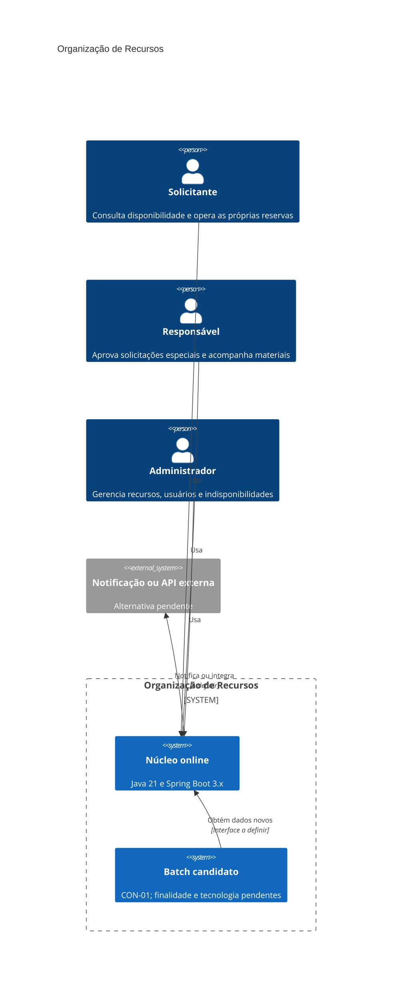
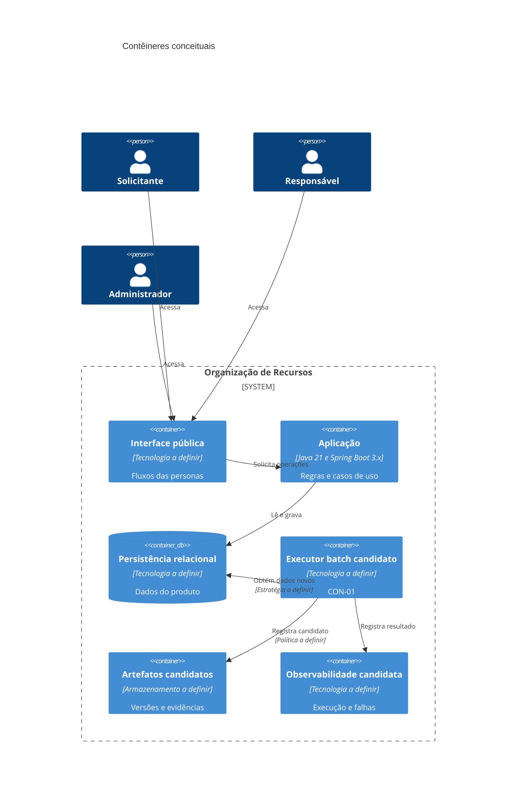
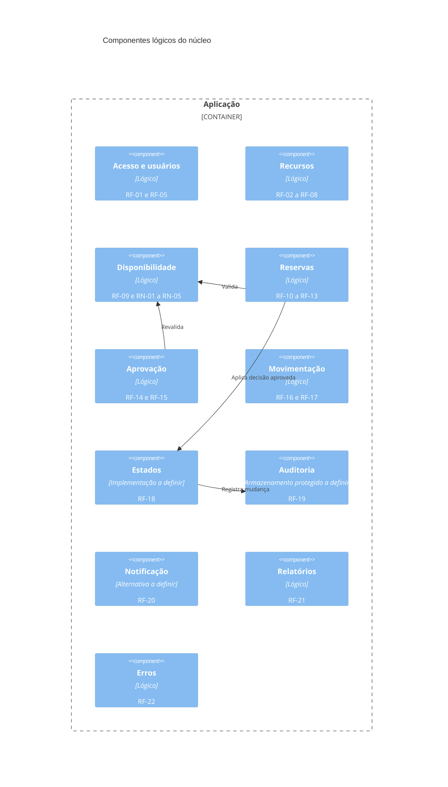
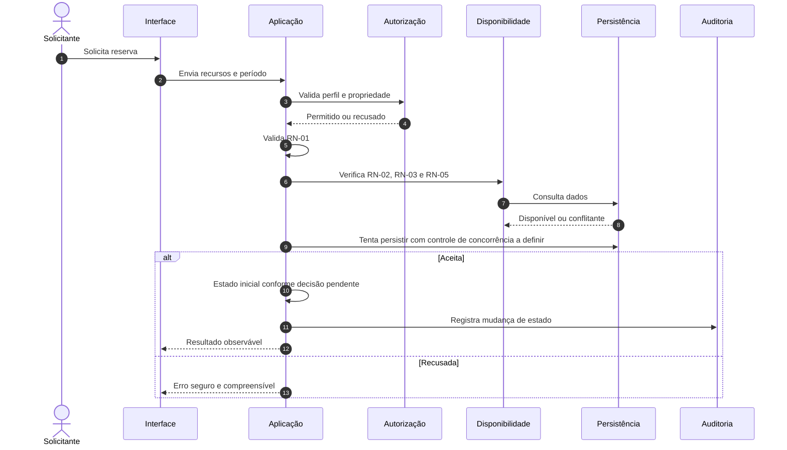
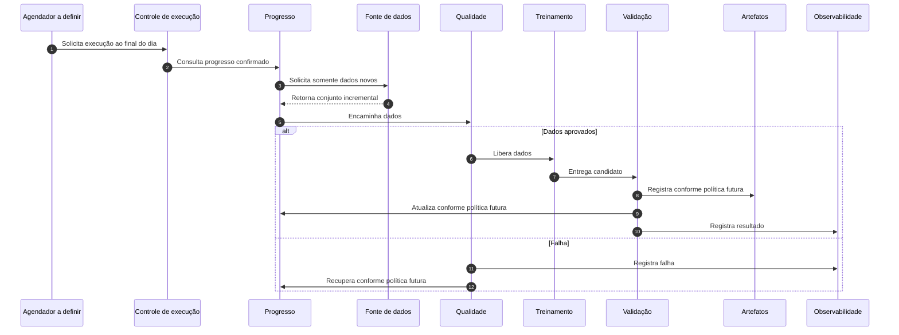

# Arquitetura: Organização de Recursos

> **Documento:** `docs/arquitetura.md`  
> **Status:** baseline arquitetural consolidada para aprovação da equipe  
> **Versão:** 2.0  
> **Data:** 2026-09-02  
> **Fontes oficiais:** `docs/prd.md`, `docs/fluxos-personas.md`, `docs/personas/solicitante.md`, `docs/personas/responsavel.md`, `docs/personas/administrador.md`  
> **Restrição adicional:** CON-01, cron job executado diariamente ao final do dia para treinar ou retreinar usando somente dados novos.

## 1. Governança do documento

1. O PRD, os fluxos e as personas são as fontes de verdade do produto.
2. Os únicos perfis oficiais são Solicitante, Responsável e Administrador.
3. CON-01 é uma restrição adicional do exercício arquitetural, ausente na baseline do produto.
4. Tecnologias citadas como alternativas não são decisões aprovadas.
5. Lacunas de negócio permanecem `PENDENTE DE DECISÃO DA EQUIPE`.
6. Evidências descritas são esperadas, não executadas.
7. O case Foot Fanatics não fornece funcionalidades ao produto avaliado.

### 1.1 Legenda

| Status | Significado |
|---|---|
| APROVADO NA BASELINE | Exigido por requisito ou regra oficial |
| PENDENTE DE DECISÃO DA EQUIPE | Exige decisão humana |
| CANDIDATO NÃO APROVADO | Alternativa possível ainda não escolhida |
| DECISÃO SEM REQUISITO | Escolha técnica sugerida sem imposição da fonte |
| HIPÓTESE PENDENTE | Valor ou comportamento proposto para validação |

## 2. Contexto, objetivo e escopo

### 2.1 Contexto

O sistema organiza a alocação de salas, professores, materiais e equipamentos sem conflitos de horário, incluindo a agenda do professor, recursos restritos, bloqueios, manutenção, retiradas, devoluções e histórico.

**Origem:** `docs/prd.md`, seção 2; `docs/fluxos-personas.md`, seção 2.

### 2.2 Objetivo

Desenvolver e validar uma aplicação que organize recursos sem conflitos e produza evidências objetivas de qualidade, segurança, rastreabilidade e desempenho.

### 2.3 Escopo oficial

E1 Acesso e Perfis; E2 Cadastro de Recursos; E3 Pesquisa e Disponibilidade; E4 Reservas e Agenda; E5 Aprovação de Recursos Restritos; E6 Manutenção e Bloqueios; E7 Retirada e Devolução; E8 Auditoria e Histórico; E9 Notificações e Integrações; E10 Relatórios; E11 Interface, Erros e Acessibilidade; E12 Documentação Pública; E13 Qualidade, Segurança, Desempenho e CI.

### 2.4 Fora do escopo

- funcionalidades do Foot Fanatics;
- perfis diferentes dos três oficiais;
- decisões de negócio não aprovadas;
- finalidade, algoritmo, features ou integração de ML não definidos em CON-01.

## 3. Stakeholders e personas

| Persona | Responsabilidade | Limites | Origem |
|---|---|---|---|
| Solicitante | Consulta disponibilidade e opera as próprias reservas | Não opera reservas alheias, não aprova recurso restrito e não administra cadastros | Persona Solicitante |
| Responsável | Aprova solicitações especiais, valida docentes e registra movimentações | Não administra cadastros e não aprova fora de sua responsabilidade | Persona Responsável |
| Administrador | Gerencia recursos, usuários, bloqueios, manutenção, relatórios e histórico autorizado | Não substitui o Responsável e não contorna regras críticas | Persona Administrador |

### 3.1 Professor como usuário e recurso

Professor-usuário pode atuar como Solicitante. Professor-recurso possui agenda sujeita à sobreposição. A relação cadastral entre essas representações permanece pendente.

### 3.2 Papel técnico do batch

Um papel técnico para acompanhar, validar ou promover artefatos pode ser necessário, mas não é persona oficial.

**Status:** CANDIDATO NÃO APROVADO.

## 4. Restrições e dependências

| Restrição | Origem | Status |
|---|---|---|
| Java 21 e Spring Boot 3.x | RNF-01 | APROVADO |
| Cobertura de linhas >= 80% | RNF-02 | APROVADO |
| Cobertura de branches >= 70% | RNF-03 | APROVADO |
| Requisitos críticos rastreados = 100% | RN-10, RNF-04 | APROVADO |
| Bugs críticos conhecidos = 0 | RNF-05 | APROVADO |
| Vulnerabilidades críticas conhecidas = 0 | RNF-06, RNF-13 | APROVADO |
| Persistência crítica com Testcontainers | RNF-07 | APROVADO |
| Integração externa com WireMock, quando aplicável | RNF-08 | APROVADO |
| Teste concorrente com exatamente uma reserva aceita | RNF-09 | APROVADO |
| GitHub Actions em pull requests | RNF-12 | APROVADO |
| SonarCloud | RNF-13 | APROVADO |
| Medição de carga com JMeter | RNF-14 | APROVADO; metas pendentes |
| Mudança de estado gera auditoria | RN-09 | APROVADO |
| Reserva iniciada não pode ser apagada | RN-08 | APROVADO |
| Entrega na semana 46 | PRD, seção 5 | APROVADO |

### 4.1 CON-01

CON-01 confirma apenas:

- execução diária ao final do dia;
- treinamento ou retreinamento;
- uso somente de dados novos.

Propósito, dados, algoritmo, features, métricas, integração, tecnologia, promoção e rollback permanecem pendentes.

## 5. Requisitos arquiteturalmente significativos

| ID | Síntese | Impacto |
|---|---|---|
| RN-01 | Término posterior ao início | Validação de domínio |
| RN-02 | Sem sobreposição do mesmo recurso | Consistência |
| RN-03 | Agenda do professor participa da sobreposição | Modelagem de agenda |
| RN-04 | Exatamente uma reserva aceita sob concorrência | Controle de concorrência |
| RN-05 | Recurso em manutenção não pode ser reservado | Disponibilidade |
| RN-06 | Somente Responsável aprova recurso restrito | Autorização contextual |
| RN-07 | Estados oficiais | Ciclo de vida |
| RN-08 | Reserva iniciada não pode ser apagada | Preservação do registro |
| RN-09 | Mudança de estado gera auditoria | Atomicidade estado-auditoria |
| RN-10 | Rastreabilidade crítica | Governança de qualidade |

RFs significativos: RF-01, RF-05, RF-09 a RF-15, RF-18 a RF-23.  
RNFs significativos: RNF-01 a RNF-18, com destaque para RNF-07, RNF-09, RNF-14 e RNF-15.

## 6. Atributos de qualidade

| Atributo | Origem | Evidência esperada | Pendência |
|---|---|---|---|
| Consistência | RN-01 a RN-05 | Testes unitários, integração e concorrência | Mecanismo técnico |
| Segurança | RF-01, RN-06, RNF-06, RNF-15 | Testes positivos/negativos e SonarCloud | Autenticação e sessão |
| Auditabilidade | RN-09, RN-10, RF-19 | Histórico e RTM | Campos, retenção e imutabilidade completa |
| Testabilidade | RNF-07 a RNF-11 | JUnit, API, E2E, Testcontainers, WireMock | Quantidades adicionais |
| Desempenho | RNF-14 | Relatório JMeter | Carga, percentis, erro e duração |
| Usabilidade | RF-22, RNF-16, RNF-17 | E2E e inspeção | Viewports e acessibilidade |
| Operabilidade batch | CON-01 | Execução e recuperação observáveis | Políticas do pipeline |
| Privacidade | RNF-06, RNF-15, CON-01 | Inventário e controles LGPD | Dados e base legal |

## 7. Drivers priorizados

| Prioridade | Driver | Origem |
|---|---|---|
| 1 | Evitar sobreposição | RN-02, RN-03 |
| 1 | Aceitar exatamente uma reserva simultânea | RN-04, RF-13, RNF-09 |
| 1 | Impedir reserva em manutenção | RN-05 |
| 1 | Autorizar por perfil, propriedade e responsabilidade | RF-01, RN-06, personas |
| 1 | Auditar toda mudança de estado | RN-09, RF-19 |
| 2 | Preservar ciclo de vida oficial | RN-07, RN-08 |
| 2 | Validar persistência e concorrência em ambiente realista | RNF-07, RNF-09 |
| 2 | Executar CON-01 sem inventar finalidade | CON-01 |
| 3 | Tratar erros com segurança | RF-22, RNF-15, RNF-17 |
| 3 | Medir desempenho | RNF-14 |
| 3 | Produzir documentação e rastreabilidade | RF-23, RNF-04, RNF-18 |

## 8. Glossário

| Termo | Definição |
|---|---|
| Recurso | Sala, professor, material ou equipamento alocável |
| Reserva | Solicitação de alocação em um período |
| Sobreposição | Interseção de períodos do mesmo recurso |
| Dupla reserva | Mais de uma reserva aceita no mesmo recurso e período concorrente |
| Recurso restrito | Recurso que exige aprovação; critério ainda pendente |
| Auditoria | Registro de mudança de estado protegido contra alteração operacional; política completa pendente |
| Dados novos | Dados ainda não processados pelo batch; critério pendente |
| Checkpoint/watermark | Alternativas de registro do progresso batch |
| Artefato candidato | Resultado de treinamento ainda não utilizado |

## 9. Fatos, lacunas, conflitos e suposições

### 9.1 Fatos

- Java 21 e Spring Boot 3.x.
- Três perfis oficiais e sete estados oficiais.
- Exatamente uma reserva aceita sob concorrência.
- Recursos em manutenção não podem ser reservados.
- Mudanças de estado devem gerar auditoria.
- CON-01 executa diariamente ao final do dia e usa somente dados novos.

### 9.2 Lacunas

- estado inicial e ocupação de reserva não restrita;
- transições e atores não definidos;
- recurso restrito e responsabilidade exata;
- professor-usuário versus professor-recurso;
- bloqueio versus manutenção;
- auditoria, notificação, relatórios, desempenho e acessibilidade;
- todas as definições funcionais e técnicas de CON-01 além dos três fatos confirmados.

### 9.3 Tensões

- CON-01 está fora do escopo original E1 a E13.
- RN-05 formaliza manutenção, enquanto os fluxos também tratam bloqueio.
- RN-04 define resultado, não mecanismo.
- RN-09 cobre estado da reserva, não todo evento técnico.

### 9.4 Suposições não aprovadas

Não se presume banco, cache, scheduler, IdP, réplica, lock, microserviços, finalidade do modelo, ausência de dados pessoais, promoção ou rollback automáticos.

## 10. Riscos iniciais

| ID | Risco | Severidade preliminar | Origem |
|---|---|---|---|
| R1 | Dupla reserva | Crítica | RN-04, FLX-06 |
| R2 | Sobreposição docente | Crítica | RN-03 |
| R3 | Reserva em indisponibilidade | Crítica | RN-05 |
| R4 | Aprovação indevida | Crítica | RN-06 |
| R5 | IDOR | Alta | FLX-08/09 |
| R6 | Exclusão de reserva iniciada | Alta | RN-08 |
| R7 | Estado sem auditoria | Alta | RN-09 |
| R8 | Movimentação inconsistente | Média | RF-16, RF-17 |
| R9 | Falha externa afetar operação | Média | RF-20 |
| R10 | Erro expor detalhes | Alta | RNF-15, RNF-17 |
| R11 | CON-01 sem propósito | Alta | CON-01 |
| R12 | Dados pessoais sem governança | Alta | CON-01, LGPD |
| R13 | Job sobreposto ou reprocessamento inconsistente | Alta | CON-01 |
| R14 | Candidato inadequado utilizado | Alta | CON-01 |

## 11. Abordagem arquitetural do núcleo

Recomenda-se um **monólito modular Spring Boot** como decisão candidata, evitando complexidade distribuída sem requisito ou evidência de escala.

Módulos lógicos candidatos:

- `identity`;
- `resources`;
- `availability`;
- `reservations`;
- `approvals`;
- `inventory`;
- `audit`;
- `notifications`;
- `reports`;
- `shared`.

Controllers cuidam de requisição e resposta; services concentram regras, autorização contextual e transações; repositories tratam persistência; DTOs controlam contratos públicos.

## 12. Decisões de domínio pendentes

1. Estado inicial da reserva não restrita.
2. Ocupação produzida por `SOLICITADA`.
3. Estados que permitem alteração e cancelamento.
4. Atores de `EM_USO`, `CONCLUIDA` e `NAO_COMPARECEU`.
5. Liberação de recursos.
6. Nova aprovação ou validação após alteração.
7. Relação entre devolução e conclusão.
8. Critério de recurso restrito.
9. Reserva afetada por manutenção.
10. Auditoria, relatórios e notificações.

## 13. Responsabilidades, limites e interfaces

### 13.1 Online e batch

| Aspecto | Núcleo online | Batch CON-01 |
|---|---|---|
| Finalidade | Atender E1 a E13 | Treinar ou retreinar diariamente com dados novos |
| Origem | PRD e fluxos | Restrição adicional |
| Consistência | RN-01 a RN-09 | Progresso e idempotência a definir |
| Tecnologia | Java 21 e Spring Boot 3.x | A definir |
| Integração | Fluxos das personas | Relação com o núcleo pendente |

A separação do batch do caminho crítico online é decisão candidata, não requisito.

### 13.2 Interfaces

Interfaces confirmadas: autenticação/autorização, consulta, pesquisa, reservas, aprovação, movimentação, histórico, notificação/integração e relatórios. Protocolos, rotas, payloads e códigos HTTP permanecem a definir.

O batch necessita conceitualmente de fonte autorizada, definição de dados novos, progresso, exclusão de sobreposição, recuperação, validação, versionamento, observabilidade, segurança e custo.

## 14. Diagramas C4

### 14.1 Contexto

### 14.2 Contêineres

### 14.3 Componentes do núcleo

### 14.4 Componentes do batch

## 15. Sequências críticas

### 15.1 Reserva online

### 15.2 Batch

## 16. Análise de CON-01

| Tema | Necessidade | Alternativas | Trade-off | Status |
|---|---|---|---|---|
| Dados novos | Identificar não processados | timestamp, ID, versão, log | Simplicidade x precisão | PENDENTE |
| Checkpoint | Registrar progresso | tabela, metadado, eventos | Consistência x complexidade | PENDENTE |
| Idempotência | Evitar efeito duplicado | chave, deduplicação, escrita condicional | Armazenamento x segurança | PENDENTE |
| Jobs sobrepostos | Coordenar execuções | banco, scheduler, coordenação externa | Infraestrutura x isolamento | PENDENTE |
| Retry | Recuperar falhas | total ou por etapa | Simplicidade x velocidade | PENDENTE |
| Qualidade | Validar dados | esquema, integridade, completude | Confiança x custo | PENDENTE |
| Linhagem | Relacionar fonte, execução e artefato | metadados, catálogo, logs | Auditabilidade x manutenção | PENDENTE |
| Reprodutibilidade | Registrar código, dados, configuração e ambiente | metadados mínimos a definir | Explicabilidade x retenção | PENDENTE |
| Validação | Avaliar candidato | conjunto de validação, referência, revisão humana | Automação x controle | PENDENTE |
| Versionamento | Distinguir candidatos | ID e metadados | Recuperação x custo | PENDENTE |
| Promoção | Tornar candidato utilizável | manual, automática, múltiplas etapas | Agilidade x governança | PENDENTE |
| Rollback | Retornar à versão anterior | reapontamento, restauração, nova promoção | Rapidez x complexidade | PENDENTE |
| Observabilidade | Tornar execução visível | logs, métricas, alertas | Diagnóstico x custo | PENDENTE |
| LGPD | Proteger dados | minimização, autorização, retenção, pseudonimização | Proteção x restrição | PENDENTE |
| Custos | Medir execução e retenção | compartilhado, dedicado, sob demanda | Custo x isolamento | PENDENTE |

A análise LGPD deve definir inventário, finalidade, base legal, minimização, acesso, retenção, descarte e tratamento de identificadores. IDs não são presumidos anônimos.

Não estão aprovados: exactly-once, determinismo binário, hash estável, threshold padrão, quantidade de retries, rollback automático, réplica, serverless, prazo máximo ou integração online.

## 17. Matriz de decisões

| ID | Decisão/necessidade | Origem | Classificação | Status |
|---|---|---|---|---|
| J1 | Separar online e batch | CON-01 | Candidata | PENDENTE |
| J2 | Definir fonte autorizada | CON-01 | Necessidade | PENDENTE |
| J3 | Definir dados novos | CON-01 | Necessidade | PENDENTE |
| J4 | Registrar progresso | CON-01 | Candidata | PENDENTE |
| J5 | Impedir jobs sobrepostos | CON-01 | Candidata | PENDENTE |
| J6 | Preservar metadados | CON-01 | Candidata | PENDENTE |
| J7 | Definir versão, promoção e rollback | CON-01 | Candidata | PENDENTE |
| J8 | Definir métricas e gates | CON-01 | Necessidade | PENDENTE |
| J9 | Definir observabilidade e recuperação | CON-01 | Candidata | PENDENTE |
| J10 | Erros seguros | RF-22, RNF-15, RNF-17 | Requisito | APROVADO |
| J11 | Autorização no back-end | RF-01, RN-06 | Requisito | APROVADO |
| J12 | Exatamente uma reserva sob concorrência | RN-04, RNF-09 | Resultado obrigatório | RESULTADO APROVADO; MECANISMO PENDENTE |
| J13 | Auditar toda mudança de estado | RN-09 | Requisito | APROVADO |
| J14 | Cache de disponibilidade | RNF-14 sem meta | Alternativa | PENDENTE |
| J15 | Notificação simulada ou externa | RF-20 | Alternativa oficial | PENDENTE |
| J16 | Metadados/reprodutibilidade batch | CON-01 | Candidata | PENDENTE |

Alternativas para J12: constraint, isolamento transacional, lock pessimista, controle otimista, slots ou outra técnica comprovada. Nenhuma está aprovada.

## 18. Riscos não resolvidos

| ID | Risco | Tratamento |
|---|---|---|
| R16 | CON-01 sem finalidade | Decisão humana |
| R17 | Metas de desempenho ausentes | Definir antes do aceite |
| R18 | Acessibilidade sem critérios | Definir cenários |
| R19 | Dados pessoais sem análise | Bloquear uso |
| R20 | Concorrência inadequada | Comparar e testar |
| R21 | Jobs sobrepostos | Definir coordenação |
| R22 | Falha parcial avançar progresso | Definir checkpoint |
| R23 | Candidato pior utilizado | Definir gates e rollback |
| R24 | Complexidade prematura | Experimentar antes de adotar |
| R25 | Cron sem valor demonstrável | Definir finalidade |

## 19. Checklist de consistência

- [x] Três perfis oficiais.
- [x] CON-01 separado do PRD.
- [x] Estado inicial pendente.
- [x] RN-04 define resultado, não mecanismo.
- [x] RN-08, RN-09 e RN-10 não justificam governança de modelos.
- [x] RNF-07 não exige réplica.
- [x] Tecnologias aparecem como alternativas.
- [x] LGPD não presume ausência de dados pessoais.
- [x] Semana 46 é prazo acadêmico.
- [x] Nenhuma evidência foi declarada executada.

## 20. Experimentos anteriores ao ATAM

| Experimento | Objetivo | Evidência | Status |
|---|---|---|---|
| Concorrência | Comparar alternativas para RN-04 | Testcontainers | NÃO APROVADO |
| Dados novos | Comparar critérios incrementais | Omissão/duplicação | NÃO APROVADO |
| Falha parcial | Avaliar checkpoint | Progresso consistente | NÃO APROVADO |
| Job sobreposto | Avaliar exclusão | Uma execução efetiva | NÃO APROVADO |
| Candidato pior | Avaliar gates | Não promoção | NÃO APROVADO |
| Rollback | Avaliar recuperação | Restauração rastreável | NÃO APROVADO |
| LGPD | Validar finalidade/minimização | Inventário | NÃO APROVADO |
| Custo | Medir execução/retenção | Relatório | NÃO APROVADO |

## 21. Avaliação ATAM independente

### 21.1 Propósito, escopo e independência da avaliação

Esta avaliação aplica o método ATAM à arquitetura do sistema Organização de Recursos. A análise não altera requisitos, não aprova tecnologias pendentes e não interpreta hipóteses como fatos.

**Fontes avaliadas:**

- `docs/prd.md`, incluindo RN-01 a RN-10, RF-01 a RF-23 e RNF-01 a RNF-18;
- `docs/fluxos-personas.md`, incluindo FLX-01 a FLX-22, cenários A a I, riscos, candidatos e pendências;
- `docs/arquitetura.md`, seções 1 a 20;
- CON-01, restrição adicional do exercício arquitetural.

**Convenções:**

- métricas existentes nas fontes são tratadas como oficiais;
- valores novos são marcados como `HIPÓTESE PENDENTE DE DECISÃO DA EQUIPE`;
- importância e dificuldade são classificações qualitativas preliminares da avaliação;
- uma abordagem avaliada não se torna automaticamente uma decisão aprovada;
- nenhum resultado de teste, experimento, ferramenta ou pipeline é declarado como executado.

### 21.2 Participantes conceituais da avaliação

A equipe avaliadora independente considera as perspectivas de arquitetura de solução, domínio, dados/ML, segurança e LGPD, operações/SRE, custos, qualidade e facilitação ATAM. Esses papéis são perspectivas de avaliação, não personas do produto.

### 21.3 Drivers arquiteturais priorizados

| Prioridade | Driver | Origem | Justificativa ATAM |
|---|---|---|---|
| 1 | Garantir exatamente uma reserva aceita sob concorrência | RN-04, RF-13, RNF-09, FLX-06 | Falha compromete a finalidade central e é limitador de avaliação |
| 1 | Impedir sobreposição de sala, material e professor | RN-02, RN-03, RF-09, RF-13 | Falha produz alocação inválida |
| 1 | Autorizar por perfil, propriedade e responsabilidade | RF-01, RN-06, RNF-15, FLX-01/07/08/09 | Falha pode produzir IDOR e contorno de governança |
| 1 | Manter coerência entre mudança de estado e auditoria | RN-09, RF-18, RF-19, FLX-18 | Falha elimina rastreabilidade obrigatória |
| 2 | Impedir reservas em manutenção e tratar bloqueios conforme decisão | RN-05, RF-06, RF-07, FLX-16/17 | Falha permite uso de recurso indisponível |
| 2 | Preservar estados oficiais e impedir exclusão de reserva iniciada | RN-07, RN-08, RF-18 | Falha produz perda de histórico ou estado inválido |
| 2 | Executar diariamente o treinamento/retreinamento com somente dados novos | CON-01 | Restrição obrigatória com alta indefinição e impacto transversal |
| 2 | Recuperar falhas parciais e impedir jobs incompatíveis sobrepostos | CON-01, J4, J5, J9 | Necessário para consistência operacional do batch |
| 3 | Tratar erros com segurança e clareza | RF-22, RNF-15, RNF-17, FLX-21 | Afeta segurança, usabilidade e diagnóstico |
| 3 | Produzir evidências objetivas de qualidade | RNF-02 a RNF-13 | Necessário para aceitação acadêmica e técnica |
| 3 | Medir desempenho sem inventar metas | RNF-14 | Avaliação exige medição, mas os valores permanecem pendentes |
| 3 | Proteger dados e artefatos conforme LGPD | RNF-06, RNF-15, CON-01 | O dataset e sua finalidade ainda não foram definidos |

### 21.4 Atributos de qualidade prioritários

| Atributo | Prioridade | Drivers | Critério de avaliação |
|---|---|---|---|
| Consistência e integridade | Muito alta | RN-01 a RN-05 | Não aceitar reservas inválidas ou conflitantes |
| Segurança | Muito alta | RF-01, RN-06, RNF-06, RNF-15 | Impedir ações e exposições indevidas |
| Auditabilidade | Muito alta | RN-09, RN-10, RF-19 | Relacionar mudança de estado e evidência correspondente |
| Confiabilidade | Alta | RNF-05, RNF-07, RNF-09 | Comportamento previsível sob concorrência e falha |
| Recuperabilidade | Alta | CON-01 | Retomar ou reprocessar sem perda silenciosa |
| Operabilidade | Alta | CON-01 | Detectar execução, falha, sobreposição e resultado |
| Qualidade de dados | Alta | CON-01 | Impedir uso silencioso de dados inadequados |
| Privacidade | Alta | RNF-06, RNF-15, LGPD | Limitar dados à finalidade e autorização aprovadas |
| Testabilidade | Alta | RNF-07 a RNF-11 | Permitir evidência automatizada, realista e reproduzível |
| Desempenho | Média, sujeita a metas | RNF-14 | Medir carga, latência e erros conforme plano aprovado |
| Manutenibilidade | Média | RNF-01, RNF-13 | Concentrar mudanças, reduzir acoplamento e permitir evolução |
| Custo | Média | CON-01 | Evitar infraestrutura desproporcional ao valor e ao escopo |

## 22. Utility tree

| Atributo | Refinamento | Cenário | Importância | Dificuldade | Origem principal |
|---|---|---|---|---|---|
| Consistência | Concorrência de reservas | ATAM-01 | Alta | Alta | RN-04, RF-13, RNF-09 |
| Consistência | Sobreposição na agenda do professor | ATAM-02 | Alta | Média | RN-03, RF-09, RF-13 |
| Segurança | Autorização contextual e IDOR | ATAM-03 | Alta | Alta | RF-01, RN-06, RNF-15 |
| Auditabilidade | Falha entre estado e auditoria | ATAM-04 | Alta | Alta | RN-09, RF-18, RF-19 |
| Disponibilidade operacional | Manutenção e bloqueio | ATAM-05 | Alta | Média | RN-05, RF-06, RF-07 |
| Operabilidade batch | Execução diária | ATAM-06 | Alta | Média | CON-01 |
| Consistência batch | Identificação de dados novos | ATAM-07 | Alta | Alta | CON-01, J3, J4 |
| Recuperabilidade | Falha parcial | ATAM-08 | Alta | Alta | CON-01, J4, J9 |
| Operabilidade | Jobs sobrepostos | ATAM-09 | Alta | Alta | CON-01, J5 |
| Qualidade de dados | Degradação ou mudança de esquema | ATAM-10 | Alta | Alta | CON-01, J8 |
| Confiabilidade de ML | Candidato pior | ATAM-11 | Alta | Alta | CON-01, J7, J8 |
| Recuperabilidade de ML | Rollback | ATAM-12 | Alta | Alta | CON-01, J7 |
| Disponibilidade | Indisponibilidade externa | ATAM-13 | Média | Média | RF-20, RNF-08 |
| Privacidade | Vazamento de dados | ATAM-14 | Alta | Alta | RNF-06, RNF-15, CON-01 |
| Desempenho | Carga simultânea | ATAM-15 | Média | Alta | RNF-14 |
| Manutenibilidade | Alteração da política de estados | ATAM-16 | Média | Média | RN-07, RF-18 |
| Confiabilidade | Retirada/devolução inconsistente | ATAM-17 | Média | Média | RF-16, RF-17 |
| Operabilidade | Ausência de dados novos | ATAM-18 | Média | Média | CON-01 |

## 23. Cenários de atributos de qualidade

### ATAM-01: duas solicitações simultâneas

- **Fonte:** dois Solicitantes autenticados.
- **Estímulo:** enviam simultaneamente solicitações para o mesmo recurso e período.
- **Ambiente:** operação normal com persistência disponível.
- **Artefato:** reserva, disponibilidade, controle de concorrência e persistência.
- **Resposta:** exatamente uma solicitação é aceita; a outra é recusada; não existem dados parciais ou reservas conflitantes persistidas.
- **Métrica:** exatamente `1` reserva aceita e `0` reservas conflitantes persistidas.
- **Origem:** RN-04, RF-10, RF-13, RNF-09, FLX-06.
- **Importância:** alta.
- **Dificuldade:** alta.
- **Decisões relacionadas:** J12.

### ATAM-02: conflito somente na agenda do professor

- **Fonte:** Solicitante.
- **Estímulo:** tenta reservar sala e material livres, mas o professor já está alocado no período.
- **Ambiente:** operação normal.
- **Artefato:** pesquisa, disponibilidade, agenda docente e criação.
- **Resposta:** o recurso não é apresentado como disponível ou a solicitação é recusada na confirmação, sem persistência inconsistente.
- **Métrica:** `0` reservas aceitas com sobreposição docente nos cenários testados.
- **Origem:** RN-03, RF-09, RF-13, FLX-04/05.
- **Importância:** alta.
- **Dificuldade:** média.
- **Decisões relacionadas:** J12 e revalidação na confirmação.

### ATAM-03: acesso indevido por perfil ou objeto

- **Fonte:** usuário autenticado sem permissão, propriedade ou responsabilidade.
- **Estímulo:** acessa diretamente operação ou reserva não autorizada.
- **Ambiente:** operação normal.
- **Artefato:** autenticação, autorização contextual, interface pública e caso de uso.
- **Resposta:** operação recusada no back-end, sem alteração de dados e sem revelar informação sensível.
- **Métrica:** `0` operações indevidas aceitas e `0` alterações persistidas nos casos negativos definidos.
- **Origem:** RF-01, RN-06, RNF-15, FLX-01/07/08/09.
- **Importância:** alta.
- **Dificuldade:** alta.
- **Decisões relacionadas:** J11.

### ATAM-04: falha entre mudança de estado e auditoria

- **Fonte:** falha de persistência ou dependência interna.
- **Estímulo:** ocorre após a validação da transição e antes da conclusão do registro de auditoria.
- **Ambiente:** degradação parcial.
- **Artefato:** componente de estados, persistência e auditoria.
- **Resposta:** a operação não deixa estado efetivado sem auditoria correspondente, nem auditoria de mudança inexistente.
- **Métrica:** `0` mudanças de estado efetivadas sem registro de auditoria correspondente.
- **Origem:** RN-09, RF-18, RF-19, RNF-07, FLX-18.
- **Importância:** alta.
- **Dificuldade:** alta.
- **Decisões relacionadas:** J13.

### ATAM-05: recurso em manutenção ou bloqueio

- **Fonte:** Administrador e Solicitante.
- **Estímulo:** um período de indisponibilidade coincide com a tentativa de reserva.
- **Ambiente:** operação normal.
- **Artefato:** gestão de bloqueio/manutenção, pesquisa e criação.
- **Resposta:** o recurso não é considerado reservável; o comportamento de reservas já existentes segue decisão ainda pendente.
- **Métrica:** `0` reservas novas aceitas durante manutenção; comportamento de bloqueio conforme regra aprovada.
- **Origem:** RN-05, RF-06, RF-07, FLX-16/17.
- **Importância:** alta.
- **Dificuldade:** média.
- **Decisões relacionadas:** política de indisponibilidade e pendência sobre reservas existentes.

### ATAM-06: execução diária do batch

- **Fonte:** agendador do processo batch.
- **Estímulo:** chega o horário diário de execução ao final do dia.
- **Ambiente:** operação normal.
- **Artefato:** agendamento, controle de execução e pipeline de CON-01.
- **Resposta:** uma execução controlada é iniciada conforme o calendário aprovado e fica observável.
- **Métrica:** `HIPÓTESE PENDENTE DE DECISÃO DA EQUIPE`: uma execução iniciada por ciclo diário aprovado; tolerância de atraso não definida.
- **Origem:** CON-01.
- **Importância:** alta.
- **Dificuldade:** média.
- **Decisões relacionadas:** J1, J5, J9.

### ATAM-07: processamento somente de dados novos

- **Fonte:** executor batch.
- **Estímulo:** solicita o conjunto incremental desde a última execução confirmada.
- **Ambiente:** existem inclusões e possíveis atualizações tardias.
- **Artefato:** fonte de dados, identificação incremental e checkpoint/watermark.
- **Resposta:** somente registros classificados como novos pela política aprovada são processados; registros anteriores não são classificados incorretamente como novos.
- **Métrica:** `HIPÓTESE PENDENTE DE DECISÃO DA EQUIPE`: `0` registros anteriores reclassificados indevidamente e `0` registros novos omitidos nos casos aprovados.
- **Origem:** CON-01, J2, J3, J4.
- **Importância:** alta.
- **Dificuldade:** alta.
- **Decisões relacionadas:** J2, J3, J4.

### ATAM-08: falha parcial do batch

- **Fonte:** falha de processamento, armazenamento ou dependência.
- **Estímulo:** uma etapa falha após parte do conjunto incremental ter sido lida ou processada.
- **Ambiente:** execução diária.
- **Artefato:** progresso, extração, treinamento e armazenamento do candidato.
- **Resposta:** não ocorre perda silenciosa; o progresso é mantido ou recuperado conforme política; o núcleo online permanece consistente.
- **Métrica:** `HIPÓTESE PENDENTE DE DECISÃO DA EQUIPE`: `0` registros omitidos ou duplicados após recuperação no cenário aprovado.
- **Origem:** CON-01, J3, J4, J9.
- **Importância:** alta.
- **Dificuldade:** alta.
- **Decisões relacionadas:** J4, J9.

### ATAM-09: jobs sobrepostos

- **Fonte:** agendador, operador técnico candidato ou mecanismo de retomada.
- **Estímulo:** inicia nova execução enquanto outra permanece ativa.
- **Ambiente:** operação normal ou recuperação.
- **Artefato:** agendamento e exclusão/coordenação da execução.
- **Resposta:** apenas uma execução incompatível processa o intervalo, ou os intervalos são coordenados sem conflito segundo política aprovada.
- **Métrica:** `HIPÓTESE PENDENTE DE DECISÃO DA EQUIPE`: uma execução efetiva por intervalo lógico incompatível.
- **Origem:** CON-01, J5.
- **Importância:** alta.
- **Dificuldade:** alta.
- **Decisões relacionadas:** J5.

### ATAM-10: degradação ou mudança dos dados

- **Fonte:** sistema de origem ou erro operacional.
- **Estímulo:** dados novos chegam com esquema incompatível, chaves ausentes, valores inválidos ou distribuição degradada.
- **Ambiente:** execução diária.
- **Artefato:** extração, qualidade, linhagem e treinamento.
- **Resposta:** o conjunto inadequado não é utilizado sem decisão explícita; a falha fica observável; o progresso não avança indevidamente.
- **Métrica:** `HIPÓTESE PENDENTE DE DECISÃO DA EQUIPE`: regras e limites de qualidade somente após definição da finalidade, dados e modelo.
- **Origem:** CON-01, J8, J9.
- **Importância:** alta.
- **Dificuldade:** alta.
- **Decisões relacionadas:** J8, J9.

### ATAM-11: candidato pior que a referência

- **Fonte:** resultado do treinamento ou retreinamento.
- **Estímulo:** o candidato apresenta regressão frente ao critério aprovado.
- **Ambiente:** validação anterior a qualquer uso.
- **Artefato:** validação, versionamento e promoção.
- **Resposta:** o candidato não substitui uma versão considerada válida.
- **Métrica:** `HIPÓTESE PENDENTE DE DECISÃO DA EQUIPE`: métricas e limites dependem do propósito ainda não definido.
- **Origem:** CON-01, J7, J8.
- **Importância:** alta.
- **Dificuldade:** alta.
- **Decisões relacionadas:** J7, J8.

### ATAM-12: rollback de versão

- **Fonte:** responsável técnico candidato ou mecanismo de observabilidade futuro.
- **Estímulo:** uma versão utilizada apresenta regressão, falha ou risco inaceitável.
- **Ambiente:** após promoção, caso o modelo venha a ser utilizado.
- **Artefato:** versionamento e política de uso do artefato.
- **Resposta:** a versão anterior pode ser restaurada conforme procedimento aprovado, preservando rastreabilidade.
- **Métrica:** `HIPÓTESE PENDENTE DE DECISÃO DA EQUIPE`: restauração sem perda do histórico; tempo alvo não definido.
- **Origem:** CON-01, J7.
- **Importância:** alta.
- **Dificuldade:** alta.
- **Decisões relacionadas:** J7.

### ATAM-13: indisponibilidade da integração externa

- **Fonte:** serviço externo de notificação, caso essa alternativa seja escolhida.
- **Estímulo:** timeout, indisponibilidade ou resposta inválida.
- **Ambiente:** operação de reserva ou aprovação.
- **Artefato:** integração de RF-20.
- **Resposta:** falha tratada de forma segura, observável e sem corromper a operação principal.
- **Métrica:** `0` reservas ou decisões corrompidas nos cenários WireMock; política de retry pendente.
- **Origem:** RF-20, RNF-08, FLX-19.
- **Importância:** média.
- **Dificuldade:** média.
- **Decisões relacionadas:** J15.

### ATAM-14: vazamento de dados

- **Fonte:** usuário, log, erro, integração, dataset ou artefato.
- **Estímulo:** tentativa de acesso ou exposição além da autorização e finalidade.
- **Ambiente:** operação normal, falha ou diagnóstico.
- **Artefato:** APIs, erros, logs, auditoria, dados de treinamento e artefatos.
- **Resposta:** acesso recusado; erros e logs não expõem dados sensíveis; batch não usa dados sem finalidade, base legal e minimização aprovadas.
- **Métrica:** `0` exposições conhecidas nos cenários de segurança; métricas adicionais de privacidade pendentes.
- **Origem:** RNF-06, RNF-15, FLX-21, CON-01, LGPD.
- **Importância:** alta.
- **Dificuldade:** alta.
- **Decisões relacionadas:** J2, J6, J16.

### ATAM-15: operação sob carga

- **Fonte:** usuários simultâneos e plano JMeter futuro.
- **Estímulo:** aumento de consultas, reservas e relatórios.
- **Ambiente:** cenário de carga aprovado.
- **Artefato:** interface, aplicação e persistência.
- **Resposta:** comportamento funcional, consistência e segurança dentro das metas aprovadas.
- **Métrica:** `HIPÓTESE PENDENTE DE DECISÃO DA EQUIPE`: carga, percentis, taxa de erro e duração não definidos.
- **Origem:** RNF-14.
- **Importância:** média.
- **Dificuldade:** alta.
- **Decisões relacionadas:** J14 e estratégia de concorrência.

### ATAM-16: alteração futura da política de estados

- **Fonte:** equipe do produto.
- **Estímulo:** aprova novas transições, atores ou condições.
- **Ambiente:** evolução planejada.
- **Artefato:** estados, autorização, auditoria, documentação e testes.
- **Resposta:** mudança concentrada, rastreável e validada sem alterar silenciosamente transições existentes.
- **Métrica:** `HIPÓTESE PENDENTE DE DECISÃO DA EQUIPE`: módulos afetados e testes de regressão a mensurar após decisão.
- **Origem:** RN-07, RF-18 e pendências dos fluxos.
- **Importância:** média.
- **Dificuldade:** média.
- **Decisões relacionadas:** política de estados pendente.

### ATAM-17: movimentação inconsistente

- **Fonte:** Responsável ou falha de persistência.
- **Estímulo:** tentativa de devolução sem retirada, duplicação ou falha parcial.
- **Ambiente:** operação normal ou degradação parcial.
- **Artefato:** retirada, devolução, reserva e persistência.
- **Resposta:** operação inválida é recusada; vínculos válidos permanecem consistentes e observáveis.
- **Métrica:** `0` devoluções aceitas sem retirada correspondente nos cenários definidos.
- **Origem:** RF-16, RF-17, FLX-11/12.
- **Importância:** média.
- **Dificuldade:** média.
- **Decisões relacionadas:** política de movimentação pendente.

### ATAM-18: execução sem dados novos

- **Fonte:** agendador batch.
- **Estímulo:** inicia ciclo diário quando não existem dados classificados como novos.
- **Ambiente:** operação normal.
- **Artefato:** identificação incremental, treinamento e observabilidade.
- **Resposta:** comportamento é explícito e observável, sem reutilizar silenciosamente dados antigos; executar ou não treinamento permanece decisão da equipe.
- **Métrica:** `HIPÓTESE PENDENTE DE DECISÃO DA EQUIPE`: `0` registros antigos processados como novos; resultado do ciclo registrado.
- **Origem:** CON-01.
- **Importância:** média.
- **Dificuldade:** média.
- **Decisões relacionadas:** J3, J4, J9.

## 24. Abordagens arquiteturais avaliadas

| ID | Abordagem | Drivers atendidos | Benefícios | Limitações | Status |
|---|---|---|---|---|---|
| AB-01 | Monólito modular Spring Boot | Manutenibilidade, prazo, testabilidade | Menor complexidade operacional e separação lógica | Exige disciplina de dependências | CANDIDATO NÃO APROVADO |
| AB-02 | Autorização por perfil e objeto | Segurança e IDOR | Proteção contextual | Mais regras e testes negativos | PRINCÍPIO DERIVADO DOS REQUISITOS |
| AB-03 | Revalidação na confirmação | Consistência | Reduz janela entre consulta e persistência | Pode ampliar custo da operação | NECESSIDADE ARQUITETURAL |
| AB-04 | Consistência estado-auditoria | Auditabilidade | Evita estado sem evidência | Mecanismo pode ampliar transação/complexidade | NECESSIDADE; MECANISMO PENDENTE |
| AB-05 | Controle de concorrência na persistência | RN-04 | Garante integridade no ponto decisivo | Técnica e impacto no desempenho pendentes | RESULTADO OBRIGATÓRIO |
| AB-06 | Separação lógica do batch | Confiabilidade e operabilidade | Evita acoplamento com o caminho online | Introduz interface e recuperação próprias | CANDIDATO NÃO APROVADO |
| AB-07 | Checkpoint incremental | Dados novos e recuperação | Permite retomada e explicação | Pode omitir atualizações se mal definido | CANDIDATO NÃO APROVADO |
| AB-08 | Exclusão de jobs sobrepostos | Consistência batch | Evita processamento conflitante | Mecanismo pode exigir infraestrutura | CANDIDATO NÃO APROVADO |
| AB-09 | Gate antes de promoção | Confiabilidade ML | Evita uso de candidato inadequado | Depende de propósito e métricas | BLOQUEADO POR LACUNA |
| AB-10 | Versionamento e rollback | Recuperabilidade | Permite retorno e evidência | Custo de retenção e governança | CANDIDATO NÃO APROVADO |
| AB-11 | Observabilidade do batch | Operabilidade | Diagnóstico e evidência | Custo e escolha de sinais | CANDIDATO NÃO APROVADO |
| AB-12 | Minimização e governança de dados | Privacidade | Reduz exposição | Pode limitar dataset | NECESSIDADE ANTES DO USO |

## 25. Pontos de sensibilidade

| ID | Ponto de sensibilidade | Efeito | Cenários | Decisões/abordagens |
|---|---|---|---|---|
| PS-01 | Fronteira transacional da confirmação | Pode permitir dupla reserva | ATAM-01, ATAM-04 | J12, AB-05 |
| PS-02 | Momento da revalidação | Consulta desatualizada pode virar reserva inválida | ATAM-01/02/05 | AB-03 |
| PS-03 | Ocupação por `SOLICITADA` | Altera disponibilidade e concorrência | ATAM-01/05/16 | Decisão de domínio pendente |
| PS-04 | Autorização por objeto | Perfil correto ainda pode produzir IDOR | ATAM-03 | J11, AB-02 |
| PS-05 | Consistência estado-auditoria | Falha parcial pode gerar histórico incompleto | ATAM-04 | J13, AB-04 |
| PS-06 | Acoplamento de RF-20 | Falha externa pode afetar reserva | ATAM-13 | J15 |
| PS-07 | Definição de dados novos | Pode omitir ou duplicar registros | ATAM-07/08/18 | J3, J4, AB-07 |
| PS-08 | Política de job sobreposto | Execuções podem conflitar | ATAM-09 | J5, AB-08 |
| PS-09 | Critérios de qualidade de dados | Dados inadequados podem alimentar treino | ATAM-10 | J8 |
| PS-10 | Métricas e promoção | Candidato pior pode ser utilizado | ATAM-11/12 | J7, J8, AB-09/10 |
| PS-11 | Conteúdo de logs e datasets | Pode expor dados pessoais | ATAM-14 | J6, J16, AB-12 |
| PS-12 | Complexidade tecnológica | Pode comprometer prazo/custo | ATAM-06 a ATAM-12/15 | J1 a J9, J14 |

## 26. Trade-offs

| ID | Trade-off | Benefício | Custo/risco | Cenários | Decisões |
|---|---|---|---|---|---|
| TO-01 | Consistência forte x concorrência/desempenho | Evita dupla reserva | Contenção ou maior latência | ATAM-01/15 | J12 |
| TO-02 | Revalidação x custo por requisição | Reduz dados desatualizados | Mais consultas/contenda | ATAM-01/02/05/15 | AB-03 |
| TO-03 | Estado-auditoria consistente x simplicidade | Preserva rastreabilidade | Transação ou compensação mais complexa | ATAM-04 | J13 |
| TO-04 | Cache x consistência | Pode reduzir latência | Invalidação pode produzir falso disponível | ATAM-01/02/05/15 | J14 |
| TO-05 | Integração síncrona x desacoplada | Resposta imediata ou isolamento | Propagação de falha ou complexidade | ATAM-13 | J15 |
| TO-06 | Batch integrado x separado | Menos componentes ou menor impacto | Acoplamento ou coordenação adicional | ATAM-06/08/09/15 | J1, J9 |
| TO-07 | Checkpoint simples x precisão | Implementação rápida | Risco com atualizações tardias | ATAM-07/08/18 | J3, J4 |
| TO-08 | Validação ampla x duração/custo | Mais confiança | Maior tempo e complexidade | ATAM-10/11 | J8 |
| TO-09 | Promoção automática x humana | Agilidade | Risco ou esforço manual | ATAM-11/12 | J7, J8 |
| TO-10 | Retenção ampla x LGPD/custo | Reprodutibilidade | Exposição e armazenamento | ATAM-12/14 | J6, J7, J16 |
| TO-11 | Infraestrutura dedicada x compartilhada | Isolamento | Maior custo | ATAM-06/09/15 | J1, J9 |
| TO-12 | Sofisticação x entrega acadêmica | Robustez futura | Desvio dos requisitos avaliados | Todos os batch | J1 a J9 |

## 27. Riscos arquiteturais

| ID | Risco | Cenários | Decisões | Prioridade | Tratamento recomendado |
|---|---|---|---|---|---|
| RA-01 | Técnica não garante exatamente uma reserva aceita | ATAM-01 | J12 | Alta | Experimento concorrente com Testcontainers |
| RA-02 | Disponibilidade não é revalidada | ATAM-01/02/05 | AB-03 | Alta | Revalidar no ponto de confirmação |
| RA-03 | Estado e auditoria ficam inconsistentes | ATAM-04 | J13 | Alta | Testar falhas e escolher limite consistente |
| RA-04 | Autorização considera somente perfil | ATAM-03 | J11 | Alta | Verificar propriedade/responsabilidade no service |
| RA-05 | Estado inicial indefinido gera comportamentos divergentes | ATAM-01/05/16 | Pendência de domínio | Alta | Decisão humana e atualização das fontes |
| RA-06 | CON-01 implementado sem finalidade | ATAM-06 a ATAM-12/18 | J1 a J9 | Alta | Bloquear decisões de ML até objetivo aprovado |
| RA-07 | Incrementalidade omite/duplica dados | ATAM-07/08/18 | J3, J4 | Alta | Experimentos com atualizações tardias |
| RA-08 | Jobs sobrepostos produzem conflito | ATAM-09 | J5 | Alta | Definir exclusão e testar concorrência batch |
| RA-09 | Degradação não detectada | ATAM-10 | J8, J9 | Alta | Definir critérios após dataset/finalidade |
| RA-10 | Candidato pior é promovido | ATAM-11 | J7, J8 | Alta | Gate e comparação aprovados |
| RA-11 | Rollback não é possível/rastreável | ATAM-12 | J7 | Alta | Versionamento e procedimento testado |
| RA-12 | Dados pessoais entram sem governança | ATAM-14 | J2, J6, J16 | Alta | Inventário, base legal, minimização e acesso |
| RA-13 | Dependência externa corrompe operação | ATAM-13 | J15 | Média | Isolar falha e testar WireMock |
| RA-14 | Movimentação aceita vínculo inválido | ATAM-17 | Política pendente | Média | Constraints/regras e testes negativos |
| RA-15 | Infraestrutura excessiva compromete entrega | ATAM-06 a ATAM-15 | J1 a J9, J14 | Média | Adotar somente após evidência |
| RA-16 | Metas inventadas direcionam arquitetura prematura | ATAM-10/11/15 | J8, J14 | Média | Manter hipóteses pendentes |

## 28. Não-riscos

| ID | Não-risco neste estágio | Justificativa | Limite da conclusão |
|---|---|---|---|
| NR-01 | Java 21 e Spring Boot 3.x | Restrição oficial e coerente | Não prova qualidade da implementação |
| NR-02 | Testcontainers na persistência crítica | Alinha teste ao principal risco do domínio | Ainda requer testes reais |
| NR-03 | WireMock para integração externa | Permite testar falhas sem serviço real | Só se aplica se a integração for escolhida |
| NR-04 | Separação lógica de módulos | Melhora organização sem exigir distribuição | Depende de disciplina de dependências |
| NR-05 | Métricas desconhecidas como hipóteses | Evita fatos inventados | Exige decisão posterior |
| NR-06 | CON-01 separada do PRD | Preserva a fonte de verdade | O conflito de escopo permanece |
| NR-07 | Estado inicial mantido pendente | Evita transição inventada | Bloqueia implementação completa do fluxo |

## 29. Temas de risco

| Tema | Riscos | Síntese | Cenários prioritários |
|---|---|---|---|
| Integridade transacional | RA-01, RA-02, RA-03, RA-05 | Limites de consistência e estados ainda precisam de decisão/evidência | ATAM-01/02/04/05 |
| Segurança contextual | RA-04, RA-12, RA-13 | Perfil não basta; objetos, dados e integrações exigem controle | ATAM-03/13/14 |
| Governança de CON-01 | RA-06 a RA-11 | Maior risco é construir pipeline antes de definir finalidade e métricas | ATAM-06 a ATAM-12/18 |
| Operação e recuperação | RA-07, RA-08, RA-09, RA-11 | Progresso, sobreposição, qualidade e rollback precisam de experimentos | ATAM-07 a ATAM-12 |
| Complexidade prematura | RA-15, RA-16 | Tecnologias e metas sem evidência podem comprometer a entrega | ATAM-15 e cenários batch |

## 30. Matriz integrada de rastreabilidade ATAM

| Cenário | Driver/atributo | Abordagem/decisão | Sensibilidade | Trade-off | Risco |
|---|---|---|---|---|---|
| ATAM-01 | Consistência, RN-04 | J12, AB-05 | PS-01, PS-02, PS-03 | TO-01, TO-02 | RA-01, RA-02, RA-05 |
| ATAM-02 | Consistência, RN-03 | AB-03 | PS-02 | TO-02, TO-04 | RA-02 |
| ATAM-03 | Segurança | J11, AB-02 | PS-04 | Custo de verificações x proteção | RA-04 |
| ATAM-04 | Auditabilidade | J13, AB-04 | PS-01, PS-05 | TO-03 | RA-03 |
| ATAM-05 | Disponibilidade | Política pendente | PS-02, PS-03 | TO-02, TO-04 | RA-02, RA-05 |
| ATAM-06 | Operabilidade batch | J1, J5, J9 | PS-08, PS-12 | TO-06, TO-11, TO-12 | RA-06, RA-15 |
| ATAM-07 | Consistência batch | J2, J3, J4, AB-07 | PS-07 | TO-07 | RA-07 |
| ATAM-08 | Recuperabilidade | J4, J9 | PS-07 | TO-06, TO-07 | RA-07 |
| ATAM-09 | Operabilidade | J5, AB-08 | PS-08 | TO-06, TO-11 | RA-08 |
| ATAM-10 | Qualidade de dados | J8, J9 | PS-09 | TO-08 | RA-09, RA-16 |
| ATAM-11 | Confiabilidade ML | J7, J8, AB-09 | PS-10 | TO-08, TO-09 | RA-10, RA-16 |
| ATAM-12 | Recuperabilidade ML | J7, AB-10 | PS-10 | TO-09, TO-10 | RA-11 |
| ATAM-13 | Disponibilidade externa | J15 | PS-06 | TO-05 | RA-13 |
| ATAM-14 | Privacidade | J2, J6, J16, AB-12 | PS-11 | TO-10 | RA-12 |
| ATAM-15 | Desempenho | J14 | PS-01, PS-12 | TO-01, TO-04, TO-11 | RA-15, RA-16 |
| ATAM-16 | Manutenibilidade | Política de estados | PS-03 | Complexidade x flexibilidade | RA-05 |
| ATAM-17 | Confiabilidade | Política de movimentação | Vínculo retirada/devolução | Integridade x flexibilidade | RA-14 |
| ATAM-18 | Operabilidade batch | J3, J4, J9 | PS-07 | TO-07 | RA-07 |

## 31. Recomendações e conclusão ATAM

### 31.1 Decisões bloqueantes

1. Estado inicial e ocupação da reserva não restrita.
2. Estratégia de concorrência que comprove RN-04.
3. Consistência entre mudança de estado e auditoria.
4. Critério de recurso restrito e responsabilidade do Responsável.
5. Propósito, dados e uso do resultado de CON-01.
6. Critério de dados novos, checkpoint e recuperação.
7. Inventário e decisão LGPD do dataset.
8. Métricas de validação e gates do candidato.

### 31.2 Experimentos prioritários

| Ordem | Experimento | Cenários | Evidência esperada |
|---|---|---|---|
| 1 | Concorrência com banco realista | ATAM-01 | Exatamente uma reserva aceita |
| 2 | Falha entre estado e auditoria | ATAM-04 | Nenhum estado sem auditoria |
| 3 | Autorização por objeto | ATAM-03 | Recusa de IDOR sem alteração |
| 4 | Revalidação na confirmação | ATAM-01/02/05 | Ausência de janela de conflito |
| 5 | Dados novos e atualizações tardias | ATAM-07/18 | Sem omissão/duplicação conforme hipótese aprovada |
| 6 | Falha parcial e retomada | ATAM-08 | Progresso consistente |
| 7 | Job sobreposto | ATAM-09 | Coordenação correta |
| 8 | Degradação de dados | ATAM-10 | Bloqueio e observabilidade |
| 9 | Candidato pior e rollback | ATAM-11/12 | Não promoção e recuperação, após métricas aprovadas |
| 10 | Vazamento e LGPD | ATAM-14 | Controles verificados após inventário |
| 11 | Carga | ATAM-15 | Relatório JMeter após metas aprovadas |

### 31.3 Resultado da avaliação

A arquitetura possui cobertura suficiente para avançar ao painel revisor e à elaboração de ADRs, desde que alternativas técnicas continuem identificadas como pendentes. Os riscos de maior prioridade são integridade transacional, autorização contextual, consistência estado-auditoria e governança de CON-01. A conclusão não representa aprovação de tecnologias, execução de testes ou aceitação dos riscos.

