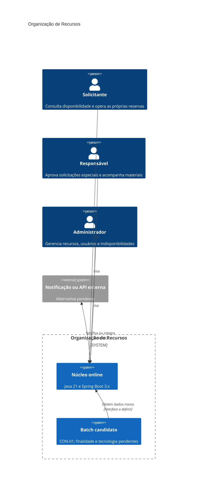
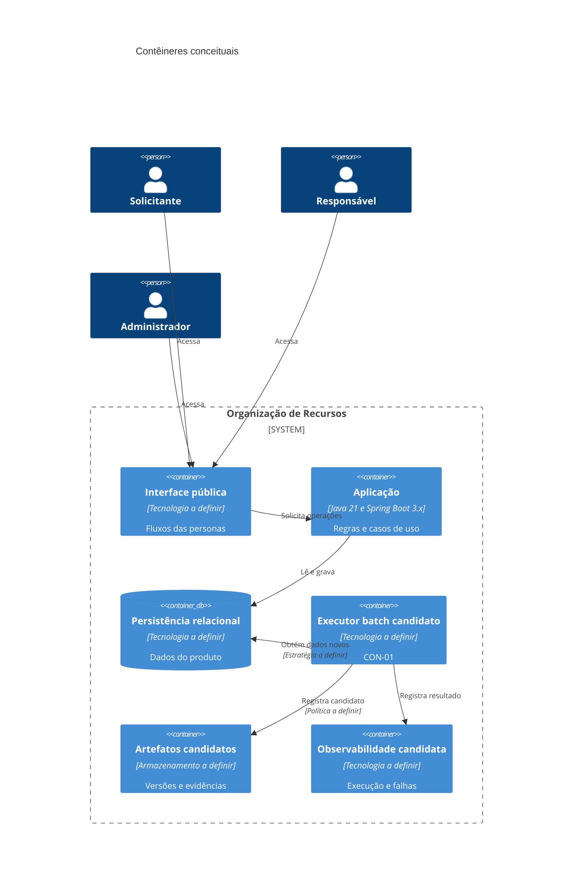
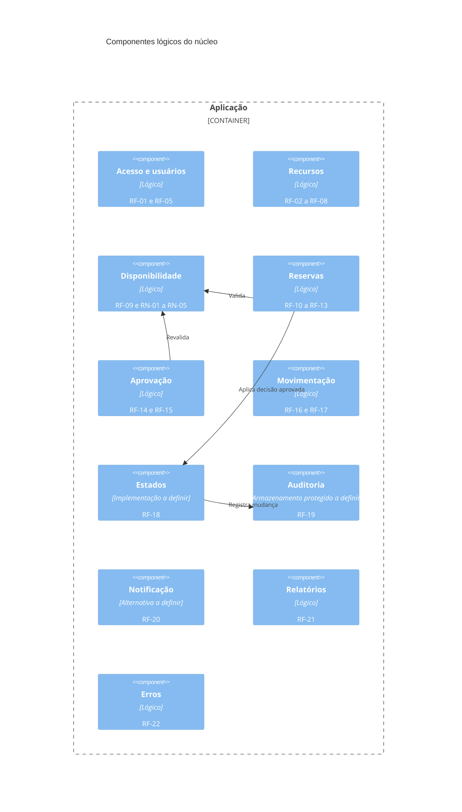
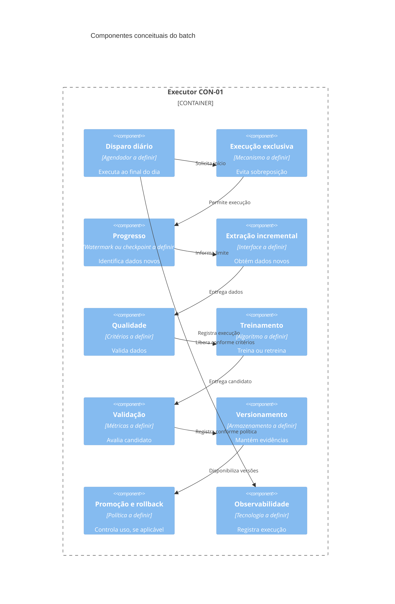
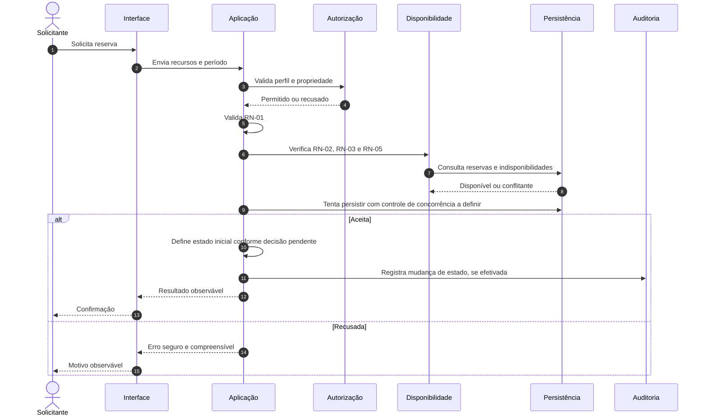
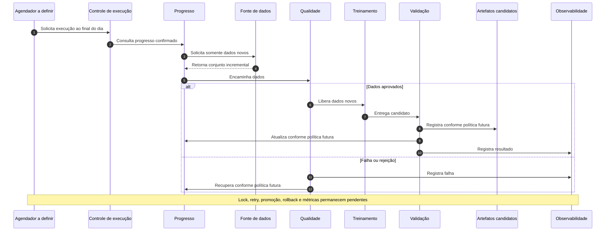

# Arquitetura: Organização de Recursos

> **Documento:** `docs/arquitetura.md`  
> **Status:** baseline arquitetural para revisão e aprovação da equipe  
> **Versão:** 1.1  
> **Data de consolidação:** 2026-09-02  
> **Fontes oficiais:** `docs/prd.md`, `docs/fluxos-personas.md`, `docs/personas/solicitante.md`, `docs/personas/responsavel.md`, `docs/personas/administrador.md`  
> **Restrição adicional da atividade:** `CON-01`, cron job diário ao final do dia para treinar ou retreinar usando somente dados novos.

## 1. Finalidade e regras de governança

Este documento consolida a arquitetura do sistema **Organização de Recursos**, preservando os requisitos, regras, perfis, estados, limitações e pendências registrados nas fontes oficiais.

As seguintes regras de governança se aplicam:

1. O PRD e os fluxos são as fontes de verdade do produto.
2. Os únicos perfis oficiais são Solicitante, Responsável e Administrador.
3. Nenhuma tecnologia citada neste documento é considerada aprovada quando estiver marcada como candidata ou pendente.
4. Nenhuma lacuna de negócio é resolvida por inferência.
5. As evidências descritas são esperadas. Nenhum teste, pipeline, relatório ou ferramenta é declarado como executado sem comprovação real.
6. O projeto Foot Fanatics é apenas demonstrativo e não fornece entidades, perfis ou funcionalidades ao produto avaliado.
7. CON-01 é uma restrição adicional da atividade de arquitetura, ausente no PRD e nas personas.

### 1.1 Legenda de status

| Status | Significado |
|---|---|
| APROVADO NA BASELINE | Exigido explicitamente por requisito ou regra oficial |
| PENDENTE DE DECISÃO DA EQUIPE | Necessita decisão humana antes de implementação definitiva |
| CANDIDATO NÃO APROVADO | Alternativa arquitetural possível, ainda não escolhida |
| DECISÃO SEM REQUISITO | Decisão técnica sugerida sem imposição direta da fonte oficial |

## 2. Contexto e objetivo

### 2.1 Problema

A alocação de salas, professores e materiais precisa ocorrer sem conflitos de horário, inclusive na agenda do professor, com controle de recursos restritos, bloqueios, manutenção, retiradas, devoluções e histórico de mudanças.

**Origem:** `docs/prd.md`, seção 2; `docs/fluxos-personas.md`, seção 2.

### 2.2 Objetivo

Desenvolver e validar uma aplicação que organize a alocação de salas, professores e materiais sem conflitos, produzindo evidências objetivas de qualidade, segurança, rastreabilidade e desempenho.

### 2.3 Valor esperado

- Evitar sobreposição de reservas.
- Impedir dupla reserva em solicitações simultâneas.
- Considerar a agenda do professor como recurso alocável.
- Impedir reservas em períodos de manutenção ou bloqueio.
- Controlar aprovação de recursos restritos.
- Registrar retiradas e devoluções.
- Preservar histórico auditável das mudanças de estado.
- Disponibilizar relatórios operacionais.
- Produzir evidências verificáveis de qualidade.

### 2.4 Escopo

O produto cobre E1 a E13:

- E1: Acesso e Perfis
- E2: Cadastro de Recursos
- E3: Pesquisa e Disponibilidade
- E4: Reservas e Agenda
- E5: Aprovação de Recursos Restritos
- E6: Manutenção e Bloqueios
- E7: Retirada e Devolução de Materiais
- E8: Auditoria e Histórico
- E9: Notificações e Integrações
- E10: Relatórios
- E11: Interface, Erros e Acessibilidade
- E12: Documentação da API ou Fluxos Públicos
- E13: Qualidade, Segurança, Desempenho e CI

### 2.5 Fora do escopo

- Funcionalidades do Foot Fanatics.
- Perfis adicionais.
- Decisões de negócio não aprovadas.
- Dados biográficos das personas.
- Finalidade, algoritmo, features ou integração de ML não definidos por CON-01.

## 3. Stakeholders e personas oficiais

| Persona | Responsabilidade principal | Limites principais | Origem |
|---|---|---|---|
| Solicitante | Consultar disponibilidade e criar, alterar ou cancelar as próprias reservas | Não opera reservas de terceiros, não aprova recursos restritos e não administra cadastros | `docs/personas/solicitante.md` |
| Responsável | Aprovar solicitações especiais, validar docentes e registrar retiradas e devoluções | Não administra recursos e não aprova fora de sua responsabilidade | `docs/personas/responsavel.md` |
| Administrador | Gerenciar recursos, usuários, bloqueios, manutenção, relatórios e histórico autorizado | Não substitui o Responsável e não contorna regras críticas | `docs/personas/administrador.md` |

### 3.1 Professor como usuário e como recurso

- Professor como usuário pode atuar com perfil Solicitante.
- Professor como recurso possui agenda sujeita à regra de sobreposição.
- A relação cadastral entre conta e recurso professor permanece **PENDENTE DE DECISÃO DA EQUIPE**.

### 3.2 Papel técnico candidato do batch

A operação de CON-01 pode exigir um responsável técnico por acompanhamento, validação ou promoção de artefatos. Esse papel não é uma persona oficial.

**Status:** CANDIDATO NÃO APROVADO.

## 4. Restrições arquiteturais

### 4.1 Restrições oficiais

| Restrição | Origem | Status |
|---|---|---|
| Java 21 e Spring Boot 3.x | RNF-01 | APROVADO NA BASELINE |
| Cobertura mínima de 80% de linhas | RNF-02 | APROVADO NA BASELINE |
| Cobertura mínima de 70% de branches | RNF-03 | APROVADO NA BASELINE |
| 100% dos requisitos críticos rastreados | RN-10, RNF-04 | APROVADO NA BASELINE |
| Zero bugs críticos conhecidos | RNF-05 | APROVADO NA BASELINE |
| Zero vulnerabilidades críticas conhecidas | RNF-06 | APROVADO NA BASELINE |
| Persistência crítica validada com Testcontainers | RNF-07 | APROVADO NA BASELINE |
| Integrações externas validadas com WireMock, quando aplicável | RNF-08 | APROVADO NA BASELINE |
| Teste automatizado de concorrência | RNF-09 | APROVADO NA BASELINE |
| GitHub Actions em pull requests | RNF-12 | APROVADO NA BASELINE |
| SonarCloud | RNF-13 | APROVADO NA BASELINE |
| JMeter para medição sob carga | RNF-14 | APROVADO, metas pendentes |
| Toda mudança de estado da reserva gera auditoria | RN-09 | APROVADO NA BASELINE |
| Reserva iniciada não pode ser apagada | RN-08 | APROVADO NA BASELINE |
| Entrega na semana 46 | PRD, seção 5 | APROVADO NA BASELINE |

### 4.2 CON-01

> Existe um cron job executado diariamente ao final do dia para treinar ou retreinar usando somente dados novos.

CON-01 não define:

- finalidade do modelo;
- fonte e classificação dos dados;
- algoritmo;
- features;
- métricas de validação;
- integração com o fluxo online;
- tecnologia de agendamento;
- política de promoção ou rollback.

Esses pontos permanecem **PENDENTES DE DECISÃO DA EQUIPE**.

## 5. Requisitos arquiteturalmente significativos

### 5.1 Regras críticas

| ID | Regra | Impacto arquitetural |
|---|---|---|
| RN-01 | Término posterior ao início | Validação de domínio e entrada |
| RN-02 | Sem sobreposição do mesmo recurso | Consistência das reservas |
| RN-03 | Agenda do professor sujeita à sobreposição | Professor modelado como recurso de agenda |
| RN-04 | Exatamente uma reserva aceita em solicitações simultâneas | Controle de concorrência e integridade |
| RN-05 | Recurso em manutenção não pode ser reservado | Disponibilidade considera indisponibilidades |
| RN-06 | Somente Responsável aprova recurso restrito | Autorização por perfil e contexto |
| RN-07 | Estados oficiais da reserva | Controle do ciclo de vida |
| RN-08 | Reserva iniciada não pode ser apagada | Preservação da entidade e histórico |
| RN-09 | Mudança de estado gera auditoria | Consistência entre estado e registro auditável |
| RN-10 | Requisitos críticos rastreados | Governança de requisitos, riscos, testes e evidências |

### 5.2 Requisitos funcionais significativos

- RF-01 e RF-05: identidade, autenticação, autorização e usuários.
- RF-09, RF-10, RF-11 e RF-13: disponibilidade, reservas e concorrência.
- RF-14 e RF-15: aprovação e validação docente.
- RF-18 e RF-19: estados e auditoria.
- RF-20: notificação ou integração externa.
- RF-21: relatórios.
- RF-22 e RF-23: interface, erros e documentação pública.

### 5.3 Requisitos não funcionais significativos

- RNF-01: plataforma.
- RNF-02 e RNF-03: cobertura.
- RNF-04: rastreabilidade.
- RNF-05 e RNF-06: ausência de críticos conhecidos.
- RNF-07 a RNF-11: estratégia de testes.
- RNF-12 e RNF-13: CI e análise estática.
- RNF-14: desempenho sob carga.
- RNF-15 a RNF-17: segurança, responsividade e erros.
- RNF-18: documentação verificável.

## 6. Atributos de qualidade

| Atributo | Drivers | Evidência esperada | Pendência |
|---|---|---|---|
| Segurança | RF-01, RN-06, RNF-06, RNF-15 | Testes positivos e negativos, SonarCloud e revisão de QA | Mecanismo de autenticação e sessão |
| Consistência | RN-01 a RN-05 | Testes unitários, integração e concorrência | Estratégia técnica de concorrência |
| Auditabilidade | RN-09, RN-10, RF-19 | Testcontainers, consulta do histórico e RTM | Campos, retenção e imutabilidade completa |
| Testabilidade | RNF-07 a RNF-11 | JUnit 5, parametrizados, integração, API e E2E | Quantidade exata por tipo |
| Desempenho | RNF-14 | Relatório JMeter | Carga, percentis, taxa de erro e duração |
| Usabilidade | RF-22, RNF-16, RNF-17 | E2E e inspeção de interface | Viewports e critérios de acessibilidade |
| Manutenibilidade | RNF-01, RNF-13 | Build e SonarCloud | Quality gates adicionais |
| Integração | RF-20, RNF-08 | WireMock ou evidência de simulação | Alternativa e contrato |
| Documentação | RF-23, RNF-18 | Inspeção e comparação com fluxos públicos | Formato de publicação |
| Operabilidade batch | CON-01 | Evidências de execução e recuperação | Todas as políticas de ML e operação |

## 7. Drivers priorizados

| Prioridade | ID | Driver | Origem |
|---|---|---|---|
| 1 | D1 | Impedir sobreposição em sala, material e professor | RN-02, RN-03 |
| 1 | D2 | Aceitar exatamente uma reserva sob concorrência | RN-04, RF-13, RNF-09 |
| 1 | D3 | Impedir reserva em manutenção | RN-05 |
| 2 | D4 | Aplicar autorização aos três perfis oficiais | RF-01, RN-06 |
| 2 | D5 | Restringir aprovação ao Responsável autorizado | RN-06, RF-14 |
| 2 | D6 | Impedir acesso a reserva de terceiro | Personas e FLX-08/09 |
| 3 | D7 | Preservar estados oficiais | RN-07, RF-18 |
| 3 | D8 | Impedir apagamento de reserva iniciada | RN-08 |
| 3 | D9 | Auditar toda mudança de estado | RN-09, RF-19 |
| 4 | D10 | Validar persistência crítica em ambiente realista | RNF-07 |
| 4 | D11 | Produzir evidência automatizada de concorrência | RNF-09 |
| 4 | D12 | Cumprir cobertura e análise estática | RNF-02, RNF-03, RNF-13 |
| 5 | D13 | Tratar erros de forma segura e compreensível | RF-22, RNF-15, RNF-17 |
| 5 | D14 | Medir desempenho sob carga | RNF-14 |
| 6 | D15 | Implementar notificação simulada ou externa | RF-20 |
| 6 | D16 | Produzir relatórios operacionais | RF-21 |
| 6 | D17 | Documentar API ou fluxos públicos | RF-23 |
| Externo | D18 | Executar CON-01 sem inventar sua finalidade | CON-01 |

## 8. Glossário

| Termo | Definição |
|---|---|
| Recurso | Sala, professor, material ou equipamento alocável |
| Professor-recurso | Docente cuja agenda participa da disponibilidade |
| Professor-usuário | Conta que pode atuar com perfil Solicitante |
| Reserva | Solicitação de alocação de recursos em um período |
| Sobreposição | Interseção de períodos do mesmo recurso |
| Dupla reserva | Mais de uma reserva aceita para o mesmo recurso e período em cenário concorrente |
| Recurso restrito | Recurso que exige aprovação do Responsável, com critérios ainda pendentes |
| Bloqueio | Indisponibilidade administrativa cuja relação com manutenção permanece pendente |
| Manutenção | Período em que o recurso não pode ser reservado |
| Auditoria | Registro das mudanças de estado, protegido contra alteração por perfis operacionais; imutabilidade completa pendente |
| Dados novos | Dados ainda não processados pelo batch, com critério pendente |
| Watermark/checkpoint | Alternativas para registrar o progresso confirmado do batch |
| Artefato candidato | Resultado do treinamento ainda não promovido ou utilizado |

## 9. Fatos, lacunas, conflitos e suposições

### 9.1 Fatos

- Java 21 e Spring Boot 3.x.
- Três perfis oficiais.
- Sete estados oficiais.
- Exatamente uma reserva aceita no cenário concorrente.
- Recursos em manutenção não podem ser reservados.
- Toda mudança de estado deve gerar auditoria.
- CON-01 executa diariamente ao final do dia e usa somente dados novos.

### 9.2 Lacunas principais

- Estado inicial e ocupação da reserva não restrita.
- Atores e condições de transições não detalhadas.
- Critério de recurso restrito.
- Relação entre professor-usuário e professor-recurso.
- Relação entre bloqueio e manutenção.
- Campos e política de auditoria.
- Notificação e contrato externo.
- Fórmulas dos relatórios.
- Metas de desempenho e acessibilidade.
- Finalidade, dados, algoritmo e métricas de CON-01.

### 9.3 Conflitos e tensões

| Tensão | Tratamento |
|---|---|
| CON-01 não pertence ao escopo original E1 a E13 | Manter como restrição adicional separada |
| RN-05 menciona manutenção, enquanto fluxos também tratam bloqueios | Manter relação operacional como pendência |
| Arquitetura precisa tratar concorrência sem mecanismo oficial | Confirmar resultado e avaliar alternativas |
| Auditoria obrigatória cobre estado da reserva, não todo evento técnico | Não ampliar RN-09 por inferência |

### 9.4 Suposições não aprovadas

Nenhuma das seguintes suposições integra a baseline:

- banco, cache, scheduler ou provedor de identidade específicos;
- read replica;
- mecanismo de lock;
- arquitetura de microserviços;
- finalidade do modelo;
- ausência de dados pessoais;
- promoção automática;
- rollback automático.

## 10. Riscos iniciais

| ID | Risco | Impacto preliminar | Origem |
|---|---|---|---|
| R1 | Dupla reserva | Crítico | RN-04, FLX-06 |
| R2 | Sobreposição na agenda do professor | Crítico | RN-03 |
| R3 | Reserva em manutenção ou bloqueio | Crítico | RN-05, FLX-16/17 |
| R4 | Aprovação por perfil indevido | Crítico | RN-06 |
| R5 | IDOR em reservas | Alto | Personas, FLX-08/09 |
| R6 | Exclusão de reserva iniciada | Alto | RN-08 |
| R7 | Mudança de estado sem auditoria | Alto | RN-09 |
| R8 | Movimentação sem vínculo correto | Médio | RF-16, RF-17 |
| R9 | Falha externa afetar a operação principal | Médio | RF-20 |
| R10 | Relatório inconsistente | Médio | RF-21 |
| R11 | Erro expor detalhes internos | Alto | RNF-15, RNF-17 |
| R12 | CON-01 sem finalidade demonstrável | Alto | CON-01 |
| R13 | Uso de dados pessoais sem análise LGPD | Alto | CON-01 |
| R14 | Job sobreposto ou reprocessamento inconsistente | Alto | CON-01 |
| R15 | Candidato de modelo inadequado ser utilizado | Alto | CON-01 |

> As classificações são preliminares e devem ser validadas pela equipe e pela avaliação ATAM.

## 11. Arquitetura lógica do núcleo

A arquitetura recomendada é um **monólito modular Spring Boot**, pois o escopo acadêmico e os requisitos não justificam microserviços. Essa recomendação evita complexidade distribuída e preserva separação lógica.

**Status:** DECISÃO ARQUITETURAL CANDIDATA.

### 11.1 Módulos lógicos

- `identity`: autenticação, autorização, usuários e perfis.
- `resources`: salas, professores, materiais, bloqueios e manutenção.
- `availability`: filtros, agenda e disponibilidade.
- `reservations`: criação, alteração, cancelamento e concorrência.
- `approvals`: aprovação de recurso restrito e validação docente.
- `inventory`: retirada e devolução.
- `audit`: mudanças de estado e consulta de histórico.
- `notifications`: simulação ou integração externa.
- `reports`: relatórios operacionais.
- `shared`: erros, validação e elementos transversais mínimos.

### 11.2 Responsabilidades de camadas

- Controllers tratam requisições, validação inicial, respostas e redirecionamentos.
- Services concentram regras, autorização contextual e transações.
- Repositories tratam persistência.
- DTOs controlam entradas e saídas públicas.
- A autorização deve ocorrer no back-end e considerar perfil e propriedade.

## 12. Decisões de domínio que permanecem pendentes

1. Estado inicial de reserva não restrita.
2. Estados que permitem alteração e cancelamento.
3. Ator de EM_USO, CONCLUIDA e NAO_COMPARECEU.
4. Liberação de recursos após estados terminais.
5. Nova aprovação após alteração de recurso restrito.
6. Nova validação após mudança de professor.
7. Relação retirada/devolução com conclusão.
8. Critério de recurso restrito.
9. Política de reservas afetadas por manutenção.
10. Campos e retenção da auditoria.
11. Fórmula dos relatórios.
12. Canal e evento de notificação.

## 13. Projeto arquitetural: responsabilidades, limites e interfaces

### 13.1 Separação entre online e batch

| Aspecto | Núcleo online | Batch CON-01 |
|---|---|---|
| Finalidade | Atender E1 a E13 | Treinar ou retreinar diariamente usando dados novos |
| Origem | PRD e fluxos | Restrição adicional |
| Consistência | Regras RN-01 a RN-09 | Idempotência e progresso a definir |
| Acoplamento | Operações das personas | Relação com o núcleo pendente |
| Tecnologia | Java 21 e Spring Boot 3.x | Tecnologia a definir |

**Decisão candidata:** manter o batch fora do caminho crítico das reservas.

**Trade-off:** reduz impacto de falhas do batch, mas adiciona coordenação e governança.

### 13.2 Interfaces confirmadas

- Autenticação e autorização.
- Consulta e pesquisa.
- Reservas.
- Aprovação e validação docente.
- Retirada e devolução.
- Histórico.
- Notificação ou integração.
- Relatórios.

Protocolos, payloads, rotas e códigos HTTP permanecem a definir.

### 13.3 Necessidades mínimas do batch

- Fonte autorizada de dados.
- Critério verificável de dados novos.
- Registro de progresso.
- Prevenção de execução sobreposta.
- Recuperação após falha.
- Validação de dados e candidato.
- Versionamento e evidência.
- Segurança, LGPD e custo.

## 14. Diagramas C4

### 14.1 Contexto

### 14.2 Contêineres conceituais

### 14.3 Componentes do núcleo

### 14.4 Componentes conceituais do batch

## 15. Sequências críticas

### 15.1 Criação de reserva

### 15.2 Execução batch de CON-01

## 16. Análise de CON-01

| Tema | Necessidade mínima | Alternativas | Trade-off | Status |
|---|---|---|---|---|
| Dados novos | Definir registros não processados | timestamp, ID crescente, versão, log de mudanças | Simplicidade versus precisão | PENDENTE |
| Checkpoint | Registrar progresso confirmado | tabela, metadado externo, eventos | Consistência versus complexidade | PENDENTE |
| Idempotência | Evitar efeito duplicado | chave de execução, deduplicação, escrita condicional | Armazenamento versus segurança | PENDENTE |
| Job sobreposto | Impedir execuções incompatíveis | lock em banco, scheduler ou coordenação externa | Infraestrutura versus isolamento | PENDENTE |
| Retry | Recuperar falhas transitórias | reinício total ou por etapa | Simplicidade versus velocidade | PENDENTE |
| Qualidade | Validar dados | esquema, integridade, completude e temporalidade | Confiança versus custo | PENDENTE |
| Linhagem | Relacionar dados, execução e artefato | metadados, catálogo ou logs | Auditabilidade versus manutenção | PENDENTE |
| Reprodutibilidade | Registrar código, dados, configuração e ambiente | conjunto mínimo de metadados a definir | Explicabilidade versus retenção | PENDENTE |
| Validação | Avaliar o candidato | conjunto de validação, anterior, revisão humana | Automação versus controle | PENDENTE |
| Gates | Impedir uso inadequado | métricas após definição da finalidade | Objetividade versus escolha errada | PENDENTE |
| Versionamento | Distinguir candidatos | ID, metadados e armazenamento versionado | Rollback versus custo | PENDENTE |
| Promoção | Tornar candidato utilizável | manual, automática ou múltiplas etapas | Agilidade versus governança | PENDENTE |
| Rollback | Retornar à versão anterior, se aplicável | reapontamento, restauração ou nova promoção | Rapidez versus complexidade | PENDENTE |
| Observabilidade | Tornar execução e falhas visíveis | logs, métricas, alertas e painel | Diagnóstico versus custo | PENDENTE |
| LGPD | Proteger dados utilizados | minimização, autorização, retenção e pseudonimização | Proteção versus restrição | PENDENTE |
| Custos | Medir execução e retenção | compartilhado, dedicado ou sob demanda | Custo versus isolamento | PENDENTE |

### 16.1 LGPD

Antes do treinamento, a equipe deve decidir:

- inventário dos dados;
- finalidade e base legal;
- minimização;
- acesso;
- retenção e descarte;
- anonimização ou pseudonimização;
- tratamento de identificadores de usuários e professores;
- evidência de origem e uso.

Não se presume que IDs sejam anônimos.

### 16.2 Fatos não presumidos

Não estão aprovados:

- exactly-once;
- determinismo binário;
- hash estável;
- threshold padrão;
- quantidade de retries;
- código de saída;
- rollback automático;
- réplica existente;
- armazenamento serverless;
- prazo máximo do job;
- retenção de artefatos;
- integração do modelo com o núcleo.

## 17. Matriz de decisões

| ID | Decisão ou necessidade | Origem | Classificação | Status |
|---|---|---|---|---|
| J1 | Separar conceitualmente online e batch | CON-01 | Decisão candidata | PENDENTE |
| J2 | Definir fonte autorizada | CON-01 | Necessidade | PENDENTE |
| J3 | Definir dados novos | CON-01 | Necessidade | PENDENTE |
| J4 | Registrar progresso | CON-01 | Decisão candidata | PENDENTE |
| J5 | Impedir jobs sobrepostos | CON-01 | Decisão candidata | PENDENTE |
| J6 | Preservar metadados de treinamento | CON-01 | Decisão candidata | PENDENTE |
| J7 | Definir versionamento, promoção e rollback | CON-01 | Decisão candidata | PENDENTE |
| J8 | Definir métricas e gates | CON-01 | Necessidade | PENDENTE |
| J9 | Definir observabilidade e recuperação | CON-01 | Decisão candidata | PENDENTE |
| J10 | Erros seguros e compreensíveis | RF-22, RNF-15 e RNF-17 | Requisito | APROVADO |
| J11 | Autorização no back-end | RF-01 e RN-06 | Requisito | APROVADO |
| J12 | Exatamente uma reserva aceita sob concorrência | RN-04 e RNF-09 | Resultado obrigatório | RESULTADO APROVADO; MECANISMO PENDENTE |
| J13 | Auditoria de toda mudança de estado | RN-09 | Requisito | APROVADO |
| J14 | Cache de disponibilidade | RNF-14 sem meta | Alternativa | PENDENTE |
| J15 | Notificação simulada ou externa | RF-20 | Alternativa oficial | PENDENTE |
| J16 | Metadados e reprodutibilidade do batch | CON-01 | Decisão candidata | PENDENTE |

### 17.1 Alternativas de concorrência

- constraint no banco;
- isolamento transacional;
- lock pessimista;
- controle otimista;
- estrutura de slots;
- outra técnica consistente.

Nenhuma está aprovada. A solução deve ser comprovada com Testcontainers e teste concorrente.

### 17.2 Limites das regras

- RN-08 trata somente da proibição de apagar reservas iniciadas.
- RN-09 trata obrigatoriamente das mudanças de estado das reservas.
- RN-10 trata da rastreabilidade dos requisitos críticos.
- Essas regras não tornam obrigatórios registry, formato de artefato, promoção ou rollback de modelo.

## 18. Riscos não resolvidos

| ID | Risco | Tratamento atual |
|---|---|---|
| R16 | CON-01 sem finalidade e dados definidos | Manter decisões pendentes |
| R17 | Metas de desempenho ausentes | Definir antes do aceite |
| R18 | Viewports e acessibilidade ausentes | Definir cenários |
| R19 | Dados pessoais usados sem análise | Bloquear uso até decisão |
| R20 | Concorrência inadequada | Comparar alternativas e testar |
| R21 | Jobs sobrepostos | Definir exclusão e idempotência |
| R22 | Falha parcial avançar o progresso | Definir checkpoint e recuperação |
| R23 | Candidato pior ser utilizado | Definir métricas, gates e rollback |
| R24 | Excesso de tecnologias candidatas | Decidir após experimento |
| R25 | Cron sem valor demonstrável | Exigir decisão de finalidade |

## 19. Checklist de consistência

- [x] Somente três perfis oficiais.
- [x] CON-01 separado do PRD.
- [x] Estado inicial não restrito permanece pendente.
- [x] RN-04 define resultado, não mecanismo.
- [x] RN-08 não justifica governança de modelos.
- [x] RN-09 não foi ampliado para todo evento batch.
- [x] RN-10 não tornou tecnologias de ML obrigatórias.
- [x] RNF-07 não foi interpretado como exigência de réplica.
- [x] Tecnologias não aprovadas aparecem como alternativas.
- [x] LGPD não presume ausência de dados pessoais.
- [x] Semana 46 permanece prazo acadêmico.
- [x] Fluxos online e batch estão separados.
- [x] Nenhum teste ou resultado foi declarado como executado.

## 20. Próximas decisões e experimentos

### 20.1 Decisões prioritárias

1. Propósito e valor de CON-01.
2. Definição de dados novos.
3. Inventário e classificação de dados.
4. Uso do resultado do modelo.
5. Estratégia de concorrência.
6. Estado inicial e ocupação da reserva.
7. Transições pendentes.
8. Metas JMeter e acessibilidade.
9. Notificação.
10. Fórmulas dos relatórios.

### 20.2 Experimentos candidatos

| Experimento | Objetivo | Evidência | Status |
|---|---|---|---|
| Concorrência | Comparar alternativas para RN-04 | Teste com Testcontainers | NÃO APROVADO |
| Dados novos | Comparar critérios incrementais | Casos de omissão e duplicação | NÃO APROVADO |
| Falha parcial | Avaliar checkpoint e recuperação | Progresso consistente | NÃO APROVADO |
| Job sobreposto | Avaliar exclusão de execução | Uma execução efetiva | NÃO APROVADO |
| Validação de candidato | Evitar promoção de candidato pior | Métricas aprovadas | NÃO APROVADO |
| Rollback | Demonstrar retorno seguro | Evidência de restauração | NÃO APROVADO |
| LGPD | Validar finalidade e minimização | Inventário e decisão | NÃO APROVADO |
| Custos | Medir execução e retenção | Relatório por cenário | NÃO APROVADO |

### 20.3 Preparação para ATAM

A avaliação ATAM deve:

- tratar métricas propostas como hipóteses;
- priorizar cenários de concorrência, autorização, auditoria e CON-01;
- avaliar falha parcial, job sobreposto, degradação de dados, candidato pior, rollback, indisponibilidade e vazamento;
- registrar sensibilidade, trade-offs, riscos, não-riscos e temas de risco;
- não transformar alternativas em decisões aprovadas.
